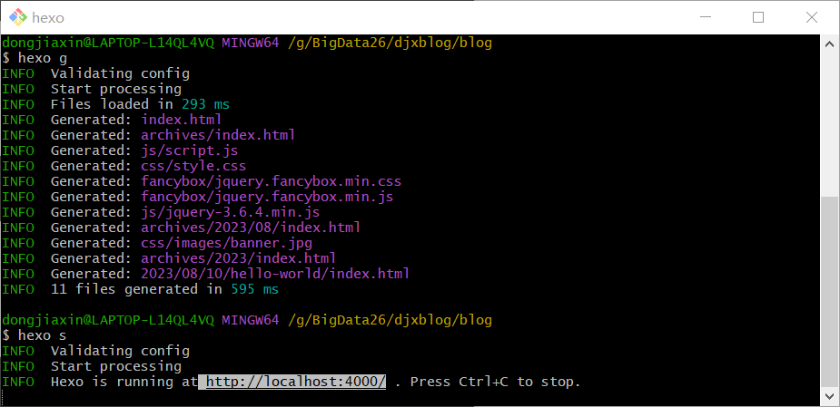
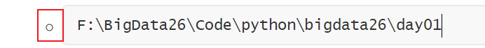
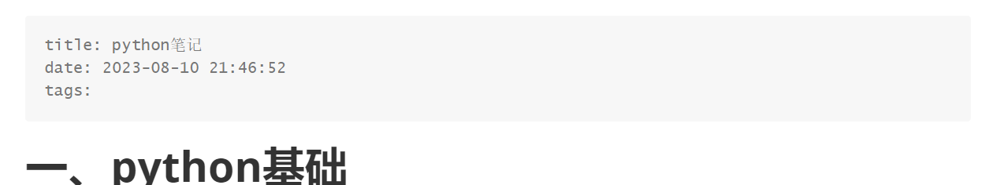

# 基于hexo-hutterfly搭建个人博客网站

## 1、构建本地个人博客

- 下载git和`node.js`

- 安装`cnpm`代替npm
  - 淘宝镜像

```
npm install -g cnpm --registry=https://registry.npmmirror.com
```

- 安装`hexo`

```
cnpm install -g hexo-cli
```

- 从`github`上拉去文件到指定文件夹中

  - 也可以，直接克隆到本地

    - ```
      git clone https://github.com/hexojs/hexo-starter.git
      ```

```
hexo init 文件夹名
```

- 进入到上述指定文件夹中，安装依赖

```
cnpm install
```


- 生成静态文件（网页文件）

```
hexo g
```

- 启动`hexo`本地服务器

```
hexo s
```

- 运行成功



- 通过url进入hexo博客主页


- `ctrl +c` 终止

#### 本地图片引用

- 需要先安装上传本地图片的插件，在`hexo`项目的根目录下输入

  - 安装`hexo-renderer-marked`后，通过`hexo new 文件名`，可以创建一个文件同名的文件夹存放图片，使用正确的引用方式可以让`hexo`解析到

  - 但是`hexo`通过此插件的图片引用方式是 

    - ```
      
      ```

  - 并且`typroa`引用相同文件夹下的图片的引用方式是

    - ```
      
      ```

  - 使得两者还有略微差别，

  - 想要再同一个文件中，引入图片时，让`hexo`和`typra`都能够解析到需要下载`hexo-image-link` 插件

    - ```
      此插件作用：让后hexo的解析方式 --> 
      ```

  - 安装过后，可以通过如下方式引用图片，使得`hexo`和`typroa`都能解析到

    - ```
      # file文件夹和此md文档同名、同级
      
      ```

  - git bash 安装插件命令

  ```
  cnpm install hexo-renderer-marked
  cnpm install hexo-image-link --save
  ```

- 最后打开`_config.yml` 文件中的`post_asset_folder: true`

  - `post_asset_folder` 是 `Hexo` 配置文件 `_config.yml` 中的一个选项，用于控制是否在每篇博文的文件夹中创建一个专门用于存放相关资源（如图片、文件等）的文件夹。
  - 当你在博文中引用资源时，如果 `post_asset_folder` 设置为 `true`，`Hexo` 会自动为每篇博文创建一个与博文同名的文件夹，用于存放该篇博文使用的资源。这有助于组织和管理博文相关的资源，使得博文文件夹更加清晰，便于维护。

- 最后也请注意，不能用对图片进行放缩，不然`typroa`的引用方式会变为如下，`hexo`就不能识别了

```

```

#### 扩展

- `hexo`也可以解析到source文件夹中images文件夹下的图片，引用图片时source相当于根目录

```

```

#### 代码块

- 注意`hexo`不能识别前面带缩进符的代码块，如下



#### 文章标题

- 如下，分别对应文章标题，创建时间，和标签




### 

## 2、同步部署到服务器

