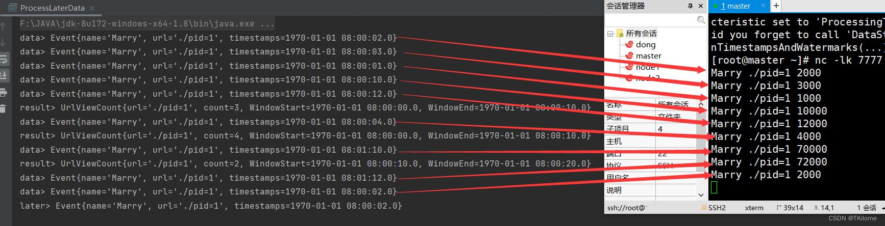

##### Flink 处理迟到数据（★）

- 处理迟到数据之前首先了解**Lambda架构**

  - Lambda架构的实现是：一个批处理器、一个流处理器。流处理器首先实时输出近似正确的结果（因为乱序流，可能导致流处理结果不准确，所以是近似正确），然后当批处理器处理处理完后，把最终结果更新为批处理的结果。

- Flink处理迟到数据的实现，其实是相当于Lambda架构的流程实现。

- 只不过，Flink实现Lambda架构的流程更为简单，只不过是调用几个API而已。

- **处理迟到数据代码实现：**统计每个url的访问量。

  - 分析：

    - 1.首先添加Socket数据源，实现乱序流的输入

      ```java
      env.socketTextStream("master", 7777);
      ```

    - 2.实现乱序流水位线生成策略，延迟时间设为2秒

      ```java
  WatermarkStrategy.<Event>forBoundedOutOfOrderness(Duration.ofSeconds(2))
      ```
    
    - 3.分区、开窗

      ```java
  //分区
      .keyBy(data -> data.url)
  //滑动事件时间窗口，大小为10秒                .window(TumblingEventTimeWindows.of(Time.seconds(10)))
      ```
    
    - 4.设置最大延迟时间
    
      ```java
  .window(TumblingEventTimeWindows.of(Time.seconds(10)))
      //4.设置最大延迟时间，1分钟
  .allowedLateness(Time.minutes(1))
      ```

      
    
    - 5.创建标签，开启侧输出流
    
      - **注意**：由于泛型擦除，要把标签定义成匿名内部类的形式。

      ```java
  //5.创建标签，**注意**：由于泛型擦除，要把标签定义成匿名内部类的形式。
      OutputTag<Event> outputTag = new OutputTag<Event>("later") {};
  .allowedLateness(Time.minutes(1))
      //5.开启侧输出流
  .sideOutputLateData(outputTag)
      ```
    
    - 6.调用aggregate方法，传入AggregateFunction和ProcessWindowFunction
    
      ```java
      .sideOutputLateData(outputTag)
      //6.调用aggregate方法，传入AggregateFunction和ProcessWindowFunction
  .aggregate(new MyAggregateFunction(), new MyProcessWindowFunction());
      ```

    - 7.获取侧输出流
    
      ```java
      //7.获取侧输出流
      streamAggregate.getSideOutput(outputTag);
  ```
    
- 完整代码
  
    ```java
    package finkDemo.Watermark_Windows;
    
  //导入自定义POJO类：Event、UrlViewCount
    import finkDemo.Watermark_Windows.Windows.WindowsFunction.Case.UrlViewCount;
  import finkDemo.Watermark_Windows.Windows.WindowsFunction.IncrementalAggregateFunction.Event;
    
    import org.apache.flink.api.common.eventtime.SerializableTimestampAssigner;
    import org.apache.flink.api.common.eventtime.WatermarkStrategy;
    import org.apache.flink.api.common.functions.AggregateFunction;
    import org.apache.flink.api.common.functions.MapFunction;
    import org.apache.flink.streaming.api.datastream.DataStream;
    import org.apache.flink.streaming.api.datastream.SingleOutputStreamOperator;
    import org.apache.flink.streaming.api.environment.StreamExecutionEnvironment;
    import org.apache.flink.streaming.api.functions.windowing.ProcessWindowFunction;
    import org.apache.flink.streaming.api.windowing.assigners.TumblingEventTimeWindows;
    import org.apache.flink.streaming.api.windowing.time.Time;
    import org.apache.flink.streaming.api.windowing.windows.TimeWindow;
    import org.apache.flink.util.Collector;
    import org.apache.flink.util.OutputTag;
    
    import java.time.Duration;
    
    /**
     * 实际应用中Flink处理迟到数据，就相当于实现了Lambda架构的流程
     *
     *
     * 案例：统计每个url访问量
     */
    public class ProcessLaterData {
        public static void main(String[] args) throws Exception {
            StreamExecutionEnvironment env = StreamExecutionEnvironment.getExecutionEnvironment();
            env.setParallelism(1);
    
            //设置水位线生成周期:100ms
            env.getConfig().setAutoWatermarkInterval(100);
    
            //1.首先添加Socket数据源，实现乱序流的输入
            //nc端输入：Marry ./pid=1 2000等
            SingleOutputStreamOperator<Event> streamSource = env.socketTextStream("master", 7777)
                    //转换数据结构为Event
                    .map(new MapFunction<String, Event>() {
                        @Override
                        public Event map(String value) throws Exception {
                            //切分nc端输入的字符串
                            String[] split = value.split(" ");
                            //返回Event
                            return new Event(split[0].trim(), split[1].trim(), Long.valueOf(split[2].trim()));
                        }
                    });
    
            //2.实现乱序流水位线生成策略，延迟时间设为2秒
            SingleOutputStreamOperator<Event> streamWatermark = streamSource
                    .assignTimestampsAndWatermarks(
                            //创建乱序流水位线生成器，延迟时间为 2秒
                            WatermarkStrategy.<Event>forBoundedOutOfOrderness(Duration.ofSeconds(2))
                                    //提取、分配时间戳
                                    .withTimestampAssigner(new SerializableTimestampAssigner<Event>() {
                                        @Override
                                        public long extractTimestamp(Event element, long recordTimestamp) {
                                            //提取时间戳
                                            return element.timestamps;
                                        }
                                    })
                    );
    
            streamWatermark.print("data");
    
            //5.创建标签，**注意**：由于泛型擦除，要把标签定义成匿名内部类的形式。
            OutputTag<Event> outputTag = new OutputTag<Event>("later") {};
            //3.分区、开窗
            SingleOutputStreamOperator<UrlViewCount> streamAggregate = streamWatermark
                    //分区
                    .keyBy(data -> data.url)
                    //滑动事件时间窗口，大小为10秒
                    .window(TumblingEventTimeWindows.of(Time.seconds(10)))
                    //4.设置最大延迟时间，1分钟
                    .allowedLateness(Time.minutes(1))
                    //5.开启侧输出流
                    .sideOutputLateData(outputTag)
                    //6.调用aggregate方法，传入AggregateFunction和ProcessWindowFunction
                    .aggregate(new MyAggregateFunction(), new MyProcessWindowFunction());
    
            streamAggregate.print("result");
            //7.获取侧输出流
            DataStream<Event> streamSideOutput = streamAggregate.getSideOutput(outputTag);
            streamSideOutput.print("later");
    
    
            env.execute();
        }
    
        //自定义AggregateFunction
        public static class MyAggregateFunction implements AggregateFunction<Event,Long,Long>{
            @Override
            public Long createAccumulator() {
                return 0L;
            }
    
            @Override
            public Long add(Event value, Long accumulator) {
                return accumulator+1L;
            }
    
            @Override
            public Long getResult(Long accumulator) {
                //返回url的访问量
                return accumulator;
            }
    
            //由于不是会话窗口，可以不用写merge方法
            @Override
            public Long merge(Long a, Long b) {
                return null;
            }
        }
    
        //自定义ProcessWindowFunction
        //由于这里的IN是getResult方法的返回值，所以IN类型为Long
        public static class MyProcessWindowFunction extends ProcessWindowFunction<Long, UrlViewCount,String, TimeWindow>{
            @Override
            public void process(String url, ProcessWindowFunction<Long, UrlViewCount, String, TimeWindow>.Context context, Iterable<Long> elements, Collector<UrlViewCount> out) throws Exception {
                //窗口开启时间
                long start = context.window().getStart();
                //窗口关闭时间
                long end = context.window().getEnd();
                //获取每个url的访问量
                Long count = elements.iterator().next();
    
                //分装为UrlViewCount类型输出
                out.collect(new UrlViewCount(url,count,start,end));
            }
        }
    }
    ```
  
    
  
  - 结果分析
  
  
- 第一个result结果输出，count = 3
  - 第一个窗口的范围为[0 , 10000)。**因为窗口默认右边值为 end-1，由于窗口大小为10000，所以end-1=9999**
  - 前面的数据，只有三条数据的时间戳，在[0 , 10000)之内，所以count=3
  - 由于数据时间戳为12000
  - 延迟时间为2秒
  - 水位线的时间戳为10000
  - 水位线推动窗口，触发结果输出。**由于最大延迟时间，此时第一个窗口没有关闭。**
- 第二个result结果输出，count = 4
  - 由于最大延迟时间为，1分钟，也就是60000毫秒，所以**第一个窗口延迟关闭60000毫秒**
  - 由于前面一条数据的时间戳为4000，在第一个窗口范围之内，所以被第一个窗口收集，并更新输出的结果，为count=4
- 第三个result结果，count = 2
  - 第二个窗口范围为[ 10000, 20000)
  - 前面数据的时间戳，在[10000 , 20000)之内的数据共有两条，所以count=2
- 第一个later，count=1
  - 在时间戳为72000的数据的推动下，水位线为70000=最大延迟时间+end1，推动了第一个窗口的关闭、销毁。
  - 最后一条数据的时间戳为2000，但是第一个窗口已经关闭，所以该数据会流入侧输出流，并输出。