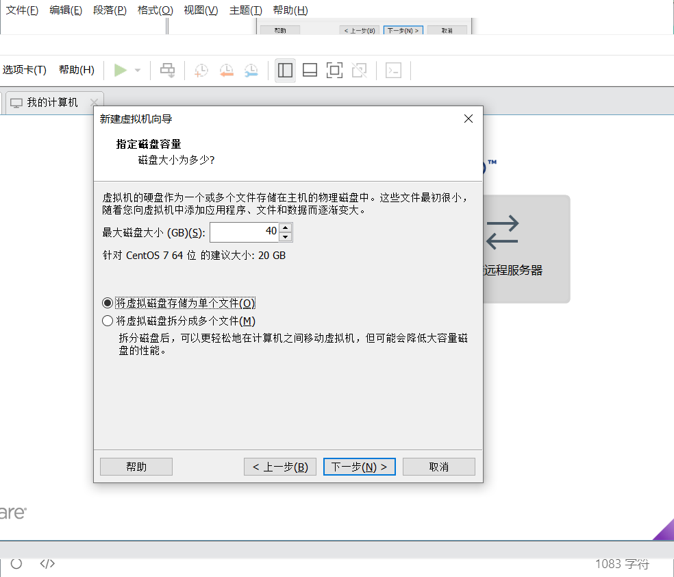
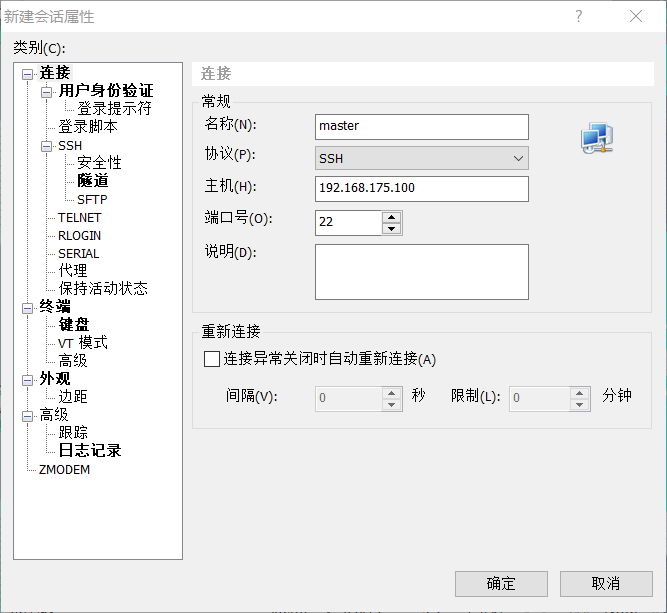
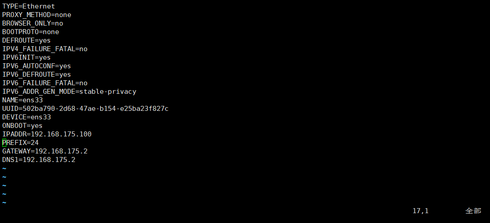

# Linux介绍

- Linux 内核最初只是由芬兰人林纳斯·托瓦兹（Linus Torvalds）在赫尔辛基大学上学时出于个人爱好而编写的
- Linux 的发行版说简单点就是将 Linux 内核与应用软件做一个打包。


- 2020 年 12 月，CentOS 社区宣布 CentOS 服务器操作系统 8 和 7 系列分别于 2021 年底和 2024 年 6 月底停止服务。
  - 龙蜥操作系统（Anolis OS）100% 兼容 RHEL/CentOS Linux 8；支持 x86_64 和 aarch64 架构及飞腾、海光、兆芯、鲲鹏等芯片，适配 x86 及 arm64 主流服务器硬件；提供 CentOS Linux 到 Anolis OS 迁移工具，帮助系统及应用的顺滑迁移

# Linux虚拟机安装与配置

## 1、安装VMware

- 取消检查更新，下一步即可


- 安装完成后，输入产品密钥


- 查看网络适配器，检查是否安装成功


## 2、配置虚拟机

- 新建虚拟机

- 选择典型模式


- 配置CentOS-7.ios镜像
  


- 选择虚拟机位置和名称


- 分配内存，并选中磁盘存储为单个文件



- 进入到虚拟机界面，回车即可

- 等待加载


## 3、虚拟机中的软件配置

- 虚拟机配置完成后，会进入到可视化界面中
- 选择语言
- 选中安装位置，点击完成


- 下载GHOME桌面


- 打开网络和主机名中的以太网，并记住当前主机ip
  - 192.168.175.128


- 开始安装
- 设置root密码，可以创建普通用户，可以不创建


- 重启虚拟机


- 重启完成后，进行初始化设置，接收许可证


- 在用户登录时，选择未列出中的root用户进行登录


- 跳过登录后的选项


- 点击应用软件中的Firefox，访问百度，测试网络是否连接


- 网络连接成功，记得连接前关闭VPN


## 4、虚拟机设置

- 进入到虚拟机设置中
- 指定内存和处理器核数
- 如果没有指定镜像文件，可以在这里指定
- 网络适配器选择NAT模式
- 删除声卡和打印机


- 如果关机后重新启动打不开或者打开出现错误，在进入到master文件夹，删除前三个文件夹，重新打开即可


## 5、家目录

### 5.1 root用户的家目录

- 桌面上的主文件就是root用户的家目录


- 在其他位置选项中，点击计算机位置，也可以看到root文件夹上也有个房子标志，表明root文件夹也是root用户的家目录


### 5.2 普通用户的家目录

- 切换到普通用户的登录

- 和root用户一样，桌面上的目录是普通用户的家目录

- 在计算机中普通用户的家目录，在home文件夹中


- 并且，普通用户对root文件的访问需要root密码

## 6、静态网络配置

- 通过网络管理工具进行配置
  -   这个**网络管理工具就是NetworkManager**
  -  关闭NetworkManager后，会发现图形化界面中的网络管理工具也会消失
  
  
  
  - 开启NetworkManager后，就会重新启动，说明两者是同一个东西
  
  
  
  - 关闭，在开启NetworkManager后，如果连接不上xshell，可以重启虚拟机试一下
  
  -  在这里配置的静态网络设置的地址，可以在ifcfg-ens33 文件中找到

#### 6.1 查看各个地址

- 在图中的有线设置中找到，网络的设置


- 点击齿轮，可以查看DNS和路由地址


- 在次设置中可以看到主机的**路由地址**和**DNS地址**
  - 后面配置网关时，可以把路由地址当作网关地址
    - 网关和路由虽然是两个不同的概念。有时候网关实际上就是一个路由器，负责将本地网络和外部网络连接起来**。在这种情况下，网关的IP地址也充当着路由器的IP地址**。


- 点击虚拟网络编辑器中，**更改设置**选项


- 可以选择DHCP选项，查看**广播地址**
  - 192.175.168.255
- **DHCP**（Dynamic Host Configuration Protocol），即动态主机配置协议
  - DHCP服务器会从预先设置的IP地址池（在起始ip和结束ip之间的地址中选择）中选择一个可用的IP地址分配给虚拟机，然后将其他相关配置信息一并发送给虚拟机，使虚拟机能够正确地连接到网络。
  - 后面会配置静态的主机ip地址
  - 动态的ip会导致连接xhell的时候，需要重新配置主机ip地址


- 可以查看window的VMware8的ipv4地址
  - 192.168.175.1


- 点击编辑中的虚拟网络编辑器，查看**VMware8的子网和子网掩码**
  - 网络适配器中VM8子网
    - 192.168.175.0
  - 网络适配器中VM8的子网掩码
    -  255.255.255.0


#### 6.2 静态网络配置

- 在图中的有线设置中找到，网络管理工具


- 点击齿轮，可以进行静态网络的配置


- 由于0、1、2、255已经被占用，所以配置主机的静态ip时要避开这几个地址
- 进行静态网络配置：**ipv4地址、子网掩码、网关（路由）、DNS**
  -  **在此配置的各个地址，都会记录到ifcfg-ens33文件中**
    -  192.168.175.100、255.255.255.0、192.168.175.2、192.168.175.2


- **关闭网络管理工具，并重新连接有线设置，使配置生效**
  - 关闭后三个点消失，在同位置可以开启


- 打开终端，输入ifconfig命令查看主机ip


- 测试网络连接，打开应用程序中Firefox，访问baidu


- 配置完成后，可以在此终端配置ifcfg-ens33文件，这里配置完成后，后面就不需要对网络配置文件进行修改了
  - BOOTPROTO=static
  - PERFIX=24  -->  NETMASK=255.255.255.0 

## 7、连接xshell

- 安装xshell5

- 配置主机地址



- 配置root用户和密码


- 接收并保存密钥


- xshell平替
  - electerm
  - FinalShell

## 8、关闭CentOS图形化界面

- 关闭图形化界面，节省内存

- 命令解释
  - `multi-user.target` 是 Linux 系统的一个目标单元（target unit），表示系统默认运行级别为多用户模式，即只启动多用户命令行界面，不启动图形界面。

```python
# 在终端输入下面命令
# system control 
systemctl set-default multi-user.target
# 重启
reboot
```

- 查看centOS 7的默认启动模式（命令行模式显示：multi-user.target）
- 修改centOS 7的默认启动模式（图形化界面显示：graphical.target）

## 9、网络文件配置以及关闭防火墙

- 配置网络连接文件
  - PREFIX=24 改为 NETMASK=255.255.255.0
    - PREFIX=24 表示子网掩码二进制1的个数
    - 中文意思：前缀
  - BOOTPROTO=static
    - BOOTPROTO是Boot Protocol的缩写，表示引导协议。
    - 常见的BOOTPROTO值包括：
      1. DHCP：动态主机配置协议 (Dynamic Host Configuration Protocol)。使用DHCP时，网络接口会向网络中的DHCP服务器请求IP地址、子网掩码、网关、DNS等配置信息，并自动获取适配的网络配置。
      2. Static：**静态配置**。设置网络接口的IP地址、子网掩码、网关等信息为手动配置，不通过DHCP获取。
      3. None：无协议。不进行网络接口的自动配置，需要手动设置IP地址等信息。
  - IPADDR=192.168.175.100  
    - ip address
    - ip地址
  - NETMASK=255.255.255.0   
    - network mask
    - 子网掩码
  - GATEWAY=192.168.175.2    
    - 它是一个网络设备（通常是路由器）的IP地址，用于将数据包从本地网络转发到其他网络。
    - 网关的IP地址可能和路由器的IP地址是一样的。这可能是因为网关实际上就是一个路由器，负责将本地网络和外部网络连接起来。在这种情况下，网关的IP地址也充当着路由器的IP地址。
    - 网关
  - DNS1=192.168.175.2
    - "Domain Name System"，即域名系统
    - 它是互联网上用于将域名（例如www.example.com）转换为IP地址（例如192.0.2.1）的一种系统。

```python
# 修改的内容
BOOTPROTO=static
IPADDR=192.168.175.100
NETMASK=255.255.255.0  
GATEWAY=192.169.175.2
DNS1=192.169.175.2
# 进入网络连接文件中
vim /etc/sysconfig/network-scripts/ifcfg-ens33
```

- 没改之前



- 改之后


- 为什么要关闭NetworkManager

  - 对应图形化界面中的三个点

  

  - NetworkManager是一个在Linux系统中管理网络连接的工具。
    - 避免冲突
      - 在某些情况下，可能会与其他网络管理工具或服务产生冲突，导致网络连接问题。关闭NetworkManager可能是为了避免这些潜在的冲突。
    - 提高性能
      - 在一些资源有限的系统中，关闭不需要的服务可以节省系统资源，从而**提高系统性能**。
    - 关闭图形化界面后，就不能使用此工具，需要手动在ifcfg-ens33文件中进行网络配置，关闭NetworkManager服务可以节省系统资源
  - 关闭后通过手动配置网络连接的文件

- 关闭NetworkManager

```python
# 显示NetworkManager的状态
systemctl status NetworkManager
# 关闭NetworkManager
systemctl stop NetworkManager
# 关闭NetworkManager的开机自启
systemctl disble NetworkManager
```


- 启动network服务
  - network"通常指计算机网络"

```python
# 查看network状态
systemctl status network
# 修改ifcfg-ens33文件后重启network服务
systemctl restart network
# 设置network开机自启
# 在ifcfg-ens33文件中的ONBOOT设置里
ONBOOT=yes
```


- 关闭防火墙
  - 关闭防火墙，以便软件可以正常连接到网络或下载所需的文件、以便特定的网络通信。

```python
# 查看防火墙状态
systemctl status firewalld
# 关闭防火墙
systemctl stop firewalld
# 关闭防火墙开机自启
systemctl disable firewalld
```

## 10、修改主机名

- 主机名
  - 主机的名字


```python
# 进入到hostaname文件中修改
vim /etc/hostname
```


```python
# 通过命令修改
hostnamectl --help   # 查看命令参数

hostnamectl set-hostname master
```


- 重启生效

```python
# 重启
reboot
```

## 11、映射

- 虚拟机映射
  - ip地址映射为一个名字

```python
# 进入映射文件
vim /etc/hosts
```


- 映射后可以通过别名访问该地址

```python
# 测试是否映射成功
ping master
```

- window本机映射
  - 映射文件路径：C:\Windows\System32\drivers\etc
  - 同样的如果在此文件配置虚拟机的映射，在window系统中的浏览器（或连接时）可以通过master访问虚拟机或连接虚拟机
  - **因为xshell是安装在windows中的软件，所以配置windows本机映射，可以用映射连接xshell**


## 12、解决异常退出文件时，再进入会出现下图情况

- 下图为，异常退出文件会出现的情况


- 删除下图中的文件即可解决

```python
# 删除该文件
rm -rf  /etc/sysconfig/network-scripts/.ifcfg-ens33.swp
```


# Linux基本功能

## 1、根目录下的文件夹

- linux本质上就是一个文件系统，所有的东西都以文件的形式保存

- 根目录下的各个文件夹，及其作用


- bin
  - 存放二进制可执行文件（就是命令，如：ls、cat、mkdir）
- boot
  - 存放用于系统引导（启动）时使用的各种文件
- dev（devices）
  - 存放设备文件
- etc（etcetera）
  - 存放所有系统配置文件
- hom
  - 存放所有用户文件的根目录
- lib
  - 存放跟文件系统中的程序运行所需要的共享库及内核模块
- proc  
  - 虚拟文件系统，存放当前内存的映射
- usr  
  - 存放系统应用程序，比较重要的目录/usr/local 管理员软件安装目录
- var  
  - 存放运行时需要改变数据的文件*
- mnt  
  - 挂载目录
- sbin  
  - 存储管理级别的二进制执行文件
- root  
  - 超级用户主目录（家目录）
- opt 
  - 额外安装的可选应用程序包安装位置

## 2、文件权限

- Linux系统是一种典型的多用户系统，不同的用户处于不同的地位，拥有不同的权限。为了保护系统的安全性，Linux系统对不同的用户访问同一文件（包括目录文件）的权限做了不同的规定


- 对应权限划分如下
  - d表示文件夹
  - 后面9个字母，每3个对应一个身份的权限
    - r表示读，w表示写，x(execute)表示执行，如果命令文件中，该用户有x权限，则可以调用该命令
      - 如果加了rw后，还是没有权限，可以加上x
    - **owner**对应的当前用户，**group**对应的是用户组，**other users**对应的是其他普通用户
      -  第一个root表示root用户，第个root表示root用户组


- 使用 u, g, o 来代表三种身份的权限，此外还有a，代表all，即所有用户
- chmod（change mode）
  - 修改文件权限


```python
# 修改文件的root用户的读权限
chmod u+r 文件名
chmod u-r 文件名
chmod u+rx 文件名
chmod u-rx 文件名
# 修改文件的root用户的写权限
chmod u+w 文件名
chmod u-w 文件名
chmod u+wx 文件名
chmod u-wx 文件名
# 修改文件的root用户的读写权限
chmod u+rw 文件名
chmod u-rw 文件名
chmod u+rwx 文件名
chmod u-rwx 文件名
# 修改文件的用户组的读写权限
chmod g+r 文件名
chmod g-r 文件名
# 修改文件的普通用户的读写权限
chmod o+r 文件名
chmod o-r 文件名
```

- 如果用户相对文件进行读写操作，除了文件本身的权限，文件所处文件夹的读写权限也要有

- chmod   xxx   文件夹
  - xxx可以用数字代替
  - rwx  r-x    r-x
  - 111 101   101
  - 7        5       5
  - chmod 755 文件名  会赋予文件rwx  r-x    r-x的权限

- chmod --help  查看命令的帮助文档
  - chmod -R 755  文件夹，此命令会递归的把指定文件夹里所有的文件和文件夹都赋予 755的权限


- chmod命令的匹配方式其实是正则表达式


- 通过chown命令可以修改文件所有者和文件关联组，进而也能影响权限
  - 命令格式：chown [-cfhvR] [--help] [--version] user[:group] file

## 3、用户和用户组

- Linux系统是一个多用户多任务的分时操作系统
- 可以创建一个有一定权限的组，然后把普通用户放入进入

- 添加的用户所在文件 /etc/passwd
  - `djx`：用户名
  - `x`：加密后的密码，通常是 'x' 或 '*' 表示密码以加密形式存储在 `/etc/shadow` 文件中
  - `1000`：用户 ID (UID)，用于标识用户的唯一标识符
  - `1000`：组 ID (GID)，用于标识用户所属的主要用户组
  - `djx`：用户的全名或描述
  - `/home/djx`：用户的主目录路径
  - `/bin/bash`：用户的默认 shell，这里指定为 Bash 解释器。


- 添加的用户组所在文件 /etc/group
- 新创建的用户和用户组的，uid和gid默认从1000开始

## 4、添加用户

- 使用useradd即可增加一个用户

- 命令格式：**useradd** 选项 用户名

- 选项:

  -c comment 指定一段注释性描述。

  -d 目录 指定用户主目录，如果此目录不存在，则同时使用-m选项，可以创建主目录。

  -g 用户组 指定用户所属的用户组。

  -G 用户组，用户组 指定用户所属的附加组。

  -s Shell文件 指定用户的登录Shell。

  -u 用户号 指定用户的用户号，如果同时有-o选项，则可以重复使用其他用户的标识号。

```python
# 创建用户
useradd lg
# 设置密码
passwd lg
# -m 将家目录内容移至新位置 (仅于 -d 一起使用)
usermod -m -d /home/lg3 lg
```

## 5、修改或删除用户

### 5.1修改用户

- 命令格式：usermod 选项 用户名
- 选项与useradd命令中的选项一样

```python
# 修改sam用户的shell文件为/bin/ksh，主目录为/home/z，用户组为developer
usermod -s /bin/ksh -d /home/z -g developer sam
```

### 5.2删除用户

- 命令格式：userdel 选项 用户名
- 常用的选项是 -r，它的作用是把用户的主目录一起删除

## 6、修改密码

- 命令格式：：**passwd** 选项 用户名
- 一般passwd 用户名即可

## 7、增加用户组

- 其格式：groupadd 选项 用户组
- 选项
  - -g GID 指定新用户组的组标识号（GID）
  - -o 一般与-g选项同时使用，表示新用户组的GID可以与系统已有用户组的GID相同

## 8、删除或修改用户组

### 8.1删除用户组

- 其格式：groupdel 用户组

### 8.2修改用户组

- 格式：groupmod 选项 用户组
- 常用的选项有：
  - -g GID 为用户组指定新的组标识号
  - -o 与-g选项同时使用，用户组的新GID可以与系统已有用户组的GID相同。
  - -n 新用户组 将用户组的名字改为新名字
- 例如：groupmod –g 10000 -n group3 group2
  - 此命令将组group2的标识号改为10000，组名修改为group3

# Linux基础命令

## 1、清空显示内容

### clear

- 清除全屏内容

## 2、查看路径

### pwd

- Print Working Directory  打印工作目录
- 显示当前文件的路径

## 3、显示文件

### ls   (list)

- 列出当前目录所有文件夹和文件


### ll    (list long)

- 列出当前目录所有文件和文件夹的详细信息

### ls -a   (list all)

- 列出当前目录所有的文件包括隐藏文件

### ll - a

-  (列出当前目录所有的文件包括隐藏文件得详细信息)

- 前面带 . 的为隐藏文件


### ls --help

- ls --help" 是用于查看 ls 命令的**帮助文档**。在 Linux 终端中，这个命令可以显示 ls 命令的使用方法、选项和参数说明，以及其他相关的信息。

### stat

- 统计

- 查看文件信息


### 不同的文件，有不同的颜色


## 4、文件及目录操作

- 创建、切换路径、复制粘贴、剪切、重命名、显示文件内容、显示文件大小

### touch

- 创建空文件

```
touch newfile
```

### mkdir

- make directory  创建文件夹
- mkdir -p 可以创建多级文件夹
  - p	--parents，递归创建目录

```python
# 创建目录
mkdir aa
# 创建多级目录
mkdir aa/bb/cc/dd
```

### cd   

- change directory   切换目录

- 切换目录

```python
# 切换到root用户的家目录
cd
cd /root
cd ~
# 切换到普通用户的家目录
cd /home/普通用户
# 切换到根目录
cd /
# 切换到上一级
cd ..
# 切换到上一级的上一级
cd ../../
# 绝对路径切换
cd /user/local
# 相对路径
cd ../文件夹
# 进入当前文件夹下的其他文件夹
cd ./文件夹
cd 文件夹
# 返回上一次所处文件夹
cd -
```

### rm 

- remove  移除

- 删除文件\文件夹
- 使用rm命令要格外小心。因为一旦删除了一个文件，就无法再恢复它

```python
# 删除文件
rm 文件名
# 强制删除文件
# force
rm -f 文件名
# 删除目录（递归删除），需要确认
# recursive
rm -r  aa/bb/cc
# 强制删除目录
rm -rf aa/bb/cc
```

### cp

- copy

- 复制粘贴

```python
# 复制粘贴文件到aa目录中
cp a.txt aa/
# 复制粘贴aa文件夹到bb中
# -r  recursive
cp -r aa bb/
```

### mv

- move 
- 剪切的意思，如果指定新的文件名，则移动过去，并会重命名

```python
# 如果path2/newname不存在，则会创建出来
mv  <path1/oldname>    <path2/newname>
```

### scp

- Secure Copy Protocol 安全复制协议
- 远程复制
- 它是一个用于在本地主机和远程主机之间进行安全复制文件的命令行工具。scp 命令使用 SSH 协议进行数据传输，因此文件在传输过程中是被加密的，提供了更高的安全性。

```python
# 从本地复制到远程 
scp /home/test/*.sh    root@172.19.2.75:/home/root 
# 从远程复制到本地 
scp root@/172.19.2.75:/home/root/*.txt   /home/test
# 从远程到远程 
scp root@192.168.21.1:/root/test/*.sh root@192.168.31.1:/root/test
# 显示进度在scp后添加-v； verbose 冗长的
# 复制目录在scp后添加-r： recursive 
```

### cat

- concatenate  连接
- 显示文本文件的内容
- 也可以用于将多个文件内容合并输出，或者将内容重定向到其他文件中。
  - 重定向
    - ">"  ：覆盖重写
    -  ">>"：追加写

```python
# 显示文件内容
cat 文件名
# 将a.txt和b.txt的内容覆盖写到/追加到c.txt中
cat a.txt b.txt > c.txt
cat a.txt b.txt >> c.txt
# 显示行号
# number
cat -b a.txt
```

### tac

- 显示文本内容（cat的倒序输出）

### tail

- tail 尾巴
- 显示末尾文本内容
- 显示完成后并不会停止，需要终止程序运行

```python
# 显示末尾10行
tail -10f a.txt
```

### tailf

- 和tail一样的作用，只不过表达不一样

```python
# 显示末尾10行
tailf 10 a.txt
```

### more/less

- 回车一次显示一部分

```python
more a.txt
less a.txt
```


### du

- disk usage 磁盘使用情况
- 显示文件大小
  - 模4k，达不到4k大小的文件，也会占用4k的空间

```python
# 统计全部目录及其子目录下的每个档案所占的磁盘空间
# -h   human；以人们习惯的方式进行展示
du -h
# 统计对应文件的磁盘空间
du -h directory
```

### df

- disk free 空闲磁盘
- 显示文件系统的磁盘空间使用情况。df 命令会列出文件系统的挂载点、总大小、已使用空间、可用空间以及文件系统类型等


### vi/vim

- 进行文本编辑
- vi和vim的区别是，vim进入文件，会显示颜色
- vim总共有三种模式：命令模式、插入模式、末行模式
  - 通过vim命令打开文件即进入**命令模式**，命令模式下可以进行复制粘贴删除等功能
  - 在命令模式按i，可以进入**插入模式**，插入模式可以进行文件编辑
  - 在插入模式按ESC键
  - 命令模式按:冒号，可以进入**末行模式**，末行模式主要进行文件保存、退出或查找替换

### who

- `who` 是一个用于显示当前登录到系统的用户信息的命令。在 Linux/Unix 系统中，`who` 命令通常用于查看当前登录用户的详细列表，包括用户名、终端、登录时间等信息。


### wc

- wordcount

- `wc` 是一个用于统计文件中行数、单词数和字符数的命令。在 Linux/Unix 系统中，`wc` 命令通常用于查看文件的文本统计信息。

  常用的选项包括：

  - `-l`：统计行数。
  - `-w`：统计单词数。
  - `-c`：统计字符数。

# Linux常用工具

## 1、vim

- Vim（Vi IMproved）文本编辑器

- nohlsearch 关闭文本搜索后的黄色光标

  - no highlight search  关闭突出搜索
  - 在末行模式下输入

  ```
  :nohlsearch
  ```

  


- Home行首
- End行尾

#### 文件中永久显示行号

- 创建 .vimrc文件（隐藏文件）
- "vimrc" 的全称是 "Vim Run Commands"。
- 用户可以在 vimrc 文件中设置各种选项，例如设置缩进、语法高亮、键盘映射、颜色方案等

```python
# 步骤
cd ~
vim .vimrc
# 在其中添加
set nu
```

## 2、压缩解压

- 命令：tar  [选项]  文件/目录

#### 2.1 打包

- 选项 "-cvf" 一般是习惯用法
- 打包时需要指定打包之后的文件名，而且要用 ".tar" 作为扩展名

- 注意 f 后面一定要跟包名


```python
# 打包
tar -cvf 包名 文件1/目录1 文件2/目录
```

#### 2.2 压缩

- **gzip压缩命令不能直接压缩目录**，必须先用 tar 命令将目录打包，然后才能用 gzip 命令对打包文件进行压缩

```python
# 压缩
gzip aa.tar
```

- tar -zcvf xxx.tar.gz  目录 ，这种格式可以直接压缩目录

```python
# 打包目录
tar -zcvf ee.tar.gz aa
```

#### 2.3 解打包操作

- 对 tar 包做解打包操作

- 打包和打包相比，只是把打包选项 "-cvf" 更换为 "-xvf"
- 想要指定解压位置，则需要使用 "-C(大写)" 选项

```python
# 解打包操作
tar -xvf aa.tar -C /temp
```

#### 2.4解压缩操作

- -z：压缩和解压缩 ".tar.gz" 格式；

  -j：压缩和解压缩 ".tar.bz2"格式。

- 常用 tar -zxvf 包名 -C  解压路径

```
# 解压到当前目录的aa目录下
tar -zxvf bb.tar.gz ./aa
```

## 3、netstat

- netstat命令是一个监控TCP/IP网络的非常有用的工具，它可以显示路由表、实际的网络连接以及每一个网络接口设备的状态信息。
- 常用选项：-nplt
  - `-n`: numeric，以数值形式显示 IP 地址和端口号。
  - `-p`: process，显示对应的进程信息，即查看占用端口的进程名称。
  - `-l`: listen，只显示监听状态的端口。
  - `-t`: TCP，只显示 TCP 协议相关的连接。
  - `-u`: UDP，只显示 UDP 协议相关的连接。


## 4、ps

- process status  进程状态

- 用于显示当前进程的状态，类似于 windows 的任务管理器。

- 常用参数：

  - -aux 显示所有包含其他使用者的进程

    - `a`: all processes，显示所有用户的所有进程，包括其他用户的进程。

      `u`: user-oriented format，以用户为导向的格式显示进程信息。

      `x`: no controlling terminal，显示无控制终端的进程，通常用于显示后台进程。

  - -ef 

    -  `-e`: 显示所有进程，包括其他用户的进程。
    -  `-f`: 显示完整的进程信息，包括进程的详细信息，如进程号、父进程号、用户、CPU 使用率、内存占用等。

- `ps`是用来查看当前进程状态的命令


- 在 `ps -ef` 中，显示所有进程，包括其他用户的进程，并且不显示与终端无关的进程。


- `ps -aux` 中，除了显示所有进程和完整的进程信息外，还显示与终端无关的进程。


## 5、find

- 命令用于在指定目录下查找文件和目录。
- 格式：find  路径  -name 文件名

```python
# 在root搜索名字中含有txt的文件
find /root -name a.txt
```

## 6、whereis

- `whereis`是一个在Linux和Unix系统中用来查找二进制程序（可执行文件）、源代码以及帮助文档的命令。它的作用是快速定位特定命令、程序或文件在系统中的位置。
- 可以用来查找命令的位置
- 注意：whereis会查找位于环境变量中的二进制文件
  - `pwd`命令的可执行文件位于`/usr/bin/pwd`。
  - 帮助文档位于`/usr/share/man/man1/pwd.1p.gz`。


# Linux 常用操作

- 查看centos版本信息

```
cat /etc/centos-release
```


## 1、yum

- `yum`可以帮助用户搜索、安装、更新和删除软件包，并管理系统的软件包依赖关系。通过 `yum`，用户可以方便地从软件源中获取所需的软件包，并在系统中安装它们。

#### 1.1 基本使用

- 安装：`yum install 包名`
- 卸载：`yum remove 包名`
- 更新：`yum update 包名`
- 显示已配置的源：`yum repolist`
- 列出安装的包：`yum list`
  - `yum list |grep "关键字"`


- 查看软件包的详细信息:`yum info 包名`: 。
- 查看帮助文档：yum --help

- `yum` 会自动从配置好的软件源中下载并安装软件包，因此在使用之前，请确保系统已正确配置了可用的**软件源**。

- 安装telnet

  - telnet ：和ssh差不多，用来远程连接，但是安全性不高，可以用来做端口测试

  - ```sh
    # 测试指定ip的端口是否被占用
    # 如果被占用则会卡住，反之输出拒绝连接
    telnet 192.168.175.100 22  
    ```

  - 卡住，指定端口被占用
    
  -  master的22端口被xshell占用
  


- 没卡住，指定端口没被占用
  
  
  
- 首先会下载一个rpm包
  


  - 可以通过yum和rpm卸载软件包
  - yum是基于 rpm的高级包管理器，提供了更方便、自动化的软件包管理方式，并具备依赖解决的功能，因此在大多数情况下，推荐使用 yum来管理软件包。


#### 1.2 换源

- 由于原网站在外网，所以换到阿里的镜像网站，提升下载速度

  - ```
    https://mirrors.aliyun.com
    ```

- 备份原有的软件源配置文件
  
  - yum.repos.d   yum.repositories directory   yum的仓库目录

```
mv /etc/yum.repos.d/CentOS-Base.repo /etc/yum.repos.d/CentOS-Base.repo.backup
```

- 从阿里官方网站下载对应系统版本的源配置文件
  -  "wget" 是一个用于从网络上下载文件的命令行工具。
  -  "-O" 是 "wget" 命令的选项之一，用于指定保存下载文件的本地文件名。

```
wget -O /etc/yum.repos.d/CentOS-Base.repo https://mirrors.aliyun.com/repo/Centos-7.repo
```

- 由于我们是非ECS（内部）用户，所以源配置文件中包含aliyuncs.com地址访问不了


- 故移除url : aliyuncs.com
  - "sed" 是 Stream Editor（流编辑器）的缩写，用于在文本流中进行查找、替换和编辑操作。
  - "sed -i -e" 是用于在文件中进行替换操作的 sed 命令的组合。

```
sed -i -e '/mirrors.cloud.aliyuncs.com/d' -e '/mirrors.aliyuncs.com/d' /etc/yum.repos.d/CentOS-Base.repo
```


- 重新构建本地缓存

```
yum makecache
```

- YUM 是基于 RPM 的高级包管理器，提供了更方便、自动化的软件包管理方式，并具备依赖解决的功能，因此在大多数情况下，推荐使用 YUM 来管理软件包。

## 2、systemctl

- system control系统控制

- 管理系统以及用户的服务

  - 网络管理工具：NetworkManager

    网络服务：network

    防火墙：firewalld

- 系统服务都在：/usr/lib/systemd/system该目录中

  都是以xxx.service形式存在


- `lib`文件夹存放的是库文件（Library Files）
- 常用操作
  * 启动：```systemctl start firewalld```
  * 停止：```systemctl stop firewalld```
  * 重启：```systemctl restart firewalld```
  * 查看状态：```systemctl status firewalld```
  * 开机自启：```systemctl enable firewalld```
  * 取消开机自启：```systemctl disable firewalld```

## 3、更换主机名

- 通过文件

```
vim /etc/hostname
```

- 通过工具

```
hostnamectl set-hostname master
```

## 4、映射

- linux修改映射

```
vim /etc/hosts
```

- windows修改映射

```
C:\Windows\System32\drivers\etc\hosts
```

## 5、修改环境变量

- 环境变量：本质上是很多路径

  当系统执行命令时，会去环境变量中的路径里查找有无该命令，有即执行，没有就会提示命令找不到

  配置环境变量就是告诉系统去哪些位置找我们需要的命令

```shell
# 进入管理环境变量的文件
vim /etc/profile

# 一般配置在文件的尾部 先配置一个XXX_HOME，然后再将其HOME下的bin目录配置在环境变量PATH中
XXX_HOME=/x/xx
YYY_HOME=/y/yy
export PATH=$XXX_HOME/bin:$YYY_HOME/bin:$PATH

# 配置完之后 source 生效
source /etc/profile
```

## 6、安装JDK

- 上传安装包到虚拟机

  - rz -E

    ```
    # 没有rz命令可以下载
    yum install lrzsz
    rz 是接收文件
    sz 是发送文件
    ```

  - xftp

- 创建问价夹存放压缩包和解压后的文件

```
mkdir /usr/local/package
mkdir /usr/local/soft
```

- 解压

```
tar -zxvf /usr/local/package/jdk-8u171-linux-x64.tar.gz -C /usr/local/soft
```

- 修改环境变量

```shell
# 进入管理环境变量的文件
vim /etc/profile

# 在文件尾部加入以下内容
JAVA_HOME=/usr/local/soft/jdk1.8.0_171
export PATH=$JAVA_HOME/bin:$PATH

# 保存退出之后 source 生效
source /etc/profile
```

- 修改配置文件（省略）
- 进行初始化工作（省略）
- 测试是否安装成功

```sh
# 查看当前系统中运行了哪些JAVA进程
jps  #  java process status 查看java进程

# 查看JAVA的版本号 
java -version
```


## 7、后台运行nohup

- no hang up 不挂起
- 将进程放在后台执行 不直接打印东西在控制台  一般带上重定向

```
nohup sh test.sh > xxx.log 2>&1
```

## 8、定时调度crontab

- `crontab` 是用于管理和设置定时任务的命令。
- 具体的选项如下
  - `crontab -e`：编辑当前用户的定时任务列表。
  - `crontab -l`：列出当前用户的定时任务列表。
  - `crontab -r`：删除当前用户的定时任务列表。
  - `crontab -u <user>`：指定要操作的用户，用于以其他用户的身份管理定时任务。
- ctontab在线工具

```
https://tool.lu/crontab/
```

- 定时调度格式

```shell
* * * * * command
 #f1 第一个 * 分钟 (0 - 59)
 #f2 第二个 * 小时 (0 - 23)
 #第三个 * 一个月中的第几天 (1 - 31)
 #第四个 * 月份 (1 - 12) 
 #第五个 * 星期中星期几 (0 - 6) (星期天 为0)
 
 #当 f1 为 */n 时表示每 n 分钟个时间间隔执行一次，f2 为 */n 表示每 n 小时个时间间隔执行一次，其余类推
 
 0 6-12/3 * 12 *   #表示 12月6点到12点 每隔三个小时的0分钟执行一次
```

- 进入页面写定时任务

```shell
 # 进入后和vim界面一样的操作
 crontab -e
```

- 查看已有的定时任务

```shell
crontab -l
```

- 删除所有的定时任务

```shell
crontab -r
```

- 定时执行脚本

```shell
crontab -e
# 写入定时任务
# 每分钟将date输出重定向到time.txt文件
* * * * * date > /root/time.txt
```

## 9、ssh

## 10、免密登录

## 11、时区配置

* 查看当前时间：`date`

* 查看当前时区：`timedatectl`

* 查看所有时区：

  * `/usr/share` 是 Linux 系统中的一个常见目录，它主要用于存放与应用程序无关的数据文件，例如共享资源、帮助文档、图标、主题等等

  ```shell
  # 进入存放时区的文件夹
  cd /usr/share/zoneinfo/
  # 展示
  ls
  ```

* 修改时区

  ```sh
  timedatectl set-timezone Asia/Shanghai
  ```

* 同步时间

  ```shell
  # 基于阿里云NTP服务器同步时间
  ntpdate ntp.aliyun.com
  # 将时间写入硬件，避免重启失效
  clock -w
  ```

## 12、关键字抓取

- 格式：命令 | grep 关键字
  - 命令 	 表示要执行的命令，
  - |           表示管道，抓取的信息，会放入管道中
  - grep     表示抓取
  - 关键字  表示要抓取信息的关键字

- ps -ef | grep 进程关键字
  - 抓取进程关键字
- ls | grep 文件关键字
- 等

# Linux扩展知识

## 1、子网掩码

- 三类地址

```python
# ip地址共 4个字节 32位

# A类地址，第一个字节开头为0：十进制范围在0-127
0 _ _ _ _ _ _ _|_ _ _ _ _ _ _ _|_ _ _ _ _ _ _ _ |_ _ _ _ _ _ _ _

# B类地址，第一个字节的前两位为10：十进制范围128-191
1 0 _ _ _ _ _ _|_ _ _ _ _ _ _ _|_ _ _ _ _ _ _ _ |_ _ _ _ _ _ _ _

# C类地址，第一个字节的前三位为110：十进制范围192-223
1 1 0 _ _ _ _ _|_ _ _ _ _ _ _ _|_ _ _ _ _ _ _ _ |_ _ _ _ _ _ _ _
```

- 子网掩码用来划分网络号和主机号
  - ip地址分为网络号和主机号
  - 数据包发送时，通过网络号找到对应的地区，再通过主机号找到对应主机接收数据

```python
# A类地址的子网掩码
# 一个A类地址可以分配255*225*225个主机号，所以一个A类地址可以划分255*225*225个ip地址
255.0.0.0
11111111.00000000.00000000.00000000

# B类地址的子网掩码
# 一个B类地址可以分配255*225个主机号，所以一个B类地址可以划分255*225个ip地址
255.255.0.0
11111111.11111111.00000000.00000000

# C类地址的子网掩码
# 一个C类地址可以分配255*225个主机号，所以一个C类地址可以划分255个ip地址
255.255.255.0
11111111.11111111.11111111.00000000
```

- 子网掩码划分ip的列子

```python
# 假如一个子网掩码为
11111111.11111111.11111111.11111100
# 那么它可以划分4个ip地址
_ _ _ _ _ _ _ _._ _ _ _ _ _ _ _._ _ _ _ _ _ _ _._ _ _ _ _ _ 0 0  十进制：0
_ _ _ _ _ _ _ _._ _ _ _ _ _ _ _._ _ _ _ _ _ _ _._ _ _ _ _ _ 0 1  十进制：1
_ _ _ _ _ _ _ _._ _ _ _ _ _ _ _._ _ _ _ _ _ _ _._ _ _ _ _ _ 1 0  十进制：2
_ _ _ _ _ _ _ _._ _ _ _ _ _ _ _._ _ _ _ _ _ _ _._ _ _ _ _ _ 1 1  十进制：3
# 由此子网掩码可以看出
# 以下四个ip同属于一个网络号
十进制：192.168.175.
二进制：11000000.10101000.10101111.000000_ _
# 分别有.0 .1 .2 .3四个主机号
192.168.175.0
192.168.175.1
192.168.175.2
192.168.175.3
# 子网掩码与ip地址进行与操作，就能判断网络号和主机号了
11111111.11111111.11111111.11111100
# 与操作
11000000.10101000.10101111.00000011
# 结果如下
# 通过结果可以看出，子网掩码中的1会将与ip地址对应的每一位都进行锁定（不变）
11000000.10101000.10101111.00000000
# 所以网络号为
11000000.10101000.10101111.000000
# 主机号为
# 00
# 01
# 10
# 11
# 可以根据1的个数表示此网络号
192.168.175.0/30
```

## 2、SSH

- 全称是 "Secure Shell"，它是一种网络协议，用于在不安全的网络中建立安全的连接，通常用于远程登录到服务器或计算机，并进行安全的数据传输和远程操作。通过 `ssh`，用户可以远程执行命令、上传和下载文件，以及进行其他安全的网络操作。它提供了一种加密的方式，确保通信过程中数据的机密性和完整性，防止被中间人攻击和窃听。

## 3、xshell

- Xshell是一款Windows平台上的SSH（Secure Shell）客户端软件。它允许用户通过SSH协议连接到远程计算机或服务器，并进行命令行操作、文件传输和远程管理等任务。Xshell提供了丰富的功能和工具，如多会话管理、自动登录、端口转发、多种认证方式、会话管理、脚本支持等，使得用户能够更加方便和高效地进行远程操作和管理。Xshell广泛用于系统管理员、开发人员和网络工程师等领域，是一款功能强大的远程连接工具。

## 4、更改xshell复制粘贴方式


## 5、usr/bin和/bin中有什么区别

首先注意 **usr 指 Unix System Resource**，而不是user

- /usr/bin
  系统预装的一些可执行程序，随系统升级会改变

- /usr/local/bin
  用户安装的可执行程序，不受系统升级影响，用户编译安装软件时，一般放到/usr/local目录下

- 如果两个目录下有相同的可执行程序，谁优先执行会受到PATH环境变量的影响

  - 举个栗子：echo $PATH查看当前 PATH 环境变量

    ```python
    /usr/local/sbin:/usr/local/bin:/usr/sbin:/usr/bin:/root/bin
    ```

  - 这里 /usr/local/git/bin 优先于 /usr/bin/git/bin

- /bin 存放所有用户皆可用的系统程序，系统启动或者系统修复时可用（在没有挂载 /usr 目录时就可以使用）

- /sbin 存放超级用户才能使用的系统程序

- /usr/bin 存放所有用户都可用的应用程序

- /usr/sbin 存放超级用户才能使用的应用程序

- /usr/local/bin 存放所有用户都可用的与本地机器无关的程序

- /usr/local/sbin 存放超级用户才能使用的与本地机器无关的程序

## 6、挂载

- 指的就是将设备文件中的顶级目录连接到 Linux 根目录下的某一目录（最好是空目录），访问此目录就等同于访问设备文件。

  Linux 系统中“一切皆文件”，所有文件都放置在以根目录为树根的树形目录结构中。在 inux 看来，任何硬件设备也都是文件，它们各有自己的一套文件系统（文件目录结构）。

  因此产生的问题是，当在 Linux 系统中使用这些硬件设备时，只有将Linux本身的文件目录与硬件设备的文件目录合二为一，硬件设备才能为我们所用。合二为一的过程称为“挂载”。

  如果不挂载，通过Linux系统中的图形界面系统可以查看找到硬件设备，但命令行方式无法找到。

  并不是根目录下任何一个目录都可以作为挂载点，由于挂载操作会使得原有目录中文件被隐藏，因此根目录以及系统原有目录都不要作为挂载点，会造成系统异常甚至崩溃，挂载点最好是新建的空目录。

- mount命令可以查看系统中已经挂载的文件系统
  
  - sysfs on /sys type sysfs (rw)<--含义是，将 sysfs 分区挂载到了/sys 目录上，文件系统是 sysfs ，具有读写权限


## 7、.bashrc

- 位于/etc/bashrc
- `.bashrc` 是 Bash Shell 的配置文件，用于配置用户在登录时所用的 Bash 环境。每个用户都可以在自己的主目录下创建一个名为 `.bashrc` 的文件，该文件中包含了一系列命令、别名、环境变量和其他设置，这些设置将在每次用户登录时自动加载。
- 如下图中，[root@master ~]#的显示，也是.bashrc文件中shell命令执行后的结果


- 用户可以编辑 `.bashrc` 文件来定制自己的 Shell 环境，然后重新登录或执行 `source ~/.bashrc` 命令使配置生效。这样，每次用户登录时，Bash 将加载该文件并执行其中的命令，从而为用户提供定制化的 Shell 环境。

## 8、网络适配器

- 网络适配器（Network Adapter）是计算机中用于连接计算机与网络之间的设备。它也被称为网络接口卡（Network Interface Card，NIC）、网络接口控制器（Network Interface Controller，NIC）或以太网卡（Ethernet Card）。

- 网络适配器允许计算机与局域网（LAN）或广域网（WAN）进行通信，它负责将计算机内部的数据包转换为网络可以识别和传输的格式，并将从网络接收的数据包转换为计算机可以理解的格式。

- 在现代计算机中，网络适配器通常是一个物理设备，可以是插入到计算机主板上的扩展卡，也可以是集成在主板上的芯片组。此外，一些计算机还支持无线网络适配器，允许计算机通过无线连接与网络通信。

## 9、为什么重新构建本地缓存

重新构建本地缓存通常是指重新生成或重建系统或应用程序使用的缓存文件，这样可以确保缓存数据是最新的、准确的，并可能提高系统或应用程序的性能。常见的场景包括：

1. 缓存文件损坏：如果本地缓存文件损坏或出现问题，可能导致应用程序无法正常工作。重新构建缓存可以解决这个问题。
2. 缓存过期：缓存通常是为了提高性能而创建的，但有时缓存的数据可能过期或不再准确。重新构建缓存可以更新数据并保持缓存的有效性。
3. 更改数据源：如果数据源发生了更改，例如数据库中的数据有更新，那么本地缓存可能不再反映最新的数据。重新构建缓存可以从新数据源获取最新的数据。
4. 清理旧数据：在某些情况下，应用程序可能会保留过多的缓存数据，导致占用过多的磁盘空间。重新构建缓存可以清理旧的、不再使用的数据。

需要注意的是，在重新构建本地缓存时，可能会导致一定的性能损失，因为系统或应用程序需要重新生成缓存。因此，通常需要在适当的时间进行重新构建，以避免对系统性能造成过多影响。