# MySQL数据库

- excel最多存104万行，1万列、

## 第一部分 MySql介绍和安装

### 1、MySQL介绍

#### 1.1 数据库

- 数据库是数据的仓库
- 据库依据数据结构来组织数据,因为数据结构的存在,所以看到的数据是条理化的
- 根据数据结构的不同,数据库分为关系型数据库和非关系型数据库

#### 1.2 关系型数据库

- 关系型数据库是依据关系模型创建数据库
- 关系模型就是一对一,一对多,多对多等关系模型,关系模型就是存储格式是以行列组成的二维表格,所以一个关系型数据库就是由二维表之间的联系所组成的一个数据组织

#### 1.3 非关系型数据库

- 由于关系型太大和复杂,所以一般使用“非关系型数据”来表示其他类型的数据库
  菲关系型的模型比如:
  - 列模型:存储的数据是一列一列,关系型数据库以一行作为一个记录，列模型数据库以一列为一个记录
  - 键值对模型:存储的数据是一个个键值对,比如name:lisi
  - 文档类模型:以一个个文档来存储数据,类似于键值对

#### 1.4 MySQL概述

- MySQL是一种开源关系型数据库管理系统，最初由瑞典MySQL AB公司的Michael Widenius和David Axmark于1995年创建。
- MySQL以其速度、可靠性、灵活性和易用性而闻名，并广泛用于Web应用程序开发和其他需要高度可靠数据管理的应用程序中。

### 2、MySQL安装

#### 2.1 MySQL安装和配置

##### 2.1.1 安装mysql5.7

- 从网上下载`mysql`的`yum`存储库
  -  -c，未下载完成则继续下载

```
wget -c http://dev.mysql.com/get/mysql57-community-release-el7-10.noarch.rpm
```

- 安装`mysql`的`yum`存储库
  - -y yes ，表示y/n选项执行yes
  - 通过安装此 RPM 包，可以在系统中启用 `MySQL 5.7` 的官方存储库，然后使用 `yum` 命令来安装 `MySQL 5.7` 和其他相关的软件包
  - 这个 RPM 包只是为了添加存储库，它本身并不包含 `MySQL 5.7` 的实际软件包。
  - 这个存储库安装后，和yum的存储库在同一个文件夹里，也就是/etc/yum.repos.d/

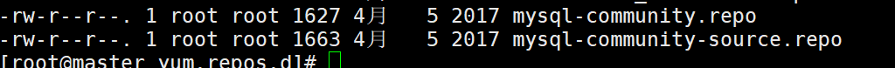

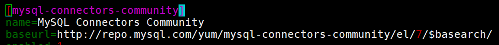

```
yum -y install mysql57-community-release-el7-10.noarch.rpm
```

- 使用yum安装`mysql5.7`

  - `nogpgcheck`，不检查软件包的`gpg`签名，也就是不进行安全验证
  - 下图为mysql的依赖安装

  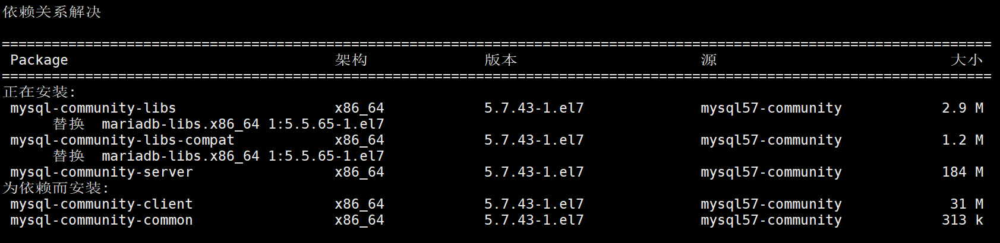
  
  

```
yum -y --nogpgcheck install mysql-community-server
```

- 卸载mysql的yum 存储库(repository)
  - 防止yum操作都会自动更新，需要把这个卸载掉
  - 卸载后/etc/yum.repos.d/文件夹中，mysql的yum存储库就会被删掉

```
yum -y remove mysql57-community-release-el7-10.noarch
```

##### 2.1.2 启动并配置mysql

- 启动mysql服务
  - mysql的服务在/usr/lib/systemd/system/中，所以sytemctl命令可以控制

```shell
systemctl start mysql
#or
systemctl start mysqld.service
```

- 设置开机自启

```
systemctl enable mysqld
```

- 查看状态

```
systemctl status mysqld
```

- 从mysqld.log文件中获取临时密码

```
grep "password" /var/log/mysqld.log
```


- 登录mysql
  - -p后有空格会123456会被认为是数据库名

```
mysql -uroot -p
请输入密码：7,>+0Od:XI<L
```

- 关闭密码复杂验证
  - 进入mysql客户端再进行
  - `validate_password_policy` 是 `MySQL` 数据库中的一个系统变量，用于设置密码策略的参数
    * `0`：低强度。不执行密码强度检查，接受任何密码。
  - 将 `validate_password_length` 设置为 `1` 是一个非常低的密码最小长度要求，它要求密码至少只需要一个字符

```
set global validate_password_policy=0;
set global validate_password_length=1;
```

- 设置密码
  - 修改当前登录用户的密码，其中：user() 方法将返回当前用户信息

```
alter user user() identified by "123456";
```

- 开放root用户远程登录
  
  - 赋予远程连接权限，可以用`navicat`连接操作数据库
  - `GRANT ALL PRIVILEGES`：该命令表示授予所有权限，即允许用户执行数据库中的任何操作，包括 SELECT、INSERT、UPDATE、DELETE 等。
  - `ON *.*`：这里的 `*.*` 表示该授权适用于所有数据库（所有库的所有表）。
  - `TO 'root'@'%'`：这指定了接收权限的用户。在这里，'root' 是用户名，'%' 表示该用户可以从任何主机（IP 地址）连接到 MySQL 服务器。
  - `IDENTIFIED BY '123456'`：这设置了用户 'root' 的密码为 '123456'。
  - `WITH GRANT OPTION`：这个选项允许用户 'root' 授予其他用户与自己相同的权限。如果没有这个选项，用户 'root' 将无法将自己的权限授予其他用户。
  
  需要特别注意的是，将 'root' 用户的权限设置为 "ALL PRIVILEGES" 并允许从任何主机连接，是一个安全风险。

```shell
# 切换数据库
use mysql;
# 修改权限
GRANT ALL PRIVILEGES ON *.* TO 'root'@'%' IDENTIFIED BY '123456' WITH GRANT OPTION;
# 刷新权限
flush privileges; 
# 退出
exit;
```

##### 2.1.3 修改mysql编码

- 修改编码防止中文乱码

- 编辑配置文件：`vim  /etc/my.cnf`

```
[client]
default-character-set = utf8mb4
[mysqld]
character-set-server = utf8mb4
collation-server = utf8mb4_general_ci
```

- 重启mysql

```
systemctl restart mysqld
```

- 登录并查看mysql编码

```shell
# 123456需替换为自己的密码
mysql -uroot -p123456

# 需在MySQL的shell中执行
show variables like "%char%";
```

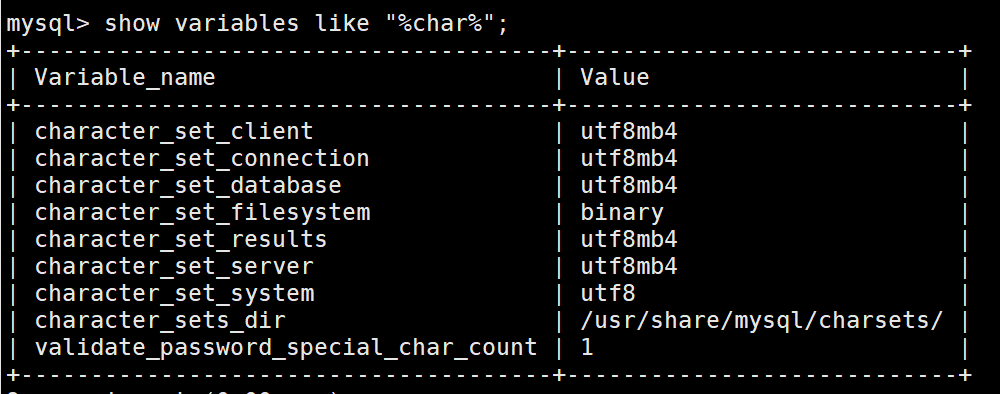

##### 2.1.4 mysql的卸载方式

- 删除依赖包
  - -qa query all
  - -i  insensitive  表示不区分大小写

```shell
# 查找mysql相关的安装包
rpm -qa |grep -i mysql
# 对mysql相关的包进行移除
# yum会处理依赖，所以mysql-community-client-5.7.43-1.el7.x86_64即使不写上也会被删除
yum remove mysql-community-server mysql-community-libs mysql-community-common
```

- 清理文件

```
# 查询残余mysql文件
find / -name mysql
# 删除查找出来的问价
rm -rf 文件名
```

#### 2.2 MySQL客户端的使用

##### 2.2.1 linux进入客户端

- 命令：`mysql -uroot -p123456`

##### 2.2.2 连接navicat

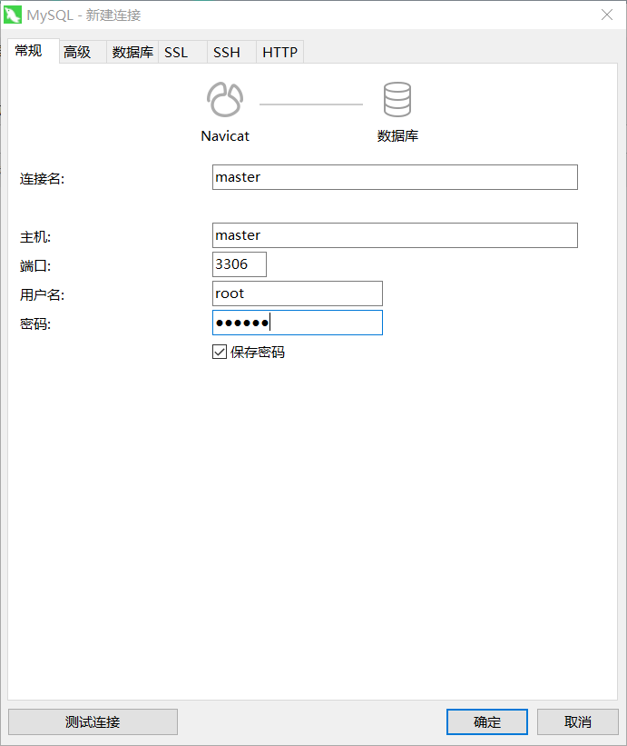

## 第二部分 数据库、表、列基本概念

### 1、MySQL数据库服务器、数据库和数据表的关系

- 安装MySQL的C/S模式，Client/Service，用户端/服务端

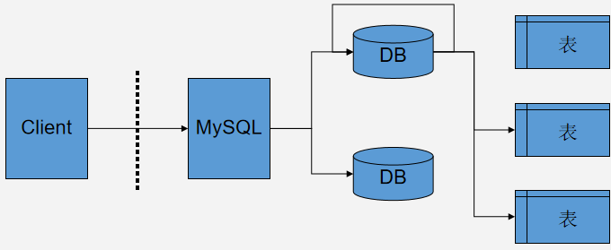

### 2、DDL操作数据库

- CRUD
- 切换数据库

```
USE db_name;
```

#### 2.1 C(create)：创建

- 通过sql创建

```sql
CTREATE DATABASES [IF NOT EXISTS] students;
```

- 创建时指定字符集

```
CTREATE DATABASES [IF NOT EXISTS] students DEFAULT CHARSET=utf8mb4;
```

#### 2.2 R(retrieve)：查询

- 显示所有数据库

```
SHOW DATABASES
```

- 显示数据库创建语句
  - 可以查看字符集

```
SHOW CREATE DATABASE db_namae
```

- 显示当前数据库

```
select database();
```

#### 2.3 U(update)：修改

- 修改数据库的字符集

```
ALTER DATABASE students CHARSET=utf8mb4;
```

#### 2.4 D(delete)：删除

```
DROP DATABASE  [IF EXISTS]  db_name
```

### 3、DDL操作数据表

#### 3.1  C(create)：创建

```sql
CREATE TABLE [IF NOT EXISTS]  students(
  id VARCHAR(255) PRIMARY KEY,
  name VARCHAR(255) NOT NULL,
  age INT,
  gender VARCHAR(255),
  clazz VARCHAR(255)
);
```

- 指定数据表创建和修改的时间

```sql
created_at DATETIME DEFAULT CURRENT_TIMESTAMP,
updated_at TIMESTAMP DEFAULT CURRENT_TIMESTAMP ON UPDATE CURRENT_TIMESTAMP,
```

- 复制表结构

```sql
CREATE TABLE student2 like student
```

- 复制表结构和表数据

```sql
CREATE TABLE student2 as SELECT * FROM student
```

#### 3.2 R(retrieve)：查询

- 显示所有数据表

```sql
SHOW  tables;
```

- 显示建表语句

```sql
SHOW CREATE TABLE student;
```

- 显示表结构(discribe)

```
DESC student;
```

#### 3.3  U(update)：修改

- 增加列，需要指定列的类型

```sql
alter table students add length float;
```

- 修改列类型,属性

```sql
alter table students modify length int not null;
```

- 删除列

```sql
alter table students drop length;
```

- 修改列名

```sql
alter table  student change id sid varchar(255);
```

- 修改字符集

```sql
alter table student character set utf8;
```

- 修改表名

```sql
rename table students to student;
```

#### 3.4 D(delete)：删除

- 删除数据表

```sql
DROP TABLE [IF EXISTS ] students;
```

## 第三部分 数据类型和约束

### 1、数据类型

```sql
-- 数值类型：INT、BIGINT、FLOAT、DOUBLE，DECIMAL等。
-- 字符串类型：CHAR、VARCHAR、TEXT等。
-- 日期和时间类型：DATE、DATETIME、TIMESTAMP等。
-- 二进制类型：BLOB、LONGBLOB、VARBINARY等。
-- 枚举类型：ENUM。
-- 集合类型：SET。
```

#### 1.1 数值类型

- DECIMAL(10,2)，表示小数，10为全部位数，2为小数位数

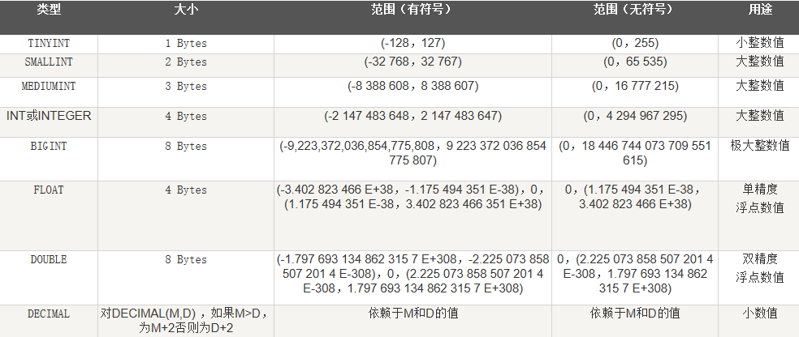

#### 1.2 字符类型

- UTF－8：一个汉字＝3个字节 GBK：一个汉字＝2个字节
- char是定长字符串，varchar为变长字符串
  - VARCHAR(255)，表示最大长度，可以根据值的长度动态变化

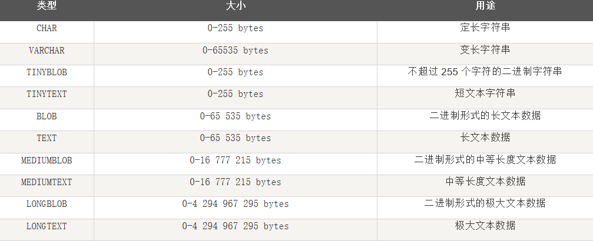

#### 1.3日期和时间类型


### 2、约束

#### 2.1 PRIMARY KEY （主键）

- 用于唯一标识表中的每一行数据，通常使用整数类型的列。不能为空，且不能重复

```sql
id VARCHAR(255) PRIMARY KEY,
```

#### 2.2 FOREIGN KEY (外键)

- 用于定义列与其他表的关系，保证引用完整性。
- 用于建立表与表之间的关联关系。
- 外键，关联的字段类型必须一样

```sql
CREATE TABLE customers (
    id INT ,
    customer_name VARCHAR(50)
);
CREATE TABLE orders (
	order_id INT,
    FOREIGN KEY (customer_id) REFERENCES customers(id)  -- customer_id设置为外键
    													-- id被引用字段
);
```

- 外键的级联

  - cascade

  - 当设置为外键为级联方式，

    删除或更新被引用的字段的某个值时，也会对设置为外键的字段的相同值，做出同样的删除或更新操作

#### 2.3 UNIQUE （唯一键）

- 保证列中的所有值都是唯一的，可以包含空值。

```sql
email VARCHAR(100) UNIQUE
```

#### 2.4 AUTO_INCREMENT （自动增长）

- 自动增长只能给整数类型的主键

```sql
id VARCHAR(255) PRIMARY KEY AUTO_INCREMENT
```

#### 2.5 NOT NULL （非空）

- 确保列中不包含空值。

```sql
name VARCHAR(50) NOT NULL
```

#### 2.6 DEFUALT （默认值）

- 在插入新行时，如果没有指定列的值，则使用默认值。

```sql
role ENUM('admin', 'user') DEFAULT 'user'
```

#### 2.7 CEACK （检查）

- 用于确保列中的值满足特定的条件，可以使用各种表达式和运算符来定义。

```sql
age INT CHECK(age >= 18)
```

## 第四部分 SQL语言基础

### 1、SQL语言简介

- Structured Query Language, 结构化查询语言
- SQL是用来存取关系数据库的语言，具有查询、操纵、定义和控制关系型数据库的四方面功能

### 2、SQL分类

- DDL 
  数据定义语言 - Data Definition Language
  是用于定义和管理数据库、表结构的语言，如数据表、视图、索引等
- DML 
  数据处理语言 - Data Manipulation Language
  在数据库表中更新，增加和删除记录
  如 update， insert， delete
- DCL
  数据控制语言 – Data Control Language
  指用于设置用户权限和控制事务语句
  如 grant，revoke，if…else，while，begin transaction
- DQL
  数据查询语言 – Data Query Language
  如 select

```sql
DDL：create、alter、drop、truncate
DML：insert、update、delete
DQL：select
DCL：
```

### 3、SQL语言的基本操作

### 3 DML

#### 3.1 INSERT （增）

- 一次插入一条

```sql
INSERT INTO students (id,name,age,gender,clazz)VALUES (1500100001,"施笑槐",22,"女","文科六班")
```

- 一次插入多条

  - 1)

  ```sql
  INSERT INTO students (id,name,age,gender,clazz)VALUES (1500100001,"施笑槐",22,"女","文科六班");
  INSERT INTO students (id,name,age,gender,clazz)VALUES (1500100002,"吕金鹏",24,"男","文科六班");
  INSERT INTO students (id,name,age,gender,clazz)VALUES (1500100003,"单乐蕊",22,"女","理科六班");
  INSERT INTO students (id,name,age,gender,clazz)VALUES (1500100004,"葛德曜",24,"男","理科三班");
  INSERT INTO students (id,name,age,gender,clazz)VALUES (1500100005,"宣谷芹",22,"女","理科五班");
  ```

  - 2)

  ```sql
  INSERT INTO students (id,name,age,gender,clazz)VALUES (1500100001,"施笑槐",22,"女","文科六班")
  ,(1500100002,"吕金鹏",24,"男","文科六班")
  ,(1500100003,"单乐蕊",22,"女","理科六班")
  ,(1500100004,"葛德曜",24,"男","理科三班")
  ,(1500100005,"宣谷芹",22,"女","理科五班");
  ```

- 入股插入的值对应字段名，字段名可以不写

```sql
INSERT INTO students VALUES (1500100001,"施笑槐",22,"女","文科六班")
```

- 自动递增的字段名和值不用给，但是其他字段的字段名不能缺少
  - id设置了自动递增

```sql
INSERT INTO students (name,age,gender,clazz)VALUES ("施笑槐",22,"女","文科六班")
-- 不给字段名用0或null占位
insert into students VALUES(0 | null,"施笑槐",22,"女","文科六班");	
```

- 插入查询的数据
  - 确保两个表的结构相同，以便可以正确执行插入操作。

```sql
INSTER INTO student  SELECT * FROM student2
```

#### 3.2 UPDATE （更新）

```sql
UPDATE table_name 
SET column1 = value1, column2 = value2, ...
WHERE some_column = some_value;
```

#### 3.3 DELETE （删）

```
DELETE FROM table_name
WHERE some_column = some_value;
```

### 4 DQL

- select 1+null  返回 null
- select  "a" +null 返回null
- select * ,1 as new from score ，会新增一个新列，值都是1

#### 查询所有

```sql
SELECT * 
FROM students;
```

#### dinstinct 

- 去重
  - 去重指定列的重复值，会去除一行

```sql
SELECT DISTINCT column_name
```

#### IF function

- IFNULL(cid, 值1 )如果column_name为空返回 值1

```
SELECT IFNULL(column_name, 值1 ) FROM table_name
```

- IF(condition,值1,值2)，如果condition成立，则返回值1，否则返回值2

#### concat 

- 字符串拼接

- select  concat ("a","-","b",null)  返回 null

#### concat_ws

- concat wiht separator 通过分隔符连接

- select  concat_ws("-","a","b",null) 返回 a-b

#### LIMIT

```sql
SELECT * 
FROM students
LIMIT 10;
```

#### where

```sql
SELECT *
FROM students
WHERE age>22;
```

#### LIKE

```sql
SELECT * 
FROM students
WHERE clazz LIKE "%文科六班%";
```

#### ORDER BY 

- ASC 升序
- DESC 降序

```sql
SELECT * 
FROM students
WHERE age>22
ORDER BY age ASC;
```

#### GROUP BY

- 分组的字段的必须带一个，不然报错
- 没有分组的字段，并且没有聚合的字段也不能带，不然报错
- 聚合函数
  - max，min，avg，sum，count

```sql
SELECT   clazz
        ,gender
        ,MAX(age)
FROM students
GROUP BY clazz,gender;
```

#### JOIN

-  join | inner join ：内连接
-  left join ：左外连接， right join：右外连接，  full join：全外连接
-  ON后面是一个condition ，表示满足该condition的时候进行关联
   -  ON t1.score > t2.score  表示 当t1.score大于t2.score时，数据行进行关联

```sql
SELECT *
FROM students 
JOIN score  ON students.id=score.id
JOIN subject ON score.subject_id=subject.subject_id;
```

#### 嵌套查询

```sql
select	t1.*
				,t2.subject_id
				,t2.sco
				,t3.subject_name 
from (
    (select	id
                    ,name
                    ,age
                    ,gender
                    ,clazz
    from students) as t1
    join 
    (select	id
                    ,subject_id
                    ,sco
    from score) as t2
    join 
    (select * from subject) as t3
    on t1.id=t2.id and t2.subject_id=t3.subject_id
);
```

### 5 DCL

#### 5.1 管理用户

- 用户所在位置   mysql.user

* 添加用户：

  * 可以用添加的用户，代替root进行登录

  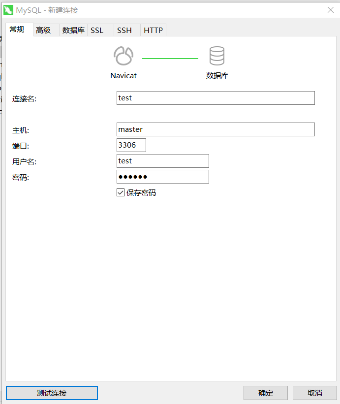

  * 关闭密码复杂验证

    ```
    set global validate_password_policy=0;
    set global validate_password_length=1;
    ```

  * 语法：

    * 主机名可用%代替，表示任何主机

    ```
    CREATE USER '用户名'@'主机名' IDENTIFIED BY '密码';
    ```

  * 例子：

    ```
    CREATE USER 'zhangsan'@'localhost' IDENTIFIED BY '123';
    
    CREATE USER 'lisi'@'%' IDENTIFIED BY '123';
    ```

* 删除用户：

  * 语法：

    ```
    DROP USER '用户名'@'主机名';
    ```

  * 例子：

    ```
    DROP USER 'zhangsan'@'localhost';
    ```

* 修改用户密码：

  * 语法：

    ```sql
    -- 老版本的写法 
    -- UPDATE USER SET PASSWORD = PASSWORD('新密码') WHERE USER = '用户名';
    
    SET PASSWORD FOR '用户名'@'主机名' = PASSWORD('新密码');
    
    ALTER USER '用户名'@'主机名' IDENTIFIED BY '新密码';
    ```

  * 例子：

    ```sql
    set password for 'lisi'@'%' = password('234567');
    ```

* 查询用户：

  * 1.切换到mysql数据库

    ```sql
    USE mysql;
    ```

  * 2.查询user表

    ```sql
    select * from user;
    ```

    > 通配符： % 表示可以在任意主机使用用户登录数据库 

    

#### 5.2.权限管理

- 权限列表

```
SELECT, INSERT, DELETE, CREATE, DROP, RELOAD, SHUTDOWN, PROCESS, FILE, REFERENCES, INDEX, ALTER, SHOW DATABASES, SUPER, CREATE TEMPORARY TABLES, LOCK TABLES, EXECUTE, REPLICATION SLAVE, REPLICATION CLIENT, CREATE VIEW, SHOW VIEW, CREATE ROUTINE, ALTER ROUTINE, CREATE USER, EVENT, TRIGGER, CREATE TABLESPACE
```

* 查询权限：

  * 语法：

    ```sql
     SHOW GRANTS FOR '用户名'@'主机名';
    
     SHOW GRANTS FOR 'lisi'@'%';
    ```

* 授予权限：

  * 语法：

    > with grant option 表示带上授权的功能

    ```sql
    grant 权限列表 on 数据库名.表名 to '用户名'@'主机名' [with grant option];
    ```

  * 例子：  

    ```sql
    -- 将表db3.account的SELECT ,DELETE, UPDATE权限授予用户'lisi'@'%'
    GRANT SELECT ,DELETE, UPDATE  ON db3.account TO 'lisi'@'%';
    
    -- 给zhangsan用户所有权限  
    
    GRANT ALL  ON *.* TO 'zhangsan'@'localhost'
    ```

* 撤销权限：

  * 语法：

    ```
    revoke 权限列表 on 数据库名.表名 from '用户名'@'主机名';
    ```

  * 例子：

    ```sql
    -- 将用户'lisi'@'%'对于表db3.account的更新权限撤销
    REVOKE UPDATE ON db3.account FROM 'lisi'@'%';
    
    -- 给lisi用户撤销所有权限
    REVOKE ALL ON *.* FROM 'lisi'@'%';
    ```

### 6、其他操作

#### 6.1 LOAD

- 加载数据文件（mysql shell中执行）
  - 注意转义符号 `\` ，可以换成`/`或 `\\`

```
LOAD DATA LOCAL INFILE 'G:/BigData26/MySQL/data/student.txt' INTO TABLE students FIELDS TERMINATED BY ',';
```

- linux执行LOAD命令时，如果文件来自windows，可以用pycharm把换行符设置为LF，也就是\n

  不然，会导致最后一列的值中有\r

  -  windows的换行符：\r\n  CRLF
  - linux的换行符：\n  LF

#### 6.2 mysqldump

- dump  转储

- 把数据表对应的sql文件，从linux中导出

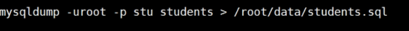

#### 6.3 source 

- 执行指定sql文件

```
mysql>  source /root/data/students.sql
```

#### 6.4 取整函数

```
round(98.99999,2) ，保留两位小数，并且四舍五入

floor(98.99999)  向下取整

ceil(98.99999)   向上取整
```

## 第五部分 基本查询

### 1、WHERE （搜索）

```
WHERE子句可以使用以下比较运算符：
=（等于）
<（小于）
>（大于）
<=（小于或等于）
>=（大于或等于）
<>或!=（不等于）
还可以使用逻辑运算符（AND、OR和NOT）来组合多个条件。
exist
any，all 多指比较
```

- 模糊搜索
  - 通配符 ：%   _

```
SELECT * FROM students WHERE clazz like ‘%文科%’
```

- in(集合)
  - 搜索符合in集合内的内容

```
select * from students where clazz in ('文科一班','文科二班','文科三班');
```

- BETWEEN AND

```sql
select * from students where age BETWEEN 22 AND 24;
-- 返回年龄在22到24的学生
```

### 2、ORDER BY  （排序）

- ORDER BY子句用于对查询结果按照一个或多个列进行排序。
- 默认升序

```sql
SELECT column1, column2, ...
FROM table_name
ORDER BY column1 [ASC | DESC], column2 [ASC | DESC], ...
```

### 3、GROUP BY 和 HAVING  （分组和过滤）

#### 3.1 GROUP BY 

- GROUP BY子句用于将查询结果按照一个或多个列进行分组，并对每个组进行聚合计算

  - max、min、sum、avg、count
  - count(1) 和count(*)都是统计所有的行
  - count(cid) 统计不为null的cid个数
  - **只有数值型的数据删除后为null    count  不能统计到 null值**
  - **varchar类型的数据删除后为空字符 ''"    count 能够统计到 空字符**
- 想要group by 的排序不起作用，可以加上order by  null

```sql
SELECT column1, column2, ..., aggregate_function(column_name)
FROM table_name
GROUP BY column1, column2, ... 
ORDER BY  null
```

- 聚合函数运作原理
  - 聚合函数如果没有分组的情况下，就是一次查询后再进行统计，而不是对每条数据进行统计
    如果加上分组的话，聚合函数就是在每个分组查询完成后执行
    如果加上聚合函数中加上if判断，那么就会等符合条件的数据查询完成后，再进行统计

```sql
SELECT SUM(IF(score>=60 , 1, 0)) /count(*) -- 每组大于等60的占比
FROM score
GROUP BY cid  
-- 每个分组所有数据IF判断结束后，再进行聚合操作
```

#### 3.2 HAVING  

- HAVING子句用于对分组后的结果进行过滤，只返回符合条件的分组。它接受一个或多个聚合函数作为参数，并可指定每个函数的过滤条件。

  - having  不能够过滤select 没查出来的字段

    having 可以聚合没查的字段

  ```sql
  select sid
  from score
  having COUNT(cid) -- and cid="01" 会报错
  -- having  不能够过滤select 没查出来的字段
  -- 但是having 可以聚合没查的字段
  ```

- 注意
  - 分组的字段的必须带一个，不然报错
  - 没有分组的字段，并且没有聚合的字段也不能带，不然报错

```sql
SELECT column1, column2, ..., aggregate_function(column_name)
FROM table_name
GROUP BY column1, column2, ...
HAVING condition;
```

- 

### 4、LIMIT 和 OFFSET  （限制和偏移量 ）

- LIMIT用于限制查询结果集的行数。
- OFFSET用于指定查询结果集的偏移量。
  - 如偏移量为2，则会从第3行返回数据

```sql
SELECT column1, column2, ...
FROM table_name
LIMIT number 

SELECT column1, column2, ...
FROM table_name
LIMIT number OFFSET offset;

-- 从offset+1开始，返回number行数据
SELECT column1, column2, ...
FROM table_name
LIMIT offset,number
```

### 5、union （行合并）

- union 合并行

```sql
(SELECT * FROM students LIMIT 0,10)
UNION s
(SELECT * FROM students LIMIT 4,10)
```

- union all 不去重

```sql
(SELECT * FROM students LIMIT 0,10)
UNION ALL
(SELECT * FROM students LIMIT 4,10)
```

### 6、执行顺序

- 从上往下

```
FROM: 从表中选择数据，生成虚拟表（视图）。
WHERE: 对虚拟表中的数据进行筛选，满足条件的数据被保留。
GROUP BY: 将数据按照指定的字段进行分组，生成分组后的结果。
SELECT: 对分组后的结果进行选择，并进行聚合函数的计算。
HAVING: 对聚合函数的结果进行筛选，满足条件的分组被保留。
ORDER BY: 对结果进行排序。
LIMIT: 限制结果的数量。
```

### 7、子查询

- where  sid in （select sid in student），子查询的一列可以作为in的集合
- hive不支持where子查询

# 扩展知识

## 1、清空表和截断表

```
清空表 delete ，存在日志和记录，可以恢复

截断表 truncate，没有日志
```

## 2、mysql数据表在liunx的存储位置

```
数据存储位置  cd /var/lib/mysql

数据存储路径配置 vim /etc/my.cnf
```

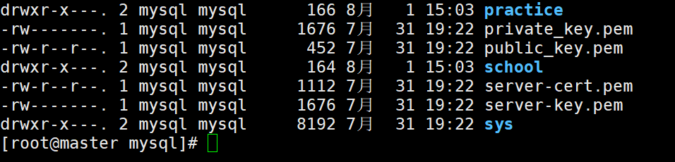


## 3、中文的比较

- 中文的比较 utf8  解析为16进制比较
  - 虽然六大于四，但是解析为utf8的十六进制之后，六的十六进制小于四的十六进制

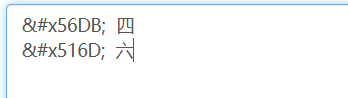

## 4、日期函数

```sql
# 获取当前日期时间
select NOW(); # 2021-04-02 09:25:29
# 获取当前日期
SELECT CURDATE(); # 2021-04-02
# 获取当前时间
SELECT CURTIME();  # 09:26:10

# 时间减少1小时（前一小时）
select date_sub(now(), INTERVAL 1 hour);

# 日期增加1天
select date_add(now(), INTERVAL 1 day);

-- 日期格式化、字符串转日期
# 格式化参考：
select DATE_FORMAT(now(),'%Y-%m-%d %H:%i:%s');
select DATE_FORMAT(now(),'%Y-%m-%d %H:00:00');

#字符串转日期
select str_to_date('2021-04-02 10:37:14', '%Y-%m-%d %H:%i:%s'); # 2021-04-02 10:37:14

-- 将具体时间时间转为timestamp
SELECT UNIX_TIMESTAMP('2017-05-15 10:37:14');-- 指定日期时间的时间戳：1494815834
-- 将时间戳转为具体时间
SELECT FROM_UNIXTIME(1494815834, '%Y年%m月%d日 %h时%分:%s秒');-- 获取时间戳对应的格式化日期时间

-- 截取从pos位置开始到最后的所有str字符串
SUBSTR (str, pos, len)
-- 返回本周的第几天
SELECT WEEKDAY('2017-05-21 10:37:14')
```

# MySQL数据常用操作

- 注释： -- # /**/

## 1、navicat操作MySQL

- 可以用dbeaver平替
- 首先连接
- 创建数据库

### 1.1 创建数据表

- 创建数据表，创建完成后要保存

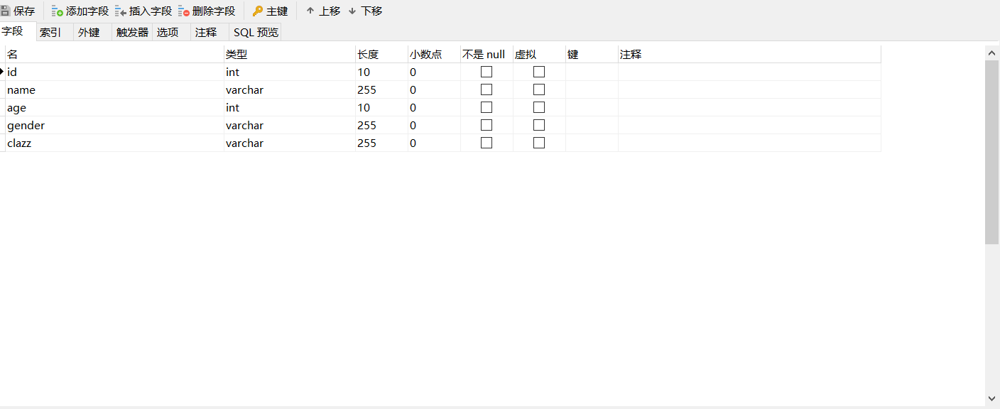

- 查看元数据
  - 元数据
    - 元数据（Metadata）是关于数据的数据，用于描述数据的特征、属性和内容。

- 导出建表语句


### 1.2 执行sql语句

### 1.3 导入数据文件

- 导入向导

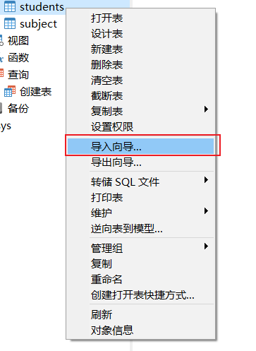

- 选择文件格式

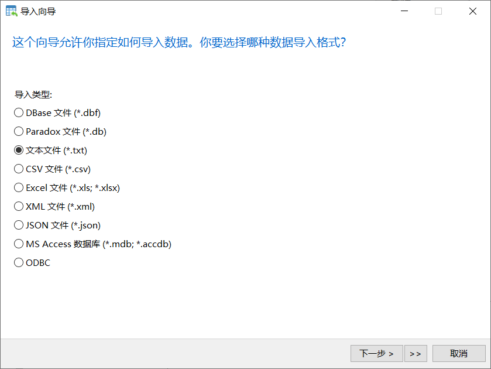

- 选择文件路径

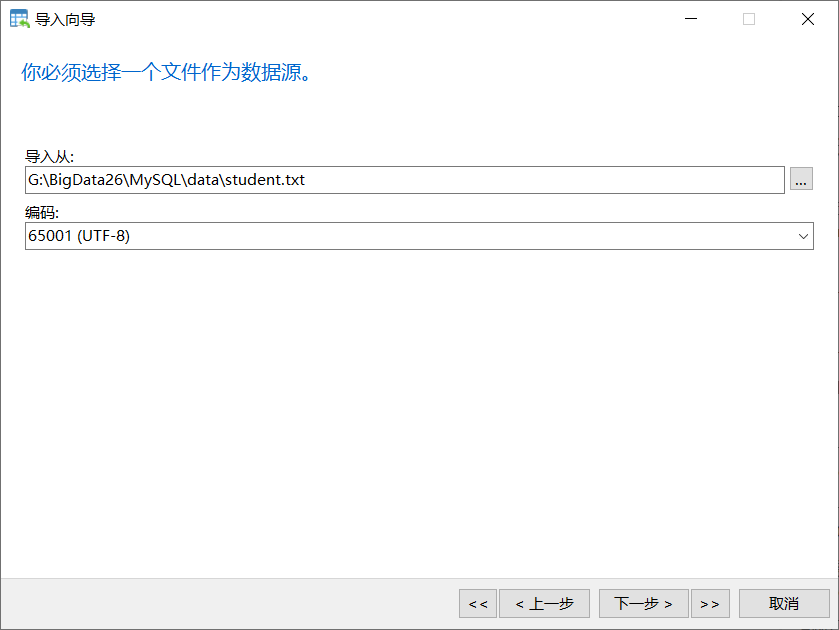

- 配置换行符和分隔符

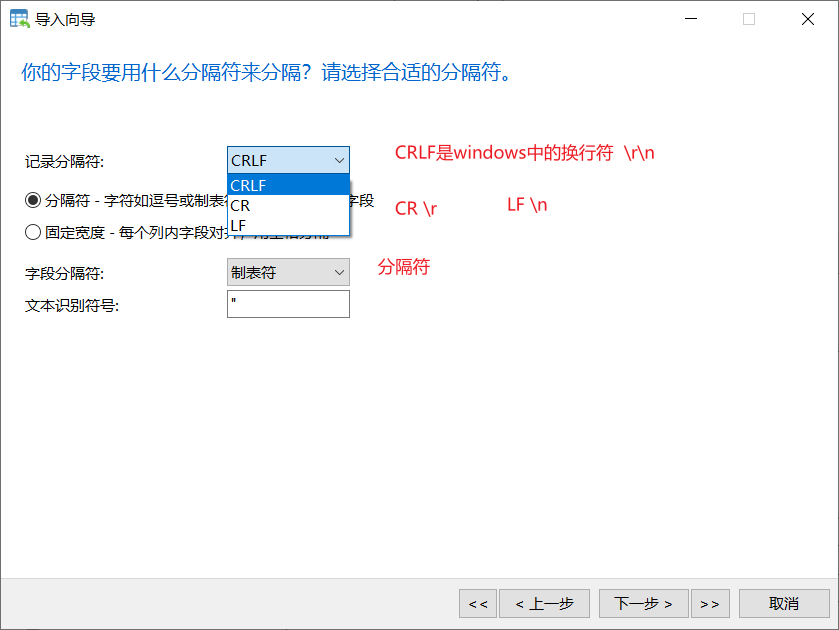

- 设置head

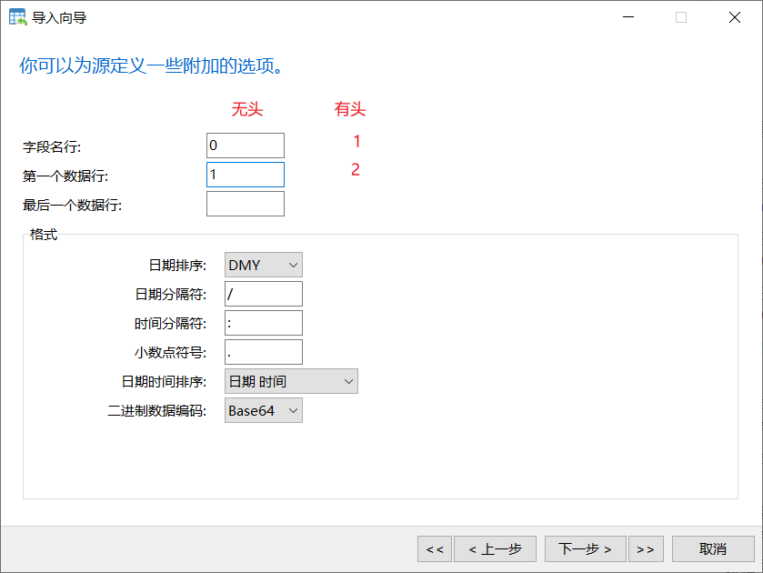

- 设置对应字段

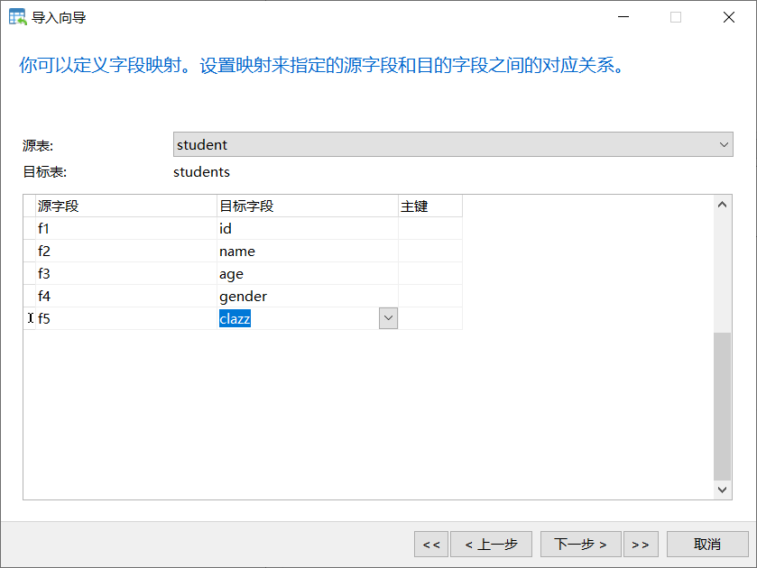

### 1.4 导出数据文件

- 导出向导

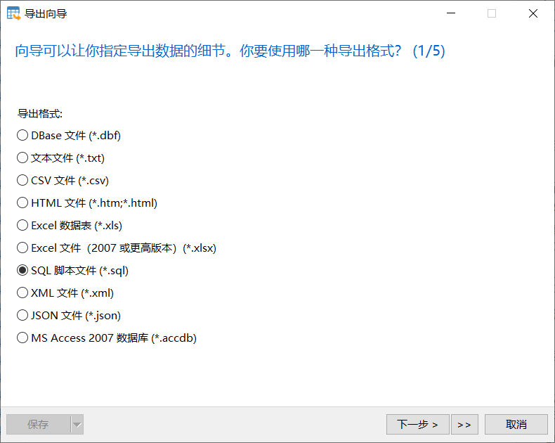

- 选择数据表
- 

### 1.5 导出sql文件

- 转储SQL文件

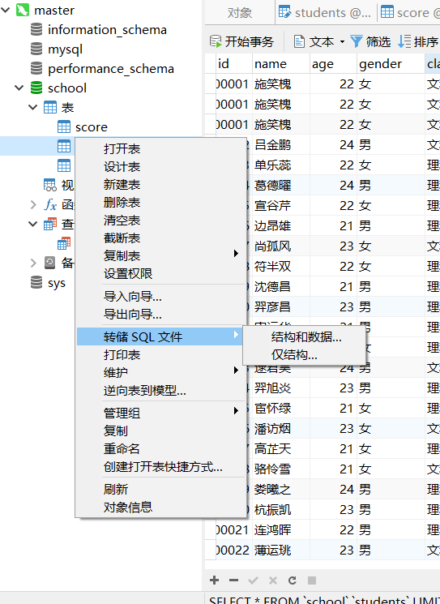

### 1.6 运行sql文件


## 2、python操作MySQL

### 2.1 准备

- 安装pymysql库

```
pip install pymysql
```

- 导入pymysql库

```
import pymysql
```

- 创建数据库连接

```
conn = pymysql.connect(host='master', port=3306, user='root', password='123456', database='school')
```

- 创建数据库操作对象：游标

```
cursor = conn.cursor()
```

- 执行sql

```
sql = "select * from students where id=1500100001"
cursor.execute(sql)  # 返回指定数据
```

- 获取DQL返回数据
  - 值得注意的是，每次查询后的，下一次查询的起始位置就是上一次查询的结束位置
    这点和文件读写很像

```python
 # 查询一条数据 ，返回一个元组
rows1 = cursor.fetchone() 
# 查询所有数据，返回一个元组
rows2 = cursor.fetchall()  
 # 查询指定行数
rows3 = cursor.fetchmany(10) 
```

- pymysql执行DML时，需要手动提交事务

```sql
sql="insert into students values(0,'name','age','gender','clazz')"

cursor.execute(sql)
connect.commit()
```

- 回滚
  - 如果执行出错，可以通过回滚的方式，让数据恢复到执行之前的状态

```sql
conn.rollback()
```

- 关闭连接

  - 手动关闭

  ```sql
  cursor.close()
  conn.close
  ```

  - 自动关闭
    - with语句，自动执行关闭语句

  ```sql
  with pymysql.connect() as conn:  
  	with conn.cursor() as cursor:
  ```

### 2.2 传入参数

#### 1、静态指定

- 静态指定的参数，如果是字符串要加上引号

```python
sql = "select * from students where id='1500100001'"
cursor.execute(sql)
```

#### 2、字符串拼接

```python
sql = "select * from students where id=" +"'1500100001'"
cursor.execute(sql)
```

#### 3、占位符

- execute
  - 通过占位符，动态指定sql中的参数
    - 不要因为参数是 string 就在 %s 两边加引号，mysql 会自动去处理。

```python
sql = "select * from students where id=%s"
cursor.execute(sql, ("1500100001"))  # 返回指定数据
```

- executemany
  - 传入可迭代的数据容器，并且元素是元组
    - 根据元素个数，决定sql执行次数

```sql
sql = "select * from students where id=%s"
cursor.executemany(sql, [("1500100001"), ("1500100002")])  # 返回指定数据
```

### 2.3 sql注入

- 如果传参方式是 字符串拼接，可以通过sql注入的方式，导致where失效，获取所有数据
  - or 1=1 可以让where失效

```sql
id="'1500100001' or 1=1"
sql = "select * from where id="+id
```

- 通过占位符传参，可以避免sql注入
  - pymysql 的 execute 支持参数化 sql，通过占位符 %s 配合参数就可以实现 sql 注入问题的避免。
  - 这样参数化的方式，让 mysql 通过 预处理 的方式避免了 sql 注入的存在。
  - 需要注意的是，不要因为参数是其他类型而换掉 %s，pymysql 的占位符并不是 python 的通用占位符。

```python
# 对比字符串拼接和占位符

sql = "select * from students where id=%s"
cursor.execute(sql, ("1500100001 or 1=1"))  # 返回指定数据
print(cursor.fetchall())

id = "1500100001 or 1=1"
sql2 = "select * from students where id=" + id
# cursor.execute(sql2)  # 返回所有数据
print(cursor.fetchall())
```

### 2.4 把文件中的数据，插入到数据库中

```python
# Description: 把文件中的数据，插入到数据库中

import pymysql
if __name__ == '__main__':

    with open('./score.txt','r',encoding='utf8') as fp:
        line_list = fp.readlines()

    tuple_list = []
    for line in line_list:
        line_split = line.strip().split(',')
        tuple_list.append((line_split[0],line_split[1],line_split[2]))

    with pymysql.connect(host='master',port=3306,user='root',password='123456',database='school') as conn:
        with conn.cursor() as cursor:
            sql = "INSERT INTO score VALUES (%s, %s, %s)"
            try:
                cursor.executemany(sql, tuple_list)
            except Exception as e:
                print(e)
                conn.rollback()
            else:
                conn.commit()
```

