# Shell编程

## 第一部分 Shell简介

- Shell 是一个用 C 语言编写的程序，它是用户使用 Linux 的桥梁。

  Shell 既是一种命令语言，又是一种程序设计语言。

  Shell和Python类似也是一门解释性语言

### 1、脚本开头

- 指定脚本文件的Shell程序（解释器）

```
#!/bin/bash
或
#!/bin/sh
```

### 2、执行脚本

- sh aaa.sh
  - 常用
- ./ aaa.sh
  - 脚本文件需要可执行权限，并且需要在当前文件夹中
- aaa.sh
  - 脚本文件需要放入环境变量中

## 第二部分 基础语法

### 1、变量

- Shell中每一个变量的值都是字符串，无论你给变量赋值时有没有使用引号，值都会以字符串的形式存储。
- 在默认情况下，不会区分变量类型，即使你将整数和小数赋值给变量，它们也会被视为字符串

#### 1.1 定义变量

- 定义变量的三种方式
  - **注意等号两边不能有空格**
  - 单引号中，即使是特殊字符也会识别成字符串，其作用如python中的 r""

```python
# 不带引号
variable=value
# 带双引号
variable="value"
# 带单引号
variable='value'
```

- 命名规范
  - 变量名由数字、字母、下划线组成；
  - 必须以字母或者下划线开头；
  - 不能使用 Shell 里的关键字（通过 help 命令可以查看保留关键字）。

#### 1.2 引用变量

- 可以通过:$变量名、${变量名}。一般最好要加上{}

```python
a=10
b=${a}
echo ${b}
# 输出10
```

- 不加{}，可能带来的影响

```python
# 加{}
skill="java"
echo "I am good at ${skill}web"
输出:"I am good at javaweb"
# 不加{}
skill="java"
echo "I am good at $skillweb"
输出：I am good at 
# 变量名被识别为skillweb，由于无此变量，对应位置为空
```

#### 1.3 单引号和双引号的区别

- 单引号' '包围变量的值时，单引号里面是什么就输出什么，即使内容中有变量和命令（命令需要反引起来）也会把它们原样输出。
- 双引号" "包围变量的值时，输出时会先解析里面的变量和命令，而不是把双引号中的变量名和命令原样输出。
- 输出也可以不带引号，和双引号一样的作用

```python
skill="java"
# 双引号
echo "I am good at ${skill}"
输出：I am good at java
# 单引号
echo 'I am good at ${skill}'
输出：I am good at ${skill}
```

#### 1.4 将命令执行结果赋值给变量

- Shell 支持将命令的执行结果赋值给变量
  - ``的方式
  - $()的方式

```python
# 第一种
variable=`pwd`
# 第二种
variable=$()
```

```python
# 命令运行结果赋值给变量
echo `pwd`  # /root/shell_code
echo $(pwd)  # /root/shell_code
# 删除变量，但是不能删除readonly关键字限制的变量（只读变量）
unset age
echo ${age}
输出为空
```

#### 1.5 传递参数

- 在指定脚本的时候，可以在文件名后面跟上一些参数，以空格隔开
- 获取参数
  - ${0}：获取文件名（包含路径）
  - ${1}：获取文件名后面第一个参数
  - ${n}：获取文件名后面第n个参数

```python
echo ${0}
echo ${1}
echo ${2}
echo ${3}
# 执行命令：sh variable.sh name age weight
# 输出如下
variable.sh
name
age
weight
```

- 特殊字符处理参数说明

  - $#获取参数的个数，但是不包括文件名
  - $*获取的是一个参数拼接的字符串

  - $@获取的是各个参数的字符串

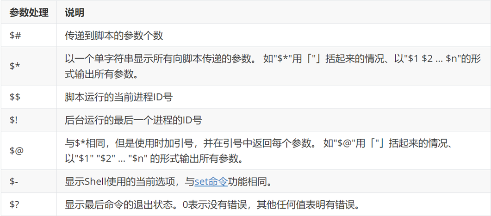

```python
echo $#
echo $*
echo $@
echo $$
# 指定命令：sh variable.sh name age weight
# 输出如下
3
name age weight
name age weight
15905
```

- $*和$@的区别
  - 假设在脚本运行时写了三个参数 1、2、3，，则 " * " 等价于 "1 2 3"（传递了一个参数），而 "@" 等价于 "1" "2" "3"（传递了三个参数）。

```python
for i in "$*"
do
 echo ${i}
done
echo "========"
for i in "$@"
do
 echo ${i}
# 输出如下
name age weight
========
name
age
weight

# 如果不带双引号，则$*和$@的结果一样
# 因为为 for i in item1 item2 item3，i会分别为item1 item2 item3
for i in $*
do
 echo ${i}
done
echo "========"
for i in $@
do
 echo ${i}
done
# 输出如下
name
age
weight
========
name
age
weight
```

### 2、字符串

- 字符串是 Shell 编程中最常用的数据类型之一

  除了数字和字符串，也没有其他类型了

#### 2.1 获取字符串长度

- 格式：${#name}

```python
# 获取字符串的长度
str_1="I'm a good man"
输出：14
```

#### 2.2 字符串拼接

- 将两个字符串并排放在一起就能实现拼接
  - 注意：如果不加双引号，变量直接的多个空格会被识别为一个空格

```python
name="djx"
age="18"
echo $name  $age
echo "$name  $age"
echo ${name}aaa${age}bbb
# 输出
djx 18
djx  18
djxaaa18bbb
```

#### 2.3 字符串截取

- Shell 截取字符串通常有两种方式：从指定位置开始截取和从指定字符（子字符串）开始截取。

- 从**指定位置**开始截取

  - 从左边开始计数 命令格式：`${name:start:length}`
  - 从右边开始计数 命令格式：`${name:0-start:length}`

  - **注意无论是从左开始计数还是从右开始计数，都会向右截取指定字符个数**
  - 如果，指定字符个数超出，会返回从指定开始位置，到右边的所有字符

```python
url="http://www.xxx.com/index.html"
# 从左开始向右截取
echo ${url:2:5}
echo ${url:2:100}
echo ${url:2}
# 从右开始向右截取
echo ${url:0-2}
echo ${url:0-1:10}
echo ${url:0-5:2}
# 输出结果：
tp://
tp://www.xxx.com/index.html
tp://www.xxx.com/index.html

ml
l
.h
```

- 从指定的子字符串开始截取
  - 截取子字符串的右边，命令格式：${name#*charts}
    - *相当于正则中作用
    - 不加*，会把指定的子字符也返回
    - ##会匹配到最右边的charts
    - 如果不需要忽略 chars 左边的字符，那么也可以不写*，
      - 会返回父字符串

  ```python
  ${url#*/}
  ${url##*/}
  ${url#/}
  # 输出
  /www.xxx.com/index.html
  index.html
  http://www.xxx.com/index.html
  ```

  - 截取子字符串的左边，命令格式：`${name%charts*}`
    - %%会匹配到最左边的charts

  ```python
  cho ${url%/*}
  cho ${url%%/*}
  cho ${url%%/}
  
  # 输出
  http://www.xxx.com
  http:
  http://www.xxx.com/index.html
  ```

  - 可以如果想返回指定内容可以，多加一点匹配字符

  ```python
  cho ${url#*m/}
  # 输出
  index.html
  ```

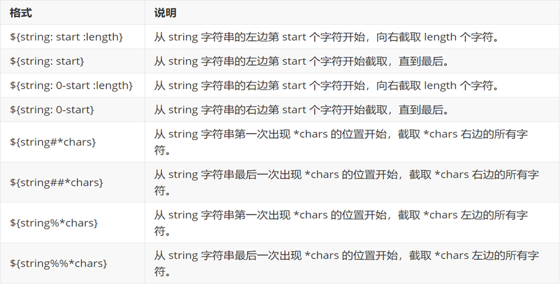

### 3、数组

- 定义数组的一般格式：arr=(1 2 3 4 "a" b c)
  - 以空格隔开，元素都是字符串，带不带引号都可以
  - 一般访问方式：${arr[0]}
  - 获取全部的数组元素：${arr[*]}或${arr[@]}
  - 数组切片：`${arr[*]:0:3}`
  - 注意：${arr}，返回的也是第一个元素

```python
# 数组
arr=(1 2 3 4 5 "c" b a)
echo ${arr[0]} 
echo ${arr[1]} 
echo ${arr[2]} 
echo ${arr[3]} 
# 切割数组
echo ${arr[*]:0:3}
# 循环遍历数组
for i in ${arr[*]}
do
 echo $i
done

#输出
1
2
3
4

1 2 3

1
2
3
4
5
c
b
a
```

- 获取数组的长度：`${#arr[*]}`
  - 和字符串的方法一样

### 4、关联数组

- Shell支持关联数组，可以使用任意的字符串、或者整数作为下标来访问数组元素。

  关联数组使用 declare 命令来声明

- 语法格式1：`declare -A site=(["google"]=1 ["taobao"]=2)`
  - 以键值对的形式存储
  - 不同元素要用空格隔开
- 语法格式2

```python
declare -A site
site["google"]=1
site["google"]=2
```

- 访问元素

```python
echo ${site["google"]}
# 输出
1
```

### 5、运算符

- 注意：**条件表达式要放在方括号之间，并且与==等符号和[]之间要有空格**

#### 5.1 算数运算符

- 命令格式

```python
`expr $a + $b`
# 或
$((a+b))
# 或
$[a+b]
```

- 假定变量 a 为 10，变量 b 为 20

  - *要加转义字符

  - 注意：**条件表达式要放在方括号之间，并且与==和[]要有空格**，

    例如: [$a==$b] 是错误的，必须写成 [ $a == $b ]。

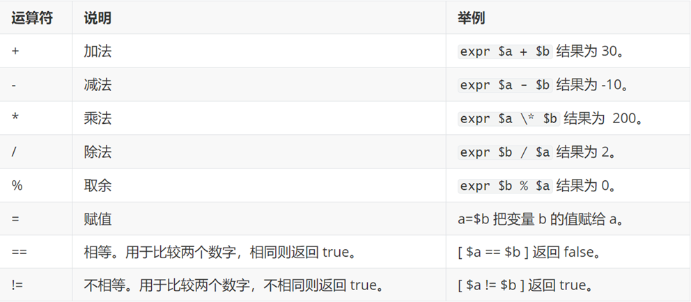

- 反引号中：* 需要转义一下，不然会有正则中通配符的作用

```python
a=10
b=20
echo "a*b=`expr $a \* $b`"
#输出
200
```

- ==、!=，结合if语句使用

```python
# == !=
if [ $a == $b ];then
 echo "a==b"
elif [ $a != $b ];then echo "a!=b"
else
 echo "error"
fi
# 输出
a!=b
```

#### 5.2 关系运算符

- 一般与if语句连用

- 假定变量 a 为 10，变量 b 为 20

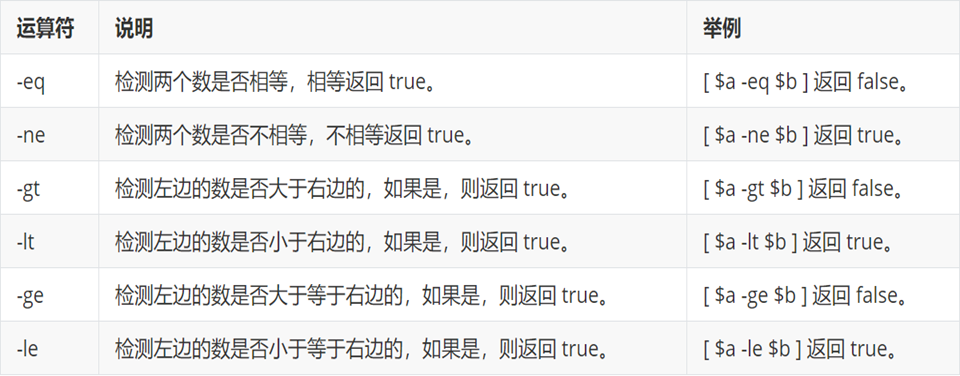

- 使用 ((...)) 作为判断语句，大于和小于可以直接使用 > 、<、<=、>=等

```
if (($a>$b))
```

#### 5.3 布尔运算符

- 一般与if语句连用

- 假定变量 a 为 10，变量 b 为 20

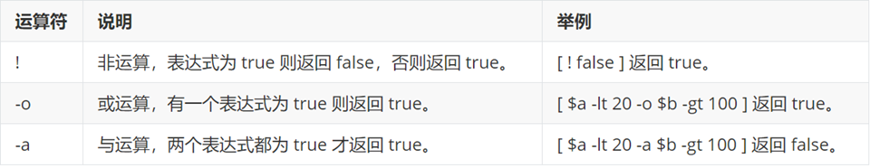

#### 5.3 逻辑运算符

- 一般与if语句连用

- 假定变量 a 为 10，变量 b 为 20
  - 注意这里是  [[]]，两个中括号

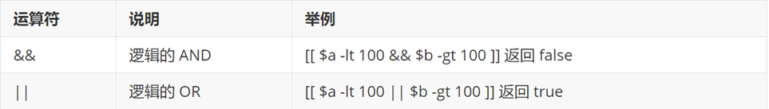

#### 5.4 字符串运算符

- 一般与if语句连用

- 假定变量 a 为 "abc"，变量 b 为 "efg"

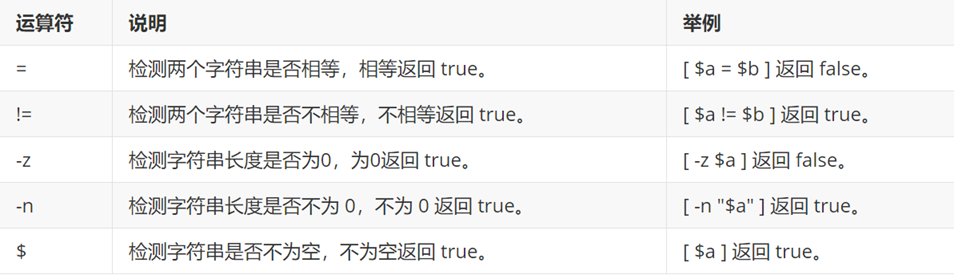

### 6、echo命令

- echo命令用于字符串的输出
- 显示普通字符

```
echo "这是一个字符串"
echo 这是一个字符串
```

- read，作用相当于python中的input
  - 从标准输入中读取一行,并把输入行的每个字段的值指定给 shell 变量

```python
read name
echo "${name} is test"
```

- 不换行
  - 用 -e 开启转义字符 \c不换行的作用
    - enable，开启
  - 使用选项 -n
    - no newline ，不换行

```python
echo -e "java shell python\c"
echo "这是下一行"

echo -n "java shell python"
echo "这是下一行"

# 输出
java shell python这是下一行
```

- 将显示内容重定向至文件

```shell
echo "This is a test" > file
echo "This is a test" >> file
```

- help echo ，查看echo命令的帮助文档

### 7、read命令

- read命令：读取从键盘输入的数据

- 命令格式：`read [-options] [variable]`
  - options表示选项，如下表所示；variables表示用来存储数据的变量，可以有一个，也可以有多个。
    - 多个变量值，默认空格间隔
  - 注意：如果接收多个变量，要在一行内输入所有的变量值，不能换行，否则只能给第一个变量赋值
  
- read支持的选项

  - -p prompt 提示

  ```shell
  read -p "please input a variable" varibale
  ```

  - -s silent 静默输入
    - 不会把输入内容显示出来

  ```
  read -s password
  ```

  - -n number 指定读取字符的个数

  ```shell
  read -n 1 variable
  # 输入：1234
  # 输出：1
  ```

  - -t timeout 指定时间内输入

  ```shell
  read -t 10 variable
  ```

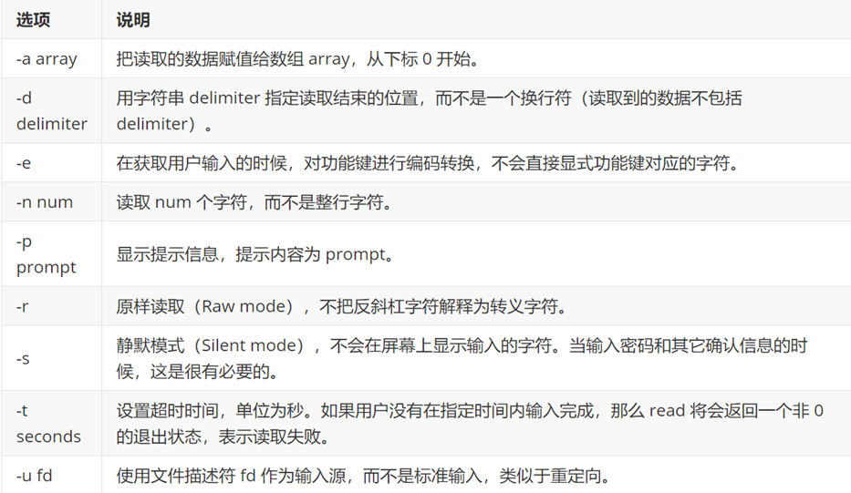

- 综合使用

```shell
#!/bin/sh

if 
   # 第一次输入密码
   read -s -t 20 -p "please input your password: " password1 && printf "\n" &&   
   # 第二次输入密码
   read -s -t 20 -p "please inout your password: " password2 && printf "\n" &&   
   # 判断两次密码是否相同
   [ ${password1} == ${password2} ]
then
   echo "valid password"
else
   echo "invalid password"
fi
```

### 8、printf命令

- 打印输出
- 命令格式：`printf  format-string  [arguments]`
  - format-string : 格式控制字符串
  - arguments : 占位符参数
  - %s 对应字符串参数，%c 对应字符参数，%d 对应整数参数，%f 对应浮点型参数
  - printf内的特殊字符可以发挥作用

```shell
#!/bin/sh
name="djx"
age=18
gender=m
printf "I'am %s,age is %d,gender is %c \n" $name $age $gender
# 输出
I'am djx,age is 18,gender is m
```

- 控制宽度，并保留指定位数的小数
  - -10s：指定的该字符宽度为10，少则全部输出，多则空格补齐
    - 任何字符都会被显示在 10 个字符宽的字符内，如果不足则自动以空格填充，超过也会将内容全部显示出来。
  - 带-表示左对齐
  - 不带-表示右对齐
  - %-10.2f: 表示保留两位小数，宽度为10，并左对齐

```shell
name="djx"
weight=102.22222
printf "%-10s is %-10.2f!\n" $name $weight
printf "%10s is %10.2f!\n" $name $weight
# 输出
djx        is 102.22     !
       djx is     102.22!
```

- printf转义序列

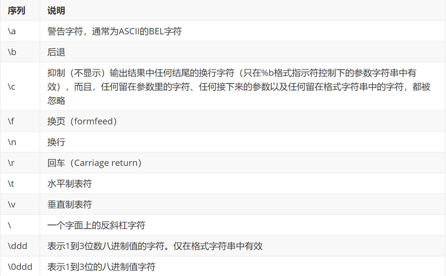

### 9、test命令

- test 命令用于检查某个条件是否成立，它可以进行数值、字符和文件三个方面的测试
- 作为判断条件condition

#### 9.1 数值判断

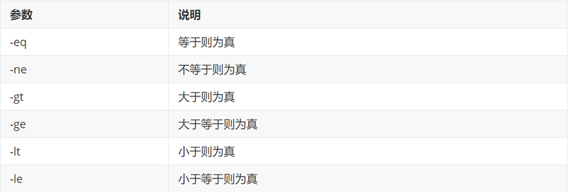

```shell
num1=10
num2=20
if test $num1 -eq $num2  
# 或 if [ $num1 == $num2 ] 或 if (($num1==$num2)) 或 if [ $num1 -eq $num2 ]
then
 echo "num1=num2"
else
 echo "num1!=num2"
fi
# 输出
num1!=num2
```

#### 9.2 字符串判断

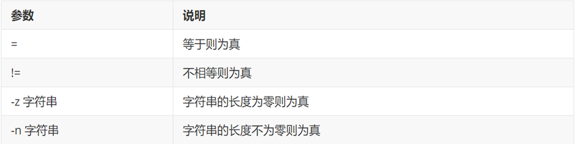

```shell
#!/bin/sh
str1="abc"
str2="abca"
if test $str1 = $ str2 && -z $str1
# 或 if [ -z $str1]
then 
 ehco "str1=str2 and str1 not is zore"
else
 echo "str1!=str2 or str1 is zore"
fi
# 输出
str1!=str2 and str1 is zore
```

#### 9.3 文件判断

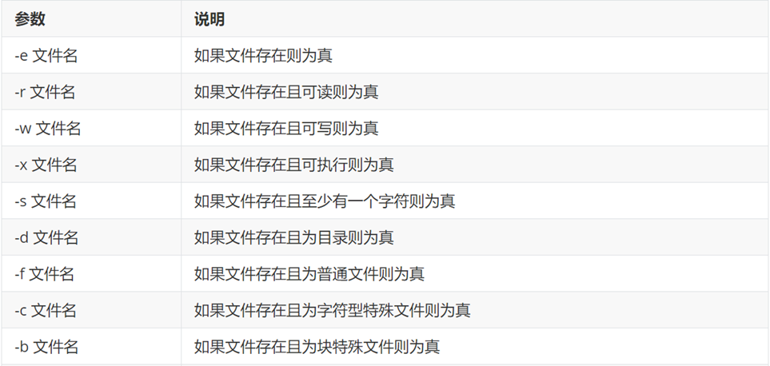

```shell
if test -e "/root/shell_code/test.sh"
# 或 if [ -e "/root/shell_code/test.sh"]
then
 echo "file is exist"
else
 echo "file not is exist"
fi
# 输出
file is exist
```


## 第三部分 流程控制

### 1、if-else

- 格式

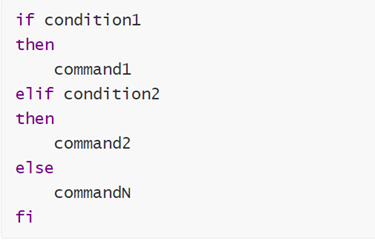

- if [] ，可以使用 -gt，-lt，-ge，-le

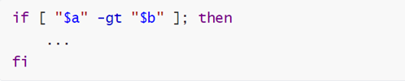

- if (())，可以使用 >，<， >=，<=，==，(())，不需要在意空格

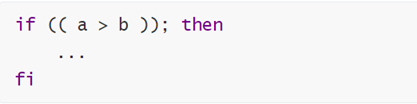

- 写成一行（适用于终端命令提示符）

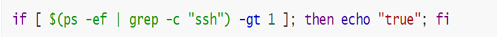

### 2、for循环

- 可以结合数组使用

- 格式

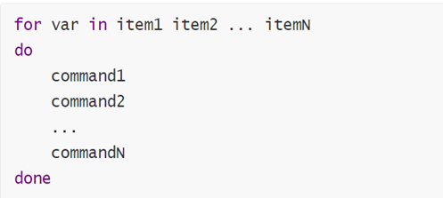

#### 2.2 sep生成序列

- `seq 1 1 10` 中，各个参数的含义如下：
  - `1`：起始值，表示序列的开始值为 1。
  - `1`：递增步长，表示每次递增 1，即生成的序列为连续的整数。
  - `10`：结束值，表示序列的结束值为 10。

```sh
for i in `seq 1 10`
do
 for j in `seq 1 $i`
 do
  echo -ne "$j * $i = `expr $i \* $j`\t"
 done
  echo
done
```

### 3、while循环

- while 循环用于不断执行一系列命令，也用于从输入文件中读取数据

- 格式

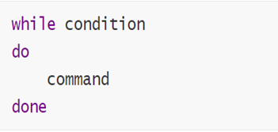

- 下例，使用了 Bash let 命令，它用于执行一个或多个表达式，变量计算中不需要加上 $ 来表示变量

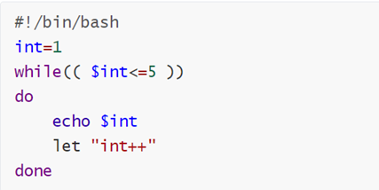

```python
#!/bin/bash
num=1
while (($num <= 5))
do
 echo $num
 let "num++"
done
```

- 循环输入

```shell
echo "按下CTRL+D停止"
while read item
do
 echo "你输入的是：$item"
done
# 输出
按下CTRL+D停止
w
你输入的是：w
d
你输入的是：d
c
你输入的是：c
d
你输入的是：d
```

- 无限循环

```shell
while :
do
done
# or
while ture
do
done
# or
for ((;;))
```

### 4、until循环

- until 循环执行一系列命令直至条件为 true 时停止

- 语法格式
  - condition 一般为条件表达式，如果返回值为 false，则继续执行循环体内的语句，为true跳出循环

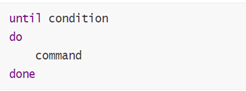

### 5、多分枝选择结构case...esac

- 与 switch ... case 语句类似，只不过每个 case 分支用右圆括号开始，;;表示执行结束
- 语法格式

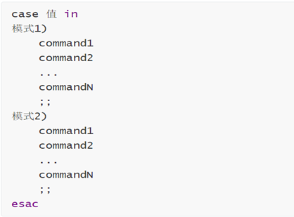

```shell
while read item
do
 case $item in
  1)
  echo "输出的是：1"  ;;
  2)
  echo "输入的是：2"  ;;
 esac
done
# 输出
输入的是：2
2
输入的是：2
1
输出的是：1
```

### 6、break、continue

- break，跳出循环
- continue，跳过本次循环，进入下一次循环

### 7、99乘法表

#### 7.1 使用seq命令

```sh
for i in `seq`
do
 for
 do
  multi=`expr ${j} \* ${i}`
  echo -e "${j}*${i}=${multi}\t\c"
 done
 echo
done
```

#### 7.2 使用数组

```shell
arr=(1 2 3 4 5 6 7 8 9)

for i in ${arr[*]}
do
  for j in ${arr[*]:0:${i}}
  do
    multi=`expr ${j} \* ${i}`
    echo -e "${j}*${i}=${multi}\t\c"  
  done
  echo ""
done
```

#### 7.3 使用((;;))

```sh
for ((i=1;i<=9;i++))
do
  for ((j=1;j<=i;j++))
  do
    multi=`expr ${j} \* ${i}`
    echo -e "${j}*${i}=${multi}\t\c"  
  done
  echo ""
done
```

## 第四部分 Shell函数

### 1、定义格式

-  参数说明：
  - 1、可以带function funname() 定义，也可以直接funname() 定义,不带任何参数。
  - 2、参数返回，可以显示加：return 返回，如果不加，将以最后一条命令运行结果，作为返回值。 return后只能跟数值n(0-255)

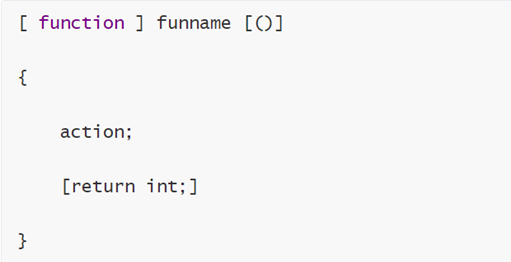

### 2、调用函数

- funname

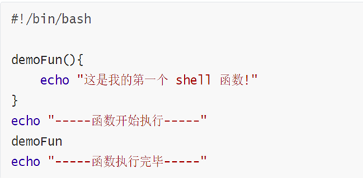

### 3、获取返回值

- 在调用函数后，`$？`可以获取该函数的返回值

```shell
demo(){

 echo "函数执行"
 num1=2
 num2=3
 return $[num1+num2]}
demo
echo $?
# 输出
5
```

### 4、函数参数

- 和脚本传参一样，只不过获取参数时 $0 还是文件名
  - 注意，$10 不能获取第十个参数，获取第十个参数需要${10}。当n>=10时，需要使用${n}来获取参数

```shell
demo2(){

 echo "demo2函数执行"
 echo "第一个参数$0"
 echo "第二个参数$1"
 echo "第10个参数${10}"
 echo "参数个数：$#"
}
demo2 1 2 3 4 5 6 7 8 9 10
# 输出
demo2函数执行
第一个参数func.sh
第二个参数1
第10个参数10
参数个数：10
```

## 第五部分 输入/输出重定向

- 一个命令通常从一个叫标准输入的地方读取输入，默认情况下，这恰好是你的终端。同样，一个命令通常将其输出写入到标准输出，默认情况下，这也是你的终端。
- **文件描述符 0 通常是标准输入（STDIN），1 是标准输出（STDOUT），2 是标准错误输（STDERR）。**

- 重定向命令列表如下

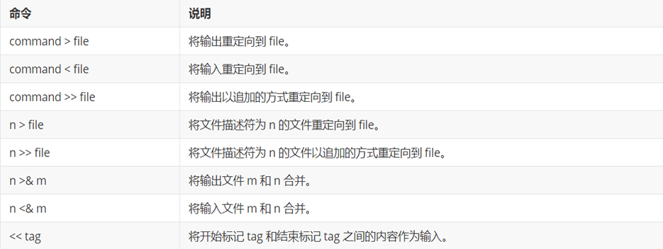

### 1、输入重定向

-  输入重定向 
  -  注意：**输入重定向不会输出文件名，因为它仅仅知道从标准输入读取内容**

```shell
[root@master shell_code]# wc -l < while.sh 
13  
[root@master shell_code]# wc -l while.sh 
13 while.sh
```

### 2、输出重定向

- 会把原本输出在显示端的信息，写入指定文件中
  - `>` 覆盖重写
  - `>>` 追加写

### 3、输入重定向和输出重定向连用

- 把 while.sh 的行数，写入file2

```shell
wc -l < while.sh > output
# 文件内容
13

wc -l while.sh >> output
# 文件内容
13 while.sh
```

### 4、深入重定向

- 标准(standard)输入文件(stdin)：stdin的文件描述符为0，Unix程序默认从stdin读取数据。

  标准输出文件(stdout)：stdout 的文件描述符为1，Unix程序默认向stdout输出数据。

  标准错误文件(stderr)：stderr的文件描述符为2，Unix程序会向stderr流中写入错误信息。

- stderr 重定向到 file

  -  错误信息写入file文件

```sh
command 2> file
command 2>> file
```

-  stdout 和 stderr 合并后重定向到 file

```
commend > file 2>&1
commend >> file 2>&1
```

- stdin 和 stdout 都重定向
  - 把file1的行数，写入file2

```
wc -l < file1 > file2
wc -l < file1 >> file2
```

### 5、/dev/null文件

- 如果希望执行某个命令，但又不希望在屏幕上显示输出结果，

  那么可以将输出重定向到 /dev/null

```
command > /dev/null
```

- /dev/null 是一个特殊的文件，写入到它的内容都会被丢弃；如果尝试从该文件读取内容，那么什么也读不到。但是 /dev/null 文件非常有用，将命令的输出重定向到它，会起到"禁止输出"的效果。
- 屏蔽 stdout 和 stderr

```
command > /dev/null 2>$1
```

