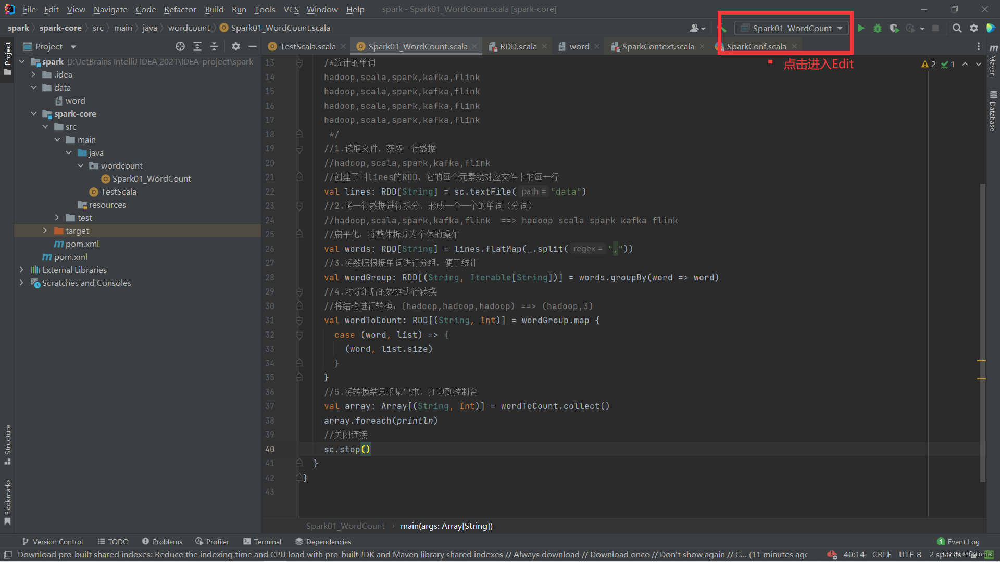

#  本地IDEA上运行Spark的WordCount时报错

# 报错原因：缺少winutils.exe编译器
# 解决方案：.
- ### 1.下载解压hadoop
   - 下载链接：https://pan.baidu.com/s/1jeEKWBF3ouYQJ2mTbME8pg?pwd=hes4 
提取码：hes4
	- 官网上下载的hadoop中缺少winutils.exe这里我已经添加进去
- ### 2.解压后复制解压路径，进去hadoop文件后再复制路径
- ### 3.进入到IDEA中
- 

  
