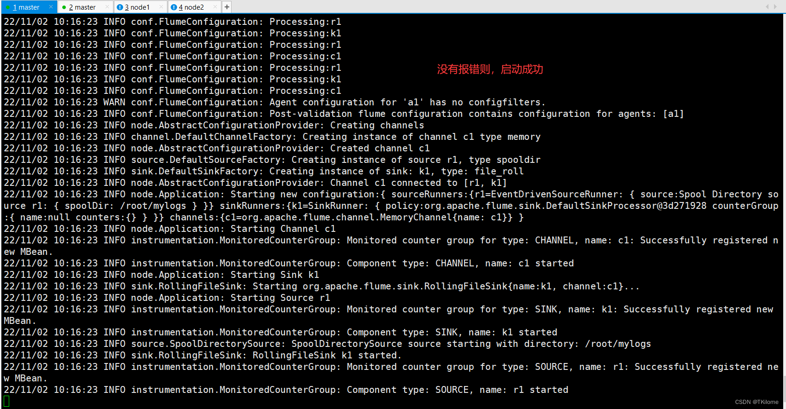
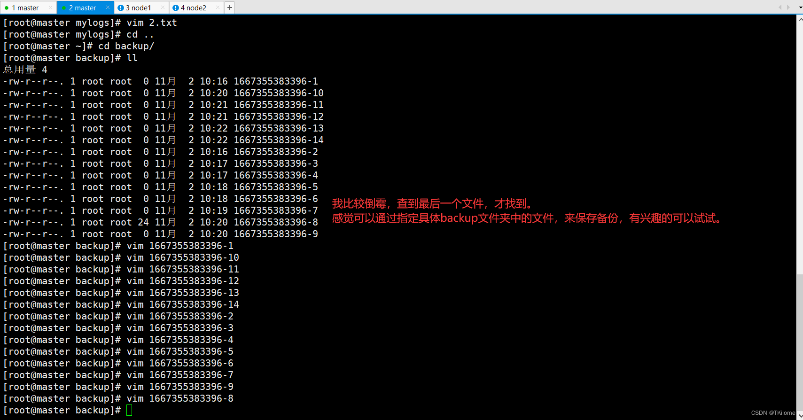
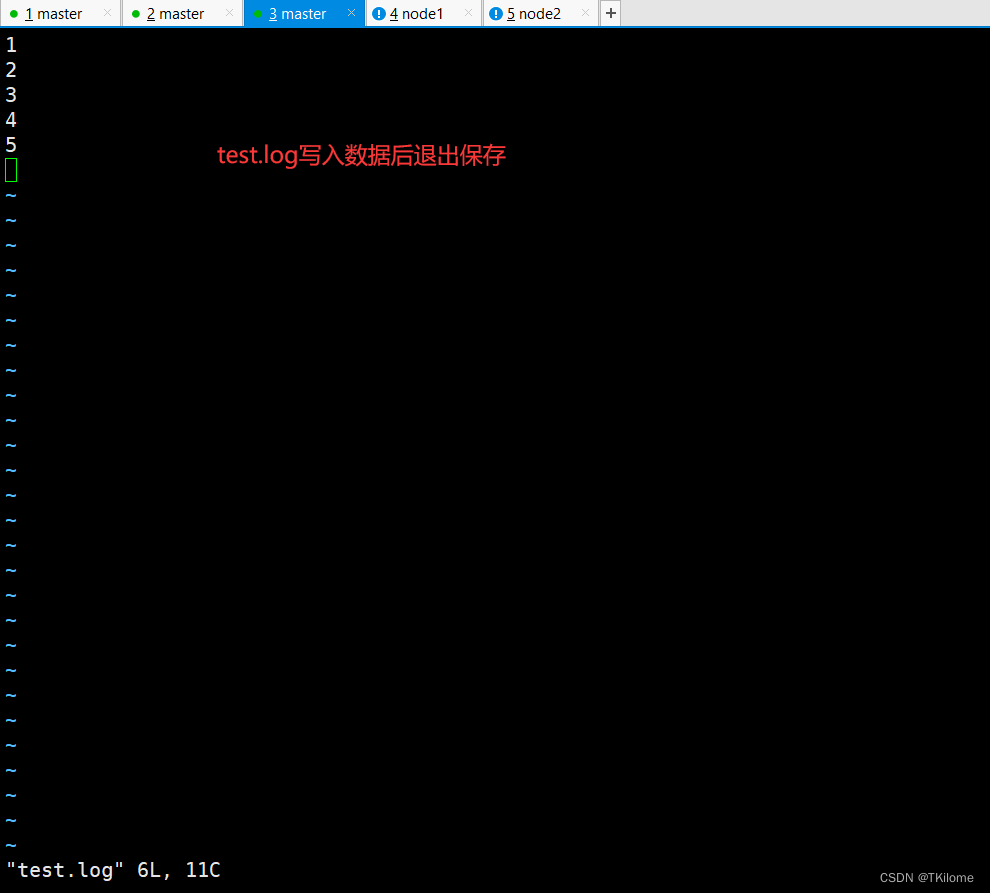
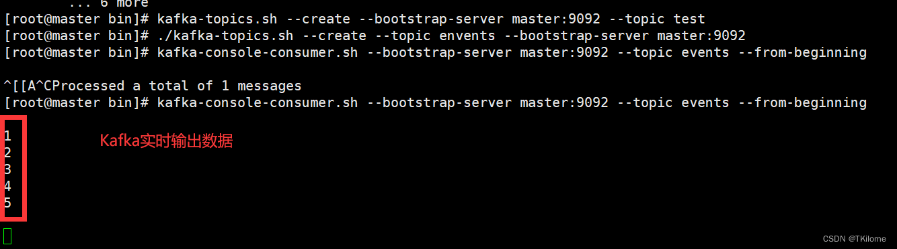
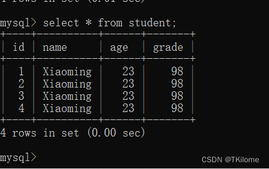
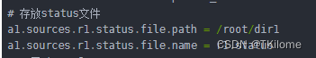
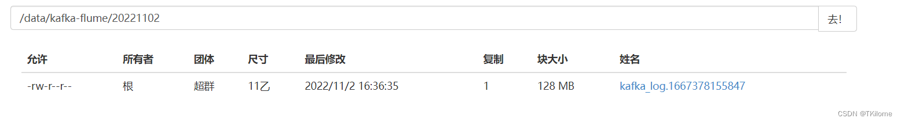

> flume实时采集mysql数据到kafka的实验，做个笔记，防止忘记
> ！！！建议从头看到尾，因为一些简单的东西我在前面提了，后面没提。

Kafka搭建：https://blog.csdn.net/cjwfinal/article/details/120803013

flume搭建：https://blog.csdn.net/cjwfinal/article/details/120441503?spm=1001.2014.3001.5502

---


# 一、flume写入当前文件系统
## 题目：
>编写配置文件，设置文件夹mylogs为source位置，文件夹backup为sink写入位置，实现对文件夹的数据备份。
新建两个文本文本文件1.txt与2.txt，在1.txt中输入Hello Flume，在2.txt中输入hello flume将两个文件拖入mylog，查看backup文件夹中出现的文件及其内容。文件可用记事本打开

## 解题：
### 1.flume配置文件
```java
#a1表示agent的名字 可以自定义
# 给sources（在一个agent里可以定义多个source）取个名字
a1.sources = r1
# 给channel个名字
a1.channels = c1
# 给channel个名字
a1.sinks = k1

# 对source进行配置
# agent的名字.sources.source的名字.参数 = 参数值

# source的类型 spoolDir（监控一个目录下的文件的变化）
a1.sources.r1.type = spooldir
# 监听哪一个目录
a1.sources.r1.spoolDir = /root/mylogs
# 是否在event的headers中保存文件的绝对路径
a1.sources.r1.fileHeader = true
# 给拦截器取个名字 i1
a1.sources.r1.interceptors = i1
# 使用timestamp拦截器，将处理数据的时间保存到event的headers中
a1.sources.r1.interceptors.i1.type = timestamp

# 配置channel
a1.channels.c1.type = memory
a1.channels.c1.capacity = 1000
a1.channels.c1.transactionCapacity = 100

# 配置sink为logger
# 直接打印到控制台
a1.sinks.k1.type = file_roll
a1.sinks.k1.channel = c1
a1.sinks.k1.sink.directory = /root/backup

# 将source、channel、sink组装成agent
a1.sources.r1.channels = c1
a1.sinks.k1.channel = c1
```
### 2.要保证配置文件中的文件的路径都存在，否则会报错
### 3.启动flume
#### 启动命令：
```shell
flume-ng agent -n a1 -f spoolingtest.cong -Dflume.root.logger=DEBUG,console
```
>a1是agent的名字，spoolingtest.cong是配置文件名，如果不一样请修改



### 4.测试
#### 1.启动flume
注意：要在配置文件所在的目录启动
#### 2.在mylogs文件夹下创建两个文件1.txt，2.txt，分别写入hello world和Hello World
写入并保存，后flume打印出来的日志会发生改变。
#### 3.查看backup文件夹
backup文件夹中，会产生许多文件，其中某个文件中会保存上面两个文件的内容，自行查找即可。



# 二、flume连接kafka
## 题目
>把flume监听到的文件内容，输入到，kafka，并由kafka的消费着消费出来。

## 解题
### 1.flume配置文件
```shell
 
# a1表示agent的名字 可以自定义
# # 给sources（在一个agent里可以定义多个source）取个名字
a1.sources = r1
# # 给channel个名字
a1.channels = c1
# # 给channel个名字
a1.sinks = k1
# 对source进行配置
# agent的名字.sources.source的名字.参数 = 参数值

# source的类型 spoolDir（监控一个目录下的文件的变化）
a1.sources.r1.type = exec
# 监听哪一个目录
a1.sources.r1.command = tail -F -c +0 /root/dir1/test.log
# 是否在event的headers中保存文件的绝对路径
a1.sources.r1.fileHeader = true
# 给拦截器取个名字 i1
a1.sources.r1.interceptors = i1
# 使用timestamp拦截器，将处理数据的时间保存到event的headers中
a1.sources.r1.interceptors.i1.type = timestamp

# 配置channel
a1.channels.c1.type = memory
a1.channels.c1.capacity = 1000
a1.channels.c1.transactionCapacity = 100

# 配置sinks，输出到kafka中
a1.sinks.k1.channel = c1
a1.sinks.k1.type = org.apache.flume.sink.kafka.KafkaSink
# topic是指定kafka的主题
a1.sinks.k1.kafka.topic = events
# master是主机名，也可以是主机IP地址
a1.sinks.k1.kafka.bootstrap.servers = master:9092
a1.sinks.k1.kafka.flumeBatchSize = 20
a1.sinks.k1.kafka.producer.acks = 1
a1.sinks.k1.kafka.producer.linger.ms = 1

# 将source、channel、sink组装成agent

a1.sources.r1.channels = c1
a1.sinks.k1.channel = c1
```
### 2测试
#### 1.创建指定的目录/root/dir1/test.log
#### 2.启动flume
```java
flume-ng agent -n a1 -f spoolingtest.cong -Dflume.root.logger=DEBUG,console
```
#### 3.启动kafka的消费者
##### 启动命令
```java
#启动消费者之前首先要创建主题
kafka-topics.sh --create --topic events --bootstrap-server master:9092
#启动消费者
kafka-console-consumer.sh --bootstrap-server master:9092 --topic events --from-beginning
```
##### kafka主题操作命令
```java
#删除主题
kafka-topics.sh --delete --topic events --zookeeper localhost:2181
#查看主题列表
kafka-topics.sh --list --bootstrap-server master:9092
```
#### 4.在test.log中写入数据


#### 5.观察kafka的消费是否消费出数据



# 三、flume实时采集mysql数据到kafka
## 题目
>在MySQL中建立数据库school，在数据库中建立表student。SQL语句如下：
```java
#创建数据库
create database school;
#使用数据库
use school;
#创建数据表
create table student(
	id int not null,
	name varchar(40),
	age int,
	grade int,
	primary key(id)
);
# 删除数据
drop database school;
# 删除数据表
drop database student;
# 查看数据表
show tables;
```
>编写配置文件，将student表中的内容输出到控制台。启动Flume，在student表中使用下列命令插入数据，在Kafka消费者中查看相应数据。
>
```java
#插入数据，sql
insert into student(id,name,age,grade)value(1,'Xiaoming',23,98);
insert into student(id,name,age,grade)value(2,'Zhangsan',24,96);
insert into student(id,name,age,grade)value(3,'Lisi',24,93);
insert into student(id,name,age,grade)value(4,'Wangwu',21,91);
insert into student(id,name,age,grade)value(5,'Weiliu',21,91);
```
## 解题
### 1.flume配置文件
```shell
# # 给sources（在一个agent里可以定义多个source）取个名字
a1.sources = r1
# # 给channel个名字
a1.channels = c1
# # 给channel个名字
a1.sinks = k1

#配置source
a1.sources.r1.type = org.keedio.flume.source.SQLSource
#ip地址和数据库名称需要修改，如果连接的本地的mysql改成本机IP地址，如果连接虚拟机上的mysql改成虚拟机的IP地址
a1.sources.r1.hibernate.connection.url = jdbc:mysql://ip地址/数据名称?useSSL=false&allowPublicKeyRetrieval=true
# mysql用户名，一般都是root
a1.sources.r1.hibernate.connection.user = root
# 密码
a1.sources.r1.hibernate.connection.password = 123456
a1.sources.r1.hibernate.connection.autocommit = true
# mysql驱动
a1.sources.r1.hibernate.dialect = org.hibernate.dialect.MySQL5Dialect
# 驱动版本过低会无法使用，驱动安装下文会提及
a1.sources.r1.hibernate.connection.driver_class = com.mysql.jdbc.Driver
a1.sources.r1.run.query.delay=5000

# 自定义查询
a1.sources.r1.start.from = 0
a1.sources.r1.table = student
a1.sources.r1.columns.to.select = *

a1.sources.r1.batch.size = 1000
a1.sources.r1.max.rows = 1000
a1.sources.r1.hibernate.connection.provider_class = org.hibernate.connection.C3P0ConnectionProvider
a1.sources.r1.hibernate.c3p0.min_size=1
a1.sources.r1.hibernate.c3p0.max_size=10
# 存放status文件
a1.sources.r1.status.file.path = /root/dir1
a1.sources.r1.status.file.name = r1.status
# 配置channel
a1.channels.c1.type = memory
a1.channels.c1.capacity = 10000
a1.channels.c1.transactionCapacity = 10000
a1.channels.c1.byteCapacityBufferPercentage = 20
a1.channels.c1.byteCapacity = 800000
# 配置sinks
a1.sinks.k1.channel = c1
a1.sinks.k1.type = org.apache.flume.sink.kafka.KafkaSink
# 指定主题名topic
a1.sinks.k1.kafka.topic = events
a1.sinks.k1.kafka.bootstrap.servers = master:9092
a1.sinks.k1.kafka.flumeBatchSize = 20
a1.sinks.k1.kafka.producer.acks = 1
a1.sinks.k1.kafka.producer.linger.ms = 1

# 将source、channel、sink组装成agent
a1.sources.r1.channels = c1
a1.sinks.k1.channel = c1
```
### 2.要保证配置中的文件路径存在，并且根据注释做出相应的修改
### 3.导入jar包到/flume/lib文件夹下
```shell
# flume连接mysqljar包
flume-ng-sql-source-1.4.3.jar
# mysql驱动jar包
mysql-connector-java-5.1.49.jar
```
### 5.flume-ng-sql-source项目的官方网址
https://github.com/keedio/flume-ng-sql-source
### 6.测试
#### 1.创建mysql数据库、数据表
```shell
#创建数据库
create database school;
#使用数据库
use school;
#创建数据表
create table student(
	id int not null,
	name varchar(40),
	age int,
	grade int,
	primary key(id)
);
```
#### 2.启动flume
```shell
flume-ng agent -n a1 -f spoolingtest.cong -Dflume.root.logger=DEBUG,console
```
#### 3.启动kafka消费者
```shell
#启动消费者之前首先要创建主题
kafka-topics.sh --create --topic events --bootstrap-server master:9092
#启动消费者
kafka-console-consumer.sh --bootstrap-server master:9092 --topic events --from-beginning
```
#### 4.student表中插入数据
```java
#插入数据，sql
insert into student(id,name,age,grade)value(1,'Xiaoming',23,98);
insert into student(id,name,age,grade)value(2,'Zhangsan',24,96);
insert into student(id,name,age,grade)value(3,'Lisi',24,93);
insert into student(id,name,age,grade)value(4,'Wangwu',21,91);
insert into student(id,name,age,grade)value(5,'Weiliu',21,91);
```
#### 5.观察数据



` 为了方便测试我重复插入了一条数据`

#### 6.遇到的问题：消费者没有消费出来数据，且flume配置文件没错
##### 解决
删除存放的status文件，也就是我配置文件中/root/dir1文件夹中的东西



# 四、Kafka链接Flume，将生产的消息存入到HDFS
## 题目
> 编写配置文件，将kafka作为输入，在生产者中输入“HelloFlume”或其他信息，通过Flume将Kafka生产者输入的信息存入hdfs中，存储格式hdfs://localhost:9000/fromkafka/%Y%m%d/，要求存储时文件名为kafka_log。
## 解答
### 1.flume配置文件
```shell

agent.sources = kafka_source
agent.channels = mem_channel
agent.sinks = hdfs_sink
# 以下配置 source
agent.sources.kafka_source.type = org.apache.flume.source.kafka.KafkaSource
agent.sources.kafka_source.channels = mem_channel
agent.sources.kafka_source.batchSize = 5000
# master为主机名或者主机IP
agent.sources.kafka_source.kafka.bootstrap.servers = master:9092
# 需要指定kafka生产者的主题
agent.sources.kafka_source.kafka.topics = kafka-flume
# 以下配置 sink
agent.sinks.hdfs_sink.type = hdfs
agent.sinks.hdfs_sink.channel = mem_channel
# 输出到HDFS文件的路径
agent.sinks.hdfs_sink.hdfs.path = /data/kafka-flume/%Y%m%d
# HDFS文件前缀
agent.sinks.hdfs_sink.hdfs.filePrefix = kafka_log
# 使用时间戳
a1.sinks.r1.hdfs.useLocalTimeStamp = true

agent.sinks.hdfs_sink.hdfs.rollSize = 0
agent.sinks.hdfs_sink.hdfs.rollCount = 0
agent.sinks.hdfs_sink.hdfs.rollInterval = 3600
agent.sinks.hdfs_sink.hdfs.threadsPoolSize = 30
agent.sinks.hdfs_sink.hdfs.fileType=DataStream
agent.sinks.hdfs_sink.hdfs.writeFormat=Text
# 以下配置 channel
agent.channels.mem_channel.type = memory
agent.channels.mem_channel.capacity = 100000
agent.channels.mem_channel.transactionCapacity = 10000
```
### 2.根据配置文件的注释根据自己的情况做出修改
### 3.hadoop操作文件夹命令
```shell
# 创建文件夹
hadoop fs -mkdir 文件夹路径
# 删除文件夹
hadoop fs -rm -r -skipTrash 文件夹路径
```
### 4.测试
#### 1.启动flume
```shell
#启动命令
flume-ng agent -n agent -f kafka-flume-hdfs.cong -Dflume.root.logger=DEBUG,console
# 参数解释
第二个agent为配置文件中agent的名字，kafka-flume-hdfs.cong为配置文件名，根据自己情况做出修改
```
#### 2.启动kafka生产者
```shell
# 启动命令，根据自己配置变换主题名
kafka-console-producer.sh --broker-list master:9092 --topic kafka-flume
# 启动后，输入HelloFlume
```
#### 3.观察HDFS界面，寻找并下载文件，查看内容


记得关闭flume后再下载，不然会下载出来.tmp文件

# 有什么问题评论区提问！


