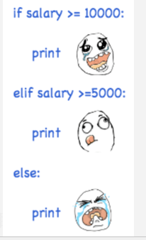

# 一、python基础

## 前言 python所学内容

- 基础语法
  - 变量、注释、基本数据类型、格式化字符串、反转字符、数据类型转化、if\elif选择结构、for\while循环
  - str的常用方法、运算符
  - 命名空间、作用域
- 数据容器
  - list列表、tuple元组、dict字典、set集合
  - 遍历数据容器、列表推导式
  - 杨辉三角、冒泡排序
- 函数
  - 函数参数
    - 必选参数、 默认参数、可选参数、关键字参数、命名关键字参数
  - 递归函数
    - 阶乘、斐波拉契数列、汉诺塔
- 面向对象
  - 类、私有变量和方法、封装、继承、多态、猴子补丁、鸭子类型、兔子问题
- 异常处理
  - 基本异常类型、捕获和抛出异常、自定义异常
- 文件读写
  - 文件打开open、文件读写、with语句
- 正则表达式
- 常用模块

## 第一部分 python简介

- Python是一门解释性、面向对象以及类型动态的高级程序语言
  - 解释型：Python代码在运行时没有了编译这个环节，类似PHP
  - 面向对象：Python支持面向对象的风格或代码封装在对象的编程技术
  - 动态数据类型：Python中没有对变量类型进行限制，代码非常灵活

#### 1、python的垃圾回收机制

- 引用计数（Reference Counting）
- 标记清除（Mark and Sweep）
  - 标记清除解决循环引用
- 分代回收（Generational Collection）

#### 2、python环境安装

- 首先官网下载安装程序

  - 选择状态为security的版本，并且选择此版本中小版本不是最后一个的版本
  - 
  - 
  - 

- 安装时，选择客制化安装（自定义路径）

  - 
  - 

- 完成安装后，查看python的环境变量（勾选上述选项后，自动添加）

  - 系统会优先调用位于**系统环境变量（所有用户都可以使用）下最上面的文件路径下的程序**
  - 目的
    - 把第一个路径下的pip.exe文件添加到全局变量中
    - 把第二个路径下的python.exe（python解释器）添加到全局变量中
  - 

- 验证是否安装成功

  ```python
  python -V  //查看版本
  pip list   //查看使用pip命令所下载的包
  ```

  

  - 

- pip命令下载包的位置

  - 刚开始之后两个，pip和setuptools
  - pip list可以查看pip命令下载的包，如上图
  - 

- python自带的组件

  - 
  - Moudle Docs（把python的安装环境变为网页形式）
    - 
  - IDLE（python自带的集成开发环境）

  - python（命令行模式）

#### 3、pycharm安装

- 官网找到pycharm社区版（免费版）
  - 
- 安装程序的介绍
  - 
  - 鼠标右击桌面的显示框
    - 
  - 关联py后缀的文件
    - 
    - 


- 创建项目时的注意事项
  - 虚拟环境
    - 创建为虚拟环境的项目，相当于把项目放在一个独立的环境中，所下载的包是独立于其他项目的
  - 非虚拟环境
    - 非虚拟环境的项目，所下载的包，是可以和其他非虚拟环境的项目所共用
    - 
    - 
    - Conda Environment 是以Anocanda的环境为基础的选择
    - Anocanda一个集成所有python的第三方库的工具，一般作为离线使用
  - 一般选择非虚拟环境
- python第三方库
  - 位于官网的PyPI
  - Docs为python官方文档
  - python为应用程序
  - 

## 第二部分 python基础语法

#### 1、相对路径和绝对路径

- ..表示退出当前文件夹到当前文件夹的上一级文件夹中

- .表示当前文件夹

- 相对路径（在print_test.py文件中helloworld.py的相对路径）

  - 

    ```
    ../day01/helloworld.py
    ```

    

  - 利用相对路径执行文件的例子

    - 

- 绝对路径

  ```
  F:\BigData26\Code\python\bigdata26\day01
  ```

  

  

#### 2、print函数、cmd命令、注释

- print函数

  - 源代码

    ```python
    def print(self, *args, sep=' ', end='\n', file=None):
        pass
    ```

  - *args是参数化变量，也就是可以传入多个参数

  - sep是间隔符

  - end代表结尾

- cmd命令

  - 
  - 在文件的路径上输入cmd就可以直接进入命令行模式
    - 
    - 
    - 


- 注释

  ```python
  # 单行注释快捷键 ctrl + /
  # 单行注释，他是给人看的，编辑器不识别
  '''
  这是多行注释、
  可以在很多行中
  写文字
  '''
  
  """
  这个也是多行注释
  也是个字符串
  """
  ```

  


#### 3、变量

- 变量的命名规则

  - 必须是大小写字母、数字、下划线
  - 不能以数字开头
  - 不能是关键字
    - 如何查看关键字
      - 
    - 所有的python关键字
      - ['False', 'None', 'True', 'and', 'as', 'assert', 'async', 'await', 'break', 'class', 'continue', 'def', 'del', 'elif', 'else', 'except', 'finally', 'for', 'from', 'global', 'if', 'import', 'in', 'is', 'lambda', 'nonlocal', 'not', 'or', 'pass', 'raise', 'return', 'try', 'while', 'with', 'yield']

- 变量命名

  ```python
  # 驼峰命名法
  # 在python中驼峰命名法一般用于文件命名
  trainHead = 5
  
  # 下划线命名法
  # python中下划线命名法一般用于变量命名
  train_head = 5
  
  # 在python可以用中文给变量命名，但是不符合规则
  # 火车头 = 5
  
  # python中可以以下划线开头
  # 但是，一般不用，因为下划线开头的方法代表私有化方法，不能改动
  _class_a = 2
  ```

  

#### 4、数据类型和转义字符

- 如果一个变量是全大写形式，就会被认为**常量**，如

  ```python
  PI = 3.14
  ```

- python的四大基本类型

  - int 整型
  - float 浮点型
  - str 字符串类型型
  - bool 布尔类型

  ```python
  print(type(变量名)) # 查看变量类型
  ```

- 特殊类型None

  - 注意：None类型不能转换为其他基本数据类型

- 转义字符 \ ，\n，\t，\r

  ```python
  # 转义字符以及''和""的套用
  # 输出I'm OK
  print("I'm OK")
  print('I\'m OK')
  
  # 输出I\'m OK
  print(r"I\'m OK")
  print('I\\\'m OK') # 第一个\把第二个\进行转义：\\输出\。第三个\把'进行转义：\'输出'
  
  # 转义字符\r：覆盖前面的字符
  print("a\rb")  # b
  print("a\rb\rcd")  # cd
  ```

#### 5、格式化字符串

```python
name = "张三"
year = 2023
month = 7
day = 11
money = 200.23445
deadline = 5
percent = 5
```

- fstring  

  ```python
  # 1.fstring
  # 02d：2代表month变量占两个空格，2之前的0代表，如果month变量占不到2个空格，剩下的位置将会被0补充。d代表整型
  # 08.2f：08表示同上述02。.2f代表浮点型保留两位小数
  words1 = f"亲爱的客户{name}，截至{year}年{month:02d}月{day}日，你已经欠费{money:08.2f}，" \
  f"请在{deadline}日内，尽快缴清话费，否则将扣除{percent}%的费用"
  print(words1)
  ```

  

- 占位符

  ```python
  # 2.占位符
  # 02d：2代表month变量占两个空格，2之前的0代表，如果month变量占不到2个空格，剩下的位置将会被0补充。d代表整型
  # 08.2f：08表示同上述02。.2f代表浮点型保留两位小数
  # 使用占位符的坑：%d%，会报错，%d%%即可解决
  words2 = "亲爱的客户%s，截至%d年%02d月%d日，你已经欠费%08.2f，请在%d日内，尽快缴清话费，否则将扣除%d%%的费用" \
  % (name, year, month, day, money, deadline, percent)
  print(words2)
  ```

- format

  ```python
  # 3.format
  # 02d：2代表month变量占两个空格，2之前的0代表，如果month变量占不到2个空格，剩下的位置将会被0补充。d代表整型
  # 08.2f：08表示同上述02。.2f代表浮点型保留两位小数
  words3 = "亲爱的客户{}，截至{}年{:02d}月{}日，你已经欠费{:08.2f}，请在{}日内，尽快缴清话费，否则将扣除{}%的费用" \
  .format(name, year, month, day, money, deadline, percent)
  print(words3)
  ```

- 第二种format

  ```python
  # 4.第二种format
  words4 = "亲爱的客户{name}，截至{year}年{month:02d}月{day}日，你已经欠费{money:08.2f}，请在{deadline}日内，尽快缴清话费，否则将扣除{percent}%的费用" \
  .format(name=name, year=year, month=month, day=day, money=money,deadline=deadline, percent=percent)
  print(words4)
  ```

- 字符串拼接

  ```python
  # 5.字符串拼接
  # 注意：python中整型不可以和字符串拼接
  print("亲爱的客户"+name+"，截至"+str(year)+"年"+str(month)+"月"+str(day)+"日")
  ```

#### 6、反转字符串

- 索引实现

  ```python
  str_a = 'hello Tuesday!'
  str[::-1]
  
  # 起始位置:结束位置:步长
  print(str_a[::-1])  # !yadseuT olleh
  # 区间左闭右开[起始位置,结束位置)，所以取不到0位置
  print(str_a[14:0:-1])  # !yadseuT olle
  # 可以不给结束位置，默认就可以取到最后一位0位置
  print(str_a[14::-1])  # !yadseuT olleh
  ```

- 使用**lambda匿名函数**实现反转字符串

  ```python
  from functools import reduce
  srt_a = "hello Tuesday!"
  # eh->leh->lleh->...->!yadseuT olleh
  print(reduce(lambda x,y:y+x,str_a))
  ```

#### 7、数据类型转化

- 整型int

  - 所有非0的整型转为bool类型后都会转为True

  ```python
  # 整型int
  int_1 = 1
  int_2 = -0
  int_3 = 0
  int_4 = 2
  print(float(int_1), float(int_2), float(int_3), float(int_4))  # 1.0 0.0 0.0 2.0
  print(str(int_1), str(int_2), str(int_3), str(int_4))  # 1 0 0 2
  # 所有非0的整型转为bool类型后都会转为True
  print(bool(int_1), bool(int_2), bool(int_3), bool(int_4))  # True False False True
  ```

- 浮点型float

  - 浮点型转为int类型是向下取整
  - 所有非0的浮点型转为bool类型后都会转为True

  ```python
  # 浮点型float
  float_1 = 1.0
  float_2 = 1.6
  float_3 = -1.0
  float_4 = -0.0
  float_5 = 0.0
  # 浮点型转为int类型的正数是向下取整
  # 浮点型转为int类型的负数是向上取整 int(-1.1) == -1
  print(int(float_1), int(float_2), int(float_3), int(float_4), int(float_5))  # 1 1 -1 0 0
  print(str(float_1), str(float_2), str(float_3), str(float_4), str(float_5))  # 1.0 1.6 -1.0 -0.0 0.0
  # 所有非0的浮点型转为bool类型后都会转为True
  print(bool(float_1), bool(float_2), bool(float_3), bool(float_4), bool(float_5))  # True True True False False
  ```

    

- 字符型str

  - 只有字符为整数才能转为整型
  - 只有字符为数值类型才能转为浮点型
  - 所有非空（非""）的字符串转为bool时，都为True

  ```python
  # 字符型str
  str_1 = "-1"
  str_2 = "1.0"
  str_3 = "2a"
  str_4 = "Ture"
  str_5 = "0"
  str_6 = " "
  str_7 = ""
  # 只有字符为整数才能转为整型，如：str_1、str_5
  # print(int(str_1),int(str_2),int(str_3),int(str_4),int(str_5),int(str_6),int(str_7))
  # 只有字符为数值类型才能转为浮点型，如：str_1、str_2、str_5
  # print(float(str_1),float(str_2),float(str_3),float(str_4),float(str_5),float(str_6),float(str_7))
  # 所有非空（非""）的字符串转为bool时，都为True
  print(bool(str_1), bool(str_2), bool(str_3), bool(str_4), bool(str_5), bool(str_6),
        bool(str_7))  # True True True True True True False
  ```

- 布尔bool

  ```python
  bool_1 = True
  bool_2 = False
  print(int(bool_1), int(bool_2))  # 1 0
  print(float(bool_1), float(bool_2))  # 1.0 0.0
  print(str(bool_1), str(bool_2))  # "True" "False"
  ```

  

- None类型

  - 转为int和str时都会报错

  ```python
  None_1 = None
  # TypeError: int() argument must be a string, a bytes-like object or a real number, not 'NoneType'
  # print(int(None_1))
  # TypeError: float() argument must be a string or a real number, not 'NoneType'
  # print(float(None_1))
  print(str(None_1))  # "None"
  print(bool(None_1))  # False
  ```

#### 8、九九乘法表

- 使用嵌套for循环实现

  ```python
  for i in range(1,10):
  	for j in range(1,i+1):
          print(f"{j}*{i}={i*j}")
      print()
  ```

  ```
  1*1=1	
  1*2=2	2*2=4	
  1*3=3	2*3=6	3*3=9	
  1*4=4	2*4=8	3*4=12	4*4=16	
  1*5=5	2*5=10	3*5=15	4*5=20	5*5=25	
  1*6=6	2*6=12	3*6=18	4*6=24	5*6=30	6*6=36	
  1*7=7	2*7=14	3*7=21	4*7=28	5*7=35	6*7=42	7*7=49	
  1*8=8	2*8=16	3*8=24	4*8=32	5*8=40	6*8=48	7*8=56	8*8=64	
  1*9=9	2*9=18	3*9=27	4*9=36	5*9=45	6*9=54	7*9=63	8*9=72	9*9=81	
  ```

- 使用**列表推导式**实现

  ```python
  print("\n".join(["\t".join([f"{j}*{i}={i*j}" for j in range (1,i+1)])for i in range(1,10)]))
  ```

  ```
  1*1=1	
  1*2=2	2*2=4	
  1*3=3	2*3=6	3*3=9	
  1*4=4	2*4=8	3*4=12	4*4=16	
  1*5=5	2*5=10	3*5=15	4*5=20	5*5=25	
  1*6=6	2*6=12	3*6=18	4*6=24	5*6=30	6*6=36	
  1*7=7	2*7=14	3*7=21	4*7=28	5*7=35	6*7=42	7*7=49	
  1*8=8	2*8=16	3*8=24	4*8=32	5*8=40	6*8=48	7*8=56	8*8=64	
  1*9=9	2*9=18	3*9=27	4*9=36	5*9=45	6*9=54	7*9=63	8*9=72	9*9=81	
  ```

#### 9、str的常用方法

#####  split() - 切分

```python
# 按照指定字符进行切分，返回一个列表。如果不传入第二个参数（maxSplit），默认全部切分
str_1 = "python,java,scala"
str_1_split = str_1.split(",", 2)
print(str_1_split)
```

##### strip() - 剥离、去除、脱离

```python
# 去除前后空格和特殊字符
str_1 = " \r\n  python,java,scala  \r\n "
str_1_strip = str_1.strip()
print(str_1_strip)
```

```python
# 传入字符串参数，去除前后指定字符串
str_1 = "python,java,scala,py"
str_1_strip = str_1.strip("py")
print(str_1_strip)
```

##### lstrip() - 左剥离

```python
# 默认去除左边头的空格和特殊字符
str_1 = " \r\n  python,java,scala   "
str_1_lstrip = str_1.lstrip()
print(str_1_lstrip)
```

```python
# lstrip(参数)
# 去除左边头，指定字符串
str_1 = "python,java,scala,py"
str_1_lstrip = str_1.lstrip("py")
print(str_1_lstrip)
```

##### rstrip() - 右剥离

```python
# 默认去除右边头的空格和特殊字符
str_1 = " \r\n  python,java,scala   \r\n"
str_1_rstrip = str_1.rstrip()
print(str_1_rstrip)
```

```python
# rstrip(参数) - 右剥离
# 去除左边头，指定字符串
str_1 = "python,java,scala,py"
str_1_rstrip = str_1.rstrip("py")
print(str_1_rstrip)
```

##### lower() - 小写

```python
# 大写字母转为小写
str_1 = "PYTHON,JAVA,SCALA"
str_1_lower = str_1.lower()
print(str_1_lower)
```

##### upper() - 大写

```python
# 小写字母转为大写
str_1 = "Python,Java,Scala"
str_1_upper = str_1.upper()
print(str_1_upper)
```

##### islower() - 是否为小写

```python
# 判断所有字母是否是小写，如果是返回Ture，如果不是返回false
str_1 = "PYTHON,JAVA,SCALA"
str_1_islower = str_1.islower()
print(str_1_islower)
```

##### isupper() - 是否为大写

```python
# 判断所有字母是否是大写，如果是返回Ture，如果不是返回false
str_1 = "PYTHON,JAVA,SCALA"
str_1_isupper = str_1.isupper()
print(str_1_isupper)
```

##### replace() - 替换

```python
# 把前一个参数的值替换为后一个参数的值，默认将字符串中所有 为前一个参数的子字符串都替换为后一个参数
# 2代表替换前两个值为前一个参数的子字符串
str_1 = "python,java,scala"
str_1_replace_1 = str_1.replace("a","A")
str_1_replace_2 = str_1.replace("a","A",2)
print(str_1_replace_1)
print(str_1_replace_2)
```

##### index() - 索引

```python
# 返回指定区间的指定元素的索引值，默认返回第一个指定元素的索引值
str_1 = "python,java,scala"
str_1_index_1 = str_1.index("a")
str_1_index_2 = str_1.index("a",7,9)
print(str_1_index_1)
print(str_1_index_2)
```

##### ord() - 字符转换为ASCii码值

- `ord` 函数的全称是 "ordinal", 它是从 "ordinal number"（序数）一词中衍生而来

```python
print(ord("A"))  # 65
```

##### chr() - ASCii码转换为字符

- `chr` 函数的全程是 "character"，它是从 "character"（字符）一词中衍生而来。

```python
print(chr(65))  # A
```

#### 10、运算符

##### 算数运算符

- 

##### 比较运算符

- 

```python
# 比较运算符 ==
# 只有 1（整型或者浮点行）等与 False
# 只有 0（整型或者浮点行）等与 False
# 其他数字及不等于False也不等于False，但是强转为bool型时，只有0才能转为False，其他皆为True
print(1 == True)  # True
print(1.0 == True)  # True
print(2 == True)  # False
print(0 == False)  # True
print(3 == False)  # False
```

##### 赋值运算符

- 

##### 逻辑运算符

- 

```python
# 逻辑运算符 and or not
# 注意 逻辑运算符中 非0的数皆为True
# and 若前者为False，则返回前者的值，否则返回后者
print(20 == False)   # False
print(20 and 30)  # 30
# or 若前者为Ture，则返回前面的值，否则返回前者
print(20 == True)  # False
print(20 or 30)  # 20
print(not 0)  # True 注意这个除0之外都是
```

##### 位运算符

- 

```python
a = 49
b = 11
"""按位与运算符& 同一则 1，否则为0
110001 a
001011 b 
000000 a&b
"""
print(a & b)  # 1

"""按位或运算符| 有1则1，否则为0
110001 a
001011 b     
111011 a&b
"""
print(a | b)  # 59

"""按位异或运算符^ 相异为1，否则为0
110001 a
001011 b     
111010 a&b
"""
print(a ^ b)  # 58

"""按位取反运算符~ 把1变为0，把0变为1 ，结果为-a-1
1 110001 a
0 001110 ~a
要计算负数的补码，需要先将其二进制表示按位取反，然后再加 1。
对于 001110，按位取反得到 110001。
然后，将 110001 加 1，得到 110010。
最终的结果 110010 对应十进制的 -50。
"""
print(~a)  # -50

"""左移运算符<< 二进制全部往前若干位，高位往前低位补0，如果补0后的整体达到32位，则舍弃高位保留32位
110001 a
11000100 a<<2
"""
print(a << 2)

"""右移运算符>> 二进制全部往后若干位，舍弃低位
110001 a
1100 a>>2
"""
print(a >> 2)
```

#### 11、if/elif选择结构

- 

```python
# 由薪水判断心情
    salary = 2500
    if salary >= 10000:  # 区间 [10000,正无穷)
        print("日子过的非常好")
    elif salary >= 5000:  # 区间 [5000,10000)
        print("日子还能过的去")
    else:  # 区间 (负无穷,5000)
        print("日子过不去了")

    # 反着写
    if salary < 5000:  # 区间 (负无穷,5000)
        print("日子过不去了")
    elif salary < 10000:  # 区间 [5000,10000)
        print("日子还能过的去")
    else:  # 区间 [10000,正无穷)
        print("日子过的非常好")
```

##### 三元运算符	

```python
# 三元运算符
    print("日子过不去了") if salary < 5000 else print("日子过的非常好")
    print("日子过不去了") if salary < 5000 else (print("日子还能过的去") if salary < 10000 else print("日子过的非常好"))
```

#### 12、while/for循环结构

while循环语句小练习：

- 1.计算1~100中奇数的和

  ```python
  # 1.
      i = 1
      summ = 0
      while i <= 100:
          # 判断为基数
          if i % 2 != 0:
              summ += i
          i += 1
      print(summ)
      # 简化
      i = 1
      summ = 0
      while i <= 100:
          # 判断为基数
          summ += i
          i += 2
      print(summ)
  ```

- 2.break continue

  ```python
  # 2.break continue
      # 下面的代码会陷入死循环
      i = 1
      while i <= 100:
          if i == 90:
              continue
          i += 1
          print(i)
  ```

- 3.给定一个字符串s = ‘beautifulCode’
      从前到后检查每个字母
      如果是大写字母则停止检查并输出：有大写字母，第一个大写字母为%s
      否则输出：无大写字母

  ```python
  s = 'beautifulCode'
      i = 0
      while i < len(s):
          if s[i].isupper():
              print(f"有大写字母，第一个大写字母{s[i]}")
              break
          i += 1
      # 由 i 值判断判断无大写字母
      if i == len(s):
          print('无大写字母')
      # 由 i 值判断判断无大写字母
      flag = 0
      while i < len(s):
          if s[i].isupper():
              print(f"有大写字母，第一个大写字母{s[i]}")
              flag = 1
              break
          i += 1
      if flag == 0:
          print('无大写字母')
  ```

#### 13、命名空间

- Python中一般有三种命名空间：
  - 内置名称（built-in names）
    -  Python 语言内置的名称，比如函数名 abs、chr 和异常名称 BaseException、Exception 等等
  - 全局名称（global names）
    - 模块中定义的名称，记录了模块的变量，包括函数、类、其它导入的模块、模块级的变量和常量
  - 局部名称（local names）
    - 函数中定义的名称，记录了函数的变量，包括函数的参数和局部定义的变量（类中定义的也是）

- 
- 命名空间查找顺序:  由内往外
  - 假设我们要使用变量 money，则 Python 的查找顺序为：
    - 局部的命名空间 -> 全局命名空间 -> 内置命名空间
    - 如果找不到变量 money，它将放弃查找并引发一个错误

#### 14、作用域

- Python 的作用域一共有4种：

  - L（Local）：包含局部变量，比如一个函数/方法内部
  - E（Enclosing）：包含了非局部(non-local)也非全局(non-global)的变量
  - G（Global）：最外层，比如当前模块的全局变量
  - B（Built-in）：包含内建变量/关键字等，最后被搜索
  - **在局部找不到，便会去局部外的局部找（例如闭包Enclosing），再找不到就会去全局找，再者去内置中找**

- **Python 中只有模块（module），类（class）以及函数（def、lambda）才会引入新的作用域，其它的代码块（如 if/elif/else/、try/except、for/while等）是不会引入新的作用域的，也就是说这些语句内定义的变量，外部也可以访问**

  ```python
  if True:
      msg = "i am from Runnob"
  print(msg)  # if不会形成新的作用域
  ```

## 第三部分 数据容器

#### todo用法

- 

#### **ctrl + p 可以让参数提示重新出现**

#### id(元素) - 返回元素内存地址

- list列表、tuple元组、dict字典、set集合

- 在 Python 中，`sort()` 方法是列表对象的内置方法，用于对列表进行原地排序。`sort()` 方法的底层实现使用一种名为 **Timsort 的排序算法**。

#### 1、list列表

- list的特点：有序的集合、可以有重复值、值类型不唯一、可变

##### append - 追加

- 添加元素，在末尾添加

```python
class_mates = ['James', 'Kobe', 'Polo']
class_mates.append("Irving")  # 添加元素，在末尾添加
print(class_mates)
```

##### inster - 插入

- 在指定索引位置，插入指定元素

```python
class_mates = ['James', 'Kobe', 'Polo']
class_mates.insert(0, "Irving")  # 在指定索引位置，插入指定元素
print(class_mates)
```

##### extend - 继承

- 再末尾追加可迭代容器中的元素

```python
class_mates = ['James', 'Kobe', 'Polo']
class_mates.extend([1, 2, 3])  # 再末尾追加可迭代容器中的元素
print(class_mates)  # ['James', 'Kobe', 'Polo', 1, 2, 3]
```

##### remove - 删除

- 删除指定元素，但不返回删除的元素

```python
class_mates = ['James', 'Kobe', 'Polo']
class_mates.remove("James")  # 删除指定元素，但不返回删除的元素
print(class_mates)
```

##### pop - 弹出、删除

- 删除指定位置元素，并返回删除的元素，默认删除最后一个元素，如果列表为空，则会引发indexError

```python
class_mates = ['James', 'Kobe', 'Polo']
class_mates_pop = class_mates.pop()  # 删除指定位置元素，并返回删除的元素，默认删除最后一个元素，如果列表为空，则会引发indexError
print(class_mates_pop)

class_mates = ['James', 'Kobe', 'Polo']
class_mates_pop_1 = class_mates.pop(1)  # 删除，索引为1的元素
print(class_mates)
print(class_mates_pop_1)
```

##### del - 关键字删除、清除内存空间

```python
class_mates = ['James', 'Kobe', 'Polo']
del class_mates[1]  # 使用del关键字进行删除
print(class_mates)

class_mates = ['James', 'Kobe', 'Polo']
del class_mates
# print(class_mates)  # NameError: name 'class_mates' is not defined.
```

##### index - 索引

- 查询指定元素，返回索引值

```python
class_mates = ['James', 'Kobe', 'Polo']
index_num = class_mates.index('James')  # 查询指定元素，返回索引值
print(index_num)
```

##### count - 统计

- 统计指定元素出现的次数

```python
list_1 = [1, 2, 2, 3, 2, 4, 2, 5, 6]
list_1_count = list_1.count(2)
print(list_1_count)  # 统计指定元素出现的次数
```

##### sort - 排序

- 默认为升序排序

```python
list_1 = [1, 2, 2, 3, 2, 4, 2, 5, 6]
list_1.sort()  # 默认为升序排序
print(list_1)
```

- 指定参数revers为True，设置为降序排序

```python
list_1 = [1, 2, 2, 3, 2, 4, 2, 5, 6]
list_1.sort(reverse=True)  # 指定参数revers为True，设置为降序排序
print(list_1)
```

##### reverse - 反转

- 列表中的元素进行反转

```python
list_1 = [1, 2, 2, 3, 2, 4, 2, 5, 6]
list_1.reverse()  # 将列表中的元素进行反转
print(list_1)
```

##### copy - 复制

- 复制列表，重新开辟一片新的内存空间

```python
class_mates = ['James', 'Kobe', 'Polo']
class_mates_copy = class_mates.copy()
print(id(class_mates))  # 2294213590208
print(id(class_mates_copy))  # 2294213319104
```

##### join - 连接  列表转为字符串

- 把列表中的字符串元素以指定字符连接起来，转换为字符串
- **请注意：如果列表中的元素不是字符串，使用此方法则会报错**

```python
class_mates = ['James', 'Kobe', 'Polo']
print("\n".join(class_mates))  # 把列表中的字符串元素以指定字符连接起来
                                # 请注意：如果列表中的元素不是字符串，使用此方法则会报错
```

通过索引的方式，对列表中的元素进行查找

```python
list_2 = ['Hadoop', 'Hive', '2006', False]
print(list_2)
print(len(list_2))
print(list_2[0])
print(list_2[1])
print(list_2[2])
print(list_2[3])
# print(list_2[4])  # list index out of range
```

##### 通过索引的方式，对列表中的元素进行修改

```python
class_mates = ['James', 'Kobe', 'Polo']
class_mates[1] = "Kobe Bryant"  # 通过索引的方式，对列表中的元素进行修改
print(class_mates)
```

##### len - 长度

- 输出列表的长度

```python
list_2 = ['Hadoop', 'Hive', '2006', False]
print(len(list_2))
```

##### 切片

- 起始位置、结束位置、步长都可以省略，如省略则等于默认值
- 如果想要将列表的顺序颠倒，则可以使用::-1 
- 切片操作同样适用于：字符串、元组中，以及后续numpy、pandas中的数据结构
- 

#### 2、tuple元组

- tuple 类似与列表 、 **不可变（没有list哪些改变增删改的方法）**
- 查找tuple中的元素，其方法也是切片
- 注意定义一个元素的元组时，在元素后加上一个英文逗号,

```python
tuple_a = (1, 2, 3, 3, "dasd", True)
# 注意定义一个元素的元组时，在元素后加上一个英文逗号,
# 如果不追加，则为int类型
tuple_b = (1,)
tuple_c = (1)
print(type(tuple_b), type(tuple_c))  #  <class 'tuple'> <class 'int'>
```

- tuple的使用可以使得代码更安全，防止错误赋值导致重要对象的改变

#### 3、dict字典

- dict字典中，
  - 键必须是唯一的，但值可以重复
  - 值可以取任何数据类型，但键必须是不可变的类型
    - 如基本数据类型、元组（列表不可以、字典也不可以）
  - dict字典中的KV键值对可以动态增减
  - dict字典是无序的（无索引）

- 为什么dict查找速度这么快？因为dict的实现原理和查字典是一样的。

  - 假设字典包含了1万个汉字，需要再其中查询某一个字

  - 第一种方式是把字典从第一页往后翻，直到找到所需的字为止，这种方法就是在list中查找元素的方法，list越大，查找越慢

  - 第二种方法是先在字典的索引表里（比如部首表）查这个字对应的页码，然后直接翻到该页，找到这个字。无论找哪个字，这种查找速度都非常快，不会随着字典大小的增加而变慢，dict字典就是该种方式

    - dict会把元素的键转换为hash值存储在内存中，查询时根据hash值查询

    - **请注意：在 Python 中，不同的哈希函数和数据类型都可能产生哈希冲突（不同元素的哈希值相同），尽管冲突的概率非常低。这是因为哈希函数的输出空间有限，而输入数据的空间是无限的。**

##### 新增一个键值对

```python
# 新增一个键值对
dict_1 = {'Michael': 95, 'Bob': 75, 'Tracy': 85}
dict_1['Luck'] = 100
print(dict_1)
```

##### 更改键值对

```python
dict_1 = {'Michael': 95, 'Bob': 75, 'Tracy': 85}
dict_1['Michael'] = 100
print(dict_1)
```

##### 查询键值对

```python
print(dict_1['Michael'])
```

##### get(k) - 通过键获取值

- 返回指定key的value

```python
# get() - 获取
    dict_1 = {'Michael': 95, 'Bob': 75, 'Tracy': 85}
    print(dict_1.get('Michael'))  # 返回指定key的value
```

##### pop(k) - 通过键删除值

- 删除指定键值对

```python
# pop - 弹出
dict_1 = {'Michael': 95, 'Bob': 75, 'Tracy': 85}
dict_1.pop('Michael')  # 删除指定键值对
print(dict_1)
```

##### keys() - 获取所有的键，并返回一个列表

- 获取所有键的集合，并返回一个集合：dict_keys(['Michael', 'Bob', 'Tracy'])
- **请注意**
  - dict_keys(['Michael', 'Bob', 'Tracy'])不是列表类型，因此不能通过索引访问

```python
dict_1 = {'Michael': 95, 'Bob': 75, 'Tracy': 85}
print(dict_1.keys())  # 获取所有键的集合，并返回一个集合：dict_keys(['Michael', 'Bob', 'Tracy'])
for item in dict_1.keys():  # 遍历所有键
	print(item)
for item in dict_1:  # 遍历所有键
	print(item)
"""请注意
dict_keys(['Michael', 'Bob', 'Tracy'])不是列表类型，因此不能通过索引访问
"""
```

##### values() - 获取所有的值，并返回一个列表

- 获取所有值的集合，并返回一个集合：dict_values([95, 75, 85])

```python
dict_1 = {'Michael': 95, 'Bob': 75, 'Tracy': 85}
print(dict_1.values())  # 获取所有值的集合，并返回一个集合：dict_values([95, 75, 85])
for item in dict_1.values():  # 遍历所有的值
	print(item)
```

##### items() - 常用于dict的遍历 

- 把所有的键值对转换为二元组
- 并返回一个集合：dict_items([('Michael', 95), ('Bob', 75), ('Tracy', 85)])

```python
dict_1 = {'Michael': 95, 'Bob': 75, 'Tracy': 85}
    print(dict_1.items())  # 以二元组的方式获取所有的键值，并返回一个集合：dict_items([('Michael', 95), ('Bob', 75), ('Tracy', 85)])
    for k, v in dict_1.items():  # 遍历所有的键和值
        print(k, v)
```

##### _len__() - 长度

- 返回dict的长度

```python
dict_1 = {'Michael': 95, 'Bob': 75, 'Tracy': 85}
print(dict_1.__len__())  # 返回dict的长度
```

##### clear - 清空字典

```python
dict_1 = {'Michael': 95, 'Bob': 75, 'Tracy': 85}
dict_1.clear()
print(dict_1)  # 返回一个空字典{}
```

##### in - 判断是否包含

- A in B(iterable) ：判断A是否在B中，B一般为一个可迭代的数据容器，如列表，元组，字典 ，set集合
- 如果B为字典，则A只能为键，但是可以通过其他方法取出字典中的值，再判断

```python
# in 判断是否包含
print('Michael' in dict_1)  # True
print('Michael' in dict_1.keys())  # True
print(95 in dict_1.values())  # True
print(('Michael',95) in dict_1.items())  # True
```

##### 注意：字典中的字符串输出都是以单引号输出

#### 4、set集合

- set集合的特点：值是唯一的，会去重，会排序，无序

  ```python
  set_1 = {1, 3, 2, 5, False, True, 'c', 'a', 1.3, 1.2}
      print(set_1)  # {False, 1, 2, 3, 1.2, 5, 'a'}，1就是True，0就是False
  ```

- 创建空的set集合 {}是空字典

  ```python
  set_1 = set()
  print(set_1, type(set_1))  # set() <class 'set'>
  
  set_1 = set([])
  print(set_1, type(set_1))  # set() <class 'set'>
  ```

##### pop()

- 这里的pop不需要参数，会随机（arbitrary）删除集合内的元素

```python
set_1 = {1, 3, 2, 5, False, True, 'c', 'a', 1.3, 1.2}
set_1.pop()  # 这里的pop不需要参数，会随机（arbitrary）删除集合内的元素
print(set_1)
```

##### remove

- 删除指定元素，没有返回值

```python
set_1 = {1, 3, 2, 5, False, True, 'c', 'a', 1.3, 1.2}
set_1.remove(1)  # 删除指定元素
print(set_1)
```

##### discard - 抛弃

- 抛弃，删除指定元素，如果元素不存在，也不会报错

```python
set_1 = {1, 3, 2, 5, False, True, 'c', 'a', 1.3, 1.2}
set_1.discard('b')  # 抛弃，删除指定元素，如果元素不存在，也不会报错
print(set_1)
```

##### add

- 添加指定元素

```python
set_1 = {1, 3, 4}
set_1.add('a')  # 添加指定元素
print(set_1)
```

##### intersection - 交

##### union - 并

##### difference - 差

```python
# 交、并、差
set_1 = {1, 2, 3, 4, 5, 6}
set_2 = {4, 5, 6, 7, 8, 9}
# intersection - 交
inter = set_1.intersection(set_2)  # A 交 B
print(inter)
# union - 并
uni = set_1.union(set_2)  # A 并 B
print(uni)
# different - 差
dif = set_1.difference(set_2)  # A-B ，返回A中不是B中元素的集合
print(dif)
```

#### 5、遍历数据容器

- 1.遍历列表、元组、set、直接遍历

  ```python
  list_1 = [[1, 2], [3, 4], [5, 6], [7, 8]]
  for list_1_sub in list_1:
      for item in list_1_sub:
          print(item)
  print("=" * 20)
  ```

- 2.遍历列表、元组 通过索引遍历

  ```python
  list_1 = [[1, 2], [3, 4], [5, 6], [7, 8]]
  for i in range(len(list_1)):
      for j in range(len(list_1[i])):
          print(list_1[i][j])
  ```

- 3.遍历字典

  ```python
  # 3.遍历字典
  dict_1 = {'k1': 1, 'k2': 2, 'k3': 3}
  # 遍历key值
  for k in dict_1:
      print(k)
  for k in dict_1.keys():
      print(k)
  # 遍历value值
  for v in dict_1.values():
      print(v)
  # 遍历key,value
  for k, v in dict_1.items():
      print(k, v)
  ```

#### 6、列表推导式

- 生成一个 1~10的奇数 的列表

```python
# 生成一个 1~10的奇数 的列表
list_1 = []
for i in range(1, 10, 2):
list_1.append(i)
print(list_1)
# 使用列表推到式方式
print([i for i in range(1, 10, 2)])
```

- 列表推导式中嵌入for和if语句

  - 由于列表推导式的语法规则，正确的顺序应该是先定义外层循环（i 循环），然后在内层循环（j 循环）中引用外层循环的变量，从左到右嵌套，要生成的变量写在最左边

  ```python
  # 复杂嵌套的列表推导式
      for i in range(1, 10):
          if i % 2 == 1:
              for j in range(1, i + 1):
                  if j % 2 == 1:
                      print(j, end=",")
      print()
      print([j for i in range(1, 10) if i % 2 == 1 for j in range(1, i + 1) if j % 2 == 1])
  ```

- 九九乘法表

  ```python
  # 99乘法表变为列表推导式的形式
      # 通过join方法把列表转换为字符串
      for i in range(1, 10):
          for j in range(1, i + 1):
              print(f"{j}*{i}={i*j}", end="\t")
          print()
      print("\n".join(["\t".join([f"{j}*{i}={i * j}" for j in range(1, i + 1)]) for i in range(1, 10)]))
  ```


#### 7、冒泡排序

- 冒泡排序思想
  - 循环遍历（遍历n-1次）
  - 两两比较
  - 大的往后挪

- 代码


```python
# num_list = [213, 3415, 3466, 247, 241, 86, 589, 222, 1]
num_list = [9, 8, 1, 2, 3, 4, 5, 6, 7]
for i in range(len(num_list) - 1):  # 只需要进行 n-1 轮排序即可
    for j in range(len(num_list) - 1 - i):  # -1-i代表不需要动的数值的个数
        if num_list[j] > num_list[j + 1]:
            # 只有python才会有的交换方式
            num_list[j], num_list[j + 1] = num_list[j + 1], num_list[j]
    print(num_list)
print("="*20)
```

##### flag优化

  - 优化思想，当某一次循环遍历时，没有数据进行交换，说明此时已经排序完成，flag是检查每次循环遍历时，】=】是否发生了数据交换的工具

  ```python
  num_list = [9, 8, 1, 2, 3, 4, 5, 6, 7]
  for i in range(len(num_list) - 1):
      flag = 1
      for j in range(len(num_list) - 1 - i):
          if num_list[j] > num_list[j + 1]:
              # 只有python才会有的交换方式
              num_list[j], num_list[j + 1] = num_list[j + 1], num_list[j]
              flag = 0
      if flag == 1:
          break
      print(num_list)
  ```

#### 8、杨辉三角

- 构建杨辉三角并打印，每一行用list列表接收，期望的最终结果如下所示：

- 

- 

- 第一种方法（自己实现）

  ```python
  if __name__ == '__main__':
      # 定义一个空列表，用来存储杨辉三角
      big_list = []
      # i 代表每一行的索引位置
      for i in range(0, 10):
          # 定义一个空列表，用来动态存储杨辉三角的每一行
          small_list = []
          # j 代表索引元素位置
          for j in range(0, i + 1):
              # 起始位置
              if j == 0:
                  small_list.append(1)
                  continue
              # 结束位置
              if j == i:
                  small_list.append(1)
                  continue
              # 遍历当前行的上一行列表元素
              # 杨辉三角中除第一个元素和最后一个元素，其他元素的值：皆是上一行中，此位置的元素 和 前一个位置元素的值 之和
              k1 = big_list[i - 1][j - 1]
              k2 = big_list[i - 1][j]
              small_list.append(k1 + k2)
          # 打印杨辉三角每一行
          print(small_list)
          # 把杨辉三角每一行添加到大列表中
          big_list.append(small_list)
  ```

- 第二种方法（gpt）

  ```python
  if __name__ == '__main__':
      triangle = []
      for i in range(10):
          # 保证每一行的起始位置为1，结束位置为1
          row = [1] * (i + 1)
          # 请注意range的默认步长为1
          # range(1,0) 表示一个空范围，因为默认步长为1，起始值 1 大于或等于终止值 0
          for j in range(1, i):
              row[j] = triangle[i-1][j-1] + triangle[i-1][j]
          print(row)
          triangle.append(row)
  ```

- 第三种方法（上课教的）

  ```python
  triangle = [[1]]
  for i in range(1, 10):  # i表示行数
  	pre_list = triangle[i - 1]
  	new_list = []
  	for j in range(len(pre_list) - 1):  # 会循环本行长度的n-2次，也就是头和尾不会出现
  		new_list.append(pre_list[j] + pre_list[j + 1])  # 去除头尾后，本行的j位置的值为上一行j位置和j+1位置的值之和
  	new_list = [1] + new_list + [1]
  	print(new_list)
  	triangle.append(new_list)
  ```

- 第三种方法列表推导式写法

  ```python
  # 使用列表推导式实现（一维数组形式）
  pre_list = [1]
  for i in range(1, 11):  # i 表示执行次数
  	print(pre_list)
  	new_list = [1]+ [ pre_list[j] + pre_list[j + 1] for j in range(len(pre_list) - 1)] + [1]
  	pre_list = new_list
  ```

## 第四部分 函数

- 函数定义

  - 函数是组织好的，可重复使用的，用来实现单一，或相关联功能的代码段
  - 函数能提高应用的模块性，和代码的重复利用率
  - Python提供了许多内建函数，比如print()、type()、类型转换函数等等
  - 用户也可以自己创建函数，这被叫做用户自定义函数（user difined function，简称UDF）

- 函数结构

  - 可选择性地使用return返回一个值给调用方，**不 return 相当于返回 None**
  - **def** 是定义函数的关键字
  - 

- 定义函数，求圆的面积

  ```python
  PI = 3.14
  # 求圆的面积
  def circle_area(r):
      S = PI * r * r
      # 不写return默认返回空值
      print(S)
  if __name__ == '__main__':
      s = circle_area(3)
      print(s)
  ```


#### 函数参数

##### 必选参数

- 必须传参

```python
# 必选参数
def person_1(name, gender):
    """
    :param name: 必选参数
    :param gender: 必选参数
    """
    pass
person('小王','男')
person(name='小王',gender='男')
person(gender='小王',name='男')
person(gender='小王','男')  # 错误写法
```

##### 默认参数

- 传参时，可传可不传，不传使用默认值

```python
# 默认参数
def person_2(name, gender, clazz='01'):
    """
    :param clazz: 默认参数，顺序赋值，如果不赋值，将按照默认值
    """
    print(clazz)
    pass
person_2(name, gender, clazz='02')
person_2(name, gender)
```

##### 可变参数

- 可变参数，可以传入0到多个值，并以元组的形式存储

```python
def person_3(name, gender, clazz='01', *args):
    """
    :param args: 可变参数，可以传入0到多个值，并以元组的形式存储
    """
    print(args)
person_3('小王','男','02',1,2,5,'6') # (1, 2, 5, '6')
```

##### 关键字参数

- 关键字参数，需要以 参数名(参数中没有出现的参数名)=值 的方式传入0到多个参数，并以字典的形式存储，参数名为键

```python
# 关键字参数
def person_4(name, gender, clazz='01', *args,**kwargs):
    """
    :param kwargs: 关键字参数，需要以 参数名(参数中没有出现的参数名)=值 的方式传入0到多个参数，并以字典的形式存储，参数名为键
    """
    print(kwargs)
person_4('小王','男','02',1,2,5,'6',weight=180,high=150)  # {'weight': 180, 'high': 150}
```

##### 命名关键字参数

- 命名关键字参数，跟在args后面的有名参数或者跟在*后面赋值时，需要指定参数名，而且如果无默认值的话，必须要赋值、

```python
# 命名关键字参数
def person_5(name,gender,clazz='01',*args,weight=180,high,**kwargs):
# def person_5(name,gender,clazz='01',*,weight=180,high):
    """
    :param weight:  命名关键字参数，跟在*args后面的有名参数或者跟在*后面
    :param high:    赋值时，需要指定参数名，而且如果无默认值的话，必须要赋值
    """
    print(clazz)  # 02
    print(args)  # (1, 2, 5, '6')
    print(weight)  # 190
    print(high)  # 150
    print(kwargs)  # {'city': '合肥', 'number': '12345'}
person_5('小王','男','02',1,2,5,'6',weight=190,high=150,city='合肥',number='12345')
```

##### 参数组合

- 定义函数时，各参数的位置

  - 先写必选参数,再写默认参数,再写可选参数,命名关键词参数,关键字参数

  ```python
  def person(gender, cardId, clazz="01", *args, weight=181, height, **kwargs):
  	pass
  ```

#### 递归函数(Recursive Function)

- 如果一个函数在内部调用自身本身，这个函数就是递归函数

- 递归函数需要满足两个条件：
  - 自己调用自己
  - 有停止条件

##### DeBug


##### 求阶乘

```python
# 求阶乘
def factorial(n):
    # 停止条件
    if n == 1:
        return 1
    return n * factorial(n-1)
print(factorial(10))
```

##### 求斐波拉契数列

- 著名的斐波拉契数列（Fibonacci）

  1, 1, 2, 3, 5, 8, 13, 21, 34, ... 除第一、二个数之外，后一个数等于前两个数之和

```python
# todo:斐波拉契数列
def fibonacci(n):
    if n == 1 or n == 2:
        return 1
    return factorial(n-1) + factorial(n-2)
```

##### 汉诺塔（Hanoi）

- 

- 思路
  - 把A柱子上面的n-1个盘子看成整体
  - 第一步：这n-1个盘子由：A柱子-->C柱子-->B柱子
  - 第二步：把A柱子剩余的1个大盘子由：A-->C
  - 第三步：把B柱子的n-1个盘子由：B-->C

```python
# 汉诺塔
# n是A柱子的盘子数
def hanoi(n, a, b, c):
    if n == 1:
        print(a + '-->' + c)
    hanoi(n - 1, a, c, b)  # 把A柱子上面的n-1个盘子看成整体，第一步：这n-1个盘子由：A柱子-->C柱子-->B柱子
    hanoi(1, a, b, c)      # 第二步：把A柱子剩余的1个大盘子由：A-->C
    hanoi(n - 1, b, a, c)  # 第三步：把B柱子的n-1个盘子由：B-->C
"""执行过程
hanoi(3,'A','B','C') -> hanoi(2,'A','C','B') -> hanoi(1,'A','B','C') -> A-->C
                                                hanoi(1,'A','C','B') -> A-->B
                                                hanoi(1,'C','A','B') -> C-->B
                     -> hanoi(1,'A','B','C') -> A-->C
                     -> hanoi(2,'B','A','C') -> hanoi(1,'B','C','A') -> B-->A
                                             -> hanoi(1,'B','A','C') -> B-->C
                                             -> hanoi(1,'A','B','C') -> A-->C
"""
```

## Python练习题 一

**1、有四个数字：1、2、3、4，能组成多少个互不相同且无重复数字的三位数？各是多少？**

```python
def question1():
    list_1 = [1, 2, 3, 4]
    summ = 0
    three_list = []
    for i in list_1:
        for j in list_1:
            if i == j:  # 防止第一位与第二位重复，如果第一位与第二位重复，那么第三位就不需要循环了
                continue
            for k in list_1:
                # if i != j and i != k and j != k
                # 	three_1 = str(i) + str(j) + str(k)
                # 	three_list.append(three_1)
                if i == k or j == k:  # 防止第一位与第三位重复  防止第二位与第三位重复
                    continue
                three_1 = str(i) + str(j) + str(k)
                three_list.append(three_1)
    print(three_list)
    print(len(three_list))
```

**2、企业发放的奖金根据利润提成**

* 利润(I)低于或等于10万元时，奖金可提10%；

* 利润高于10万元，低于20万元时，低于10万元的部分按10%提成，高于10万元的部分，可提成7.5%；
* 20万到40万之间时，高于20万元的部分，可提成5%；
* 40万到60万之间时高于40万元的部分，可提成3%；
* 60万到100万之间时，高于60万元的部分，可提成1.5%；
* 高于100万元时，超过100万元的部分按1%提成；

**从键盘输入当月利润I，求应发放奖金总数？**

- **第一种**

```python
def question2():
    I = 3000000
    reward = 0
    if I <= 100000:
        reward = I * 0.1
    elif I <= 200000:
        reward = 100000 * 0.1 + (I - 100000) * 0.075
    elif I <= 400000:
        reward = 100000 * 0.1 + 100000 * 0.075 + (I - 200000) * 0.05
    elif I <= 600000:
        reward = 100000 * 0.1 + 100000 * 0.075 + 200000 * 0.05 + (I - 400000) * 0.03
    elif I <= 1000000:
        reward = 100000 * 0.1 + 100000 * 0.075 + 200000 * 0.05 + 200000 * 0.03 + (I - 600000) * 0.015
    else:
        reward = 100000 * 0.1 + 100000 * 0.075 + 200000 * 0.05 + 200000 * 0.03 + 400000 * 0.015 + (I - 1000000) * 0.01
    print(reward)
```

- **第二种**

```python
# 利用区间边界值匹配提成率
def question2_2(I):
    reward = 0
    money_edge = [0, 10, 20, 40, 60, 100, 10000000000]  # 最后一个表示无穷大，目的是取到超出100的值
    percent = [0.1, 0.075, 0.05, 0.03, 0.015, 0.01]  # percent的值的位置与money中的区间对应

    for i in range(1, len(money_edge)):
        if I < money_edge[i]:  # 计算的是超出的部分
            reward += (I - money_edge[i - 1]) * percent[i - 1]
            break  # 找到值对应的区间，退出循环
        else:  # 计算的是每超出的内部分对应的提成
            reward += (money_edge[i] - money_edge[i - 1]) * percent[i - 1]
    return reward
```

**3、10000以内的整数，它加上100和加上268后都是一个完全平方数，请问该数是多少？**

```python
# 3.10000以内的整数，它加上100和加上268后都是一个完全平方数，请问该数是多少？
# 3.1%1=0.1  3%1=0 判断是否是整数
def question3():
    import math
    for i in range(10000):
        m = i + 100
        n = i + 268
        # if int(math.pow(m, 0.5)) == math.pow(m, 0.5) and int(math.pow(n, 0.5)) == math.pow(n, 0.5):
        if (m**0.5) % 1 == 0 and (n**0.5) % 1 == 0:
            print(i)
```

**4、模拟用户登录，检测用户输入的用户名和密码**

* 准备一个字典，保存用户名及对应的密码
* 若用户名不存在，则提示'User Not Allowed'
* 若用户名存在，但密码不正确，则提示'Authentication failure'
* 若用户名和密码都正确，则登录成功，输出：xxx@localhost:~$
* 当用户登录失败后可重试3次，每次重试需间隔5s钟，累计3次失败后，退出登录程序

```python
# 4.模拟用户登录，检测用户输入的用户名和密码
"""
dict_1 = {'user': '123', 'user2': '12345'}
user = 'user'
print(user in dict_1)
print(user in dict_1 != True)  # True 
问：为什么第二个print返回True
答：在 Python 中，比较运算符 != 具有比成员运算符 in 更高的优先级，
因此 user in dict_1 != True 的表达式会先进行 user in dict_1 的判断，然后再将结果与 True 进行比较。
改：print((user in dict_1) != True)  # False 
"""
def question4():
    import time
    dict_1 = {'user': '123', 'user2': '12345'}
    n = 0  # 计数
    while True:
        user = input('请输入用户名：')
        password = input('请输入密码：')
        if not (user in dict_1):  # 避免运算符优先级的影响 用括号括起来
            print('User Not Allowed')
        elif password != dict_1.get(user):
            print('Authentication failure')
        else:
            print(user + '@localhost:~$')
            break
        n = n + 1
        if n == 3:
            break
        time.sleep(5)
```

**5、有一对兔子，从出生后第3个月起每个月都生一对兔子，小兔子长到第三个月后每个月又生一对兔子，假如兔子都不死，问每个月的兔子总数为多少？**

- 第一种

```python
"""
分析
    月   兔子年龄    兔子对数    
    1     1         1  
    2     2         1
    3     31        2
    4     412       3
    5     51231     5 
    6     61231412  8
"""
# 根据上述分析，兔子对数是斐波拉契数列
def question5(month):
    if month == 1 or month == 2:
        return 1
    return question5(month - 1) + question5(month - 2)
```

- 第二种

```python
# 但是上述解法太过理想
def question5_2(month):
    rabbit_list = [{'age': 0}]  # 初始化第一对兔子
    for i in range(month):
        for rabbit in rabbit_list:
            rabbit['age'] += 1
            if rabbit['age'] >= 3:
                rabbit_list.append({'age': 0})  # 生兔子
    return len(rabbit_list)
```

## python练习题 二

1、输入三个整数x,y,z，请把这三个数由小到大输出

```python
# 1、输入三个整数x,y,z，请把这三个数由小到大输出
def question1(x, y, z):
    list_1 = []
    list_1.append(x)
    list_1.append(y)
    list_1.append(z)
    list_1.sort()
    print(list_1)
 
# 最基本的排序方式，比较排序
def question1_2(x, y, z):
    if x > y:
        if y > z:
            print(z, y, x)
        else:  # y < z
            if x > z:
                print(y, z, x, )
            else:  # x < z
                print(y, x, z)
    else:  # x < y
        if y < z:
            print(x, y, z)
        else:  # y > z
            if x > z:
                print(z, x, y)
            else:  # x < z
                print(z, x, y)
# 冒泡排序
def question1_3(x,y,z):
    list_a = [x,y,z]
    flag = 1
    for i in range(len(list_a)-1):
        for j in range(len(list_a)-1-i):
            if list_a[j] > list_a[j+1]:
                list_a[j],list_a[j+1] = list_a[j+1],list_a[j]
                flag = 0
        if flag:
            break
    print(list_a)
```

2、输入某年某月某日，判断这一天是这一年的第几天

- datetime模块的应用

```python
# 2.输入某年某月某日，判断这一天是这一年的第几天
import datetime
def question2(year, month, day):
    # 创建日期对象
    date = datetime.date(year, month, day)
    # timetuple().tm_yday获取日期对象在年份中的第几天
    y_day = date.timetuple().tm_yday
    print(y_day)
# 面向过程
def question2_2(year, month, day):
    # 首先判断日期是否合法
    if year < 0 or (month > 12 or month < 0) or (day > 31 or day < 0):
        print("日期不合法！！！")
        return
    # 判断是否是闰年
    # 能被4整除，但是不能被100整除
    # 能被400整除
    month_31day = [1, 3, 5, 7, 8, 10, 12]
    month_30day = [4, 6, 9, 11]
    ydays = 0
    if (year % 4 == 0 and year % 100 != 0) or (year % 400) == 0:
        if (month == 2 and day > 29) or ((month not in month_30day) and day > 30):
            print("日期不合法")
            return
        for i in range(1, month):
            if i in month_31day:
                ydays += 31
            elif i == 2:
                ydays += 29
            else:
                ydays += 30
        ydays += day
    else:
        for i in range(1, month):
            if i in month_31day:
                ydays += 31
            elif i == 2:
                ydays += 28
            else:
                ydays += 30
        ydays += day
    print(ydays)
# datetime的应用
def question2_3():
    time = "2020年7月12日"
    date = datetime.datetime.strptime(time, "%Y年%m月%d日")  # strptime：字符串解析为datetime
    print(date)
    y = date.year
    m = date.month
    d = date.day

    str_time = datetime.datetime.strftime(date, "%Y/%m/%d")  # strftime：字符串格式化datetime，也就是datetime转为字符串
    print(str_time)

    print(date.timetuple().tm_yday)  # 求一年当中的第几天

    # question2_2优化
    month_list = [1, 2, 3, 4, 5, 6, 7, 8, 9, 10]
    day_list_r = [31, 29, 31, 30, 31, 30, 31, 31, 30, 31, 30, 31]  # 对应闰年
    day_list_p = [31, 28, 31, 30, 31, 30, 31, 31, 30, 31, 30, 31]  # 对应平年
    yday = 0
    for i in range(m - 1):  # 0,1,2,3,4,5
        yday += day_list_r[i]
    yday += d
    print(yday)

    # 再优化
    yday = sum(day_list_r[0:m - 1])
    yday += d
    print(yday)
```

3、有一分数序列：2/1,3/2,5/3,8/5,13/8,21/13...求出这个数列的前20项之和

```python
# 3.有一分数序列：2/1,3/2,5/3,8/5,13/8,21/13...求出这个数列的前20项之和
def m(k):  # 分母  注意要给出前两项的返回值，不然m(2-2)=m(0)=报错
    if k == 1:
        return 2
    if k == 2:
        return 3
    return m(k - 1) + m(k - 2)
def n(k):  # 分子
    if k == 1:
        return 1
    if k == 2:
        return 2
    return n(k - 1) + n(k - 2)
def question3(k):
    summ = 0
    for i in range(1, k + 1):
        summ += m(i) / n(i)
    print(summ)
# 二维数组求解问题三
"""
2/1,3/2,5/3,8/5,13/8,21/13
"""
def question3_2(n):
    list_a = [[2, 4]]
    summ = 0
    for i in range(n):
        summ += list_a[i][0] / list_a[i][1]
        list_a.append([list_a[i][0]+list_a[i][1],list_a[i][0]])
    print(summ)

# 一个一维数组求解问题三
"""
1 2 3 5
2/1,3/2,5/3,8/5,13/8,21/13
2 4 6 8
2/4,6/2,8/6,14/8
"""
# 本方法只适用：分子大于分母，不适用：2/4,6/2,8/6
def question3_3(n):
    list_a = [2,3]
    summ = list_a[1]/list_a[0]  # 加第一项
    print(f'{list_a[1]}/{list_a[0]}')  # 第一项
    for i in range(2,n+1):
        list_a.append(list_a[i-1]+list_a[i-2])
        summ += list_a[i]/list_a[i-1]  # 加第i项
        print(f'{list_a[i]}/{list_a[i-1]}')  # 第i项
    print(summ)
# question3_3(3)
# 两个一维数组求解问题三
def question3_4(n):
    list_a = [2]  # 分子
    list_b = [1]  # 分母
    summ = 0
    for i in range(n):
        summ += list_a[i] / list_b[i]  # 第i+1项
        list_a.append(list_a[i]+list_b[i])
        list_b.append(list_a[i])
    # print(list_a)  # 最后list_a和list_b中的元素会比 summ的累加项 多一项
    # print(list_b)
    print(summ)
```

4、一球从100米高度自由落下，每次落地后反跳回原高度的一半；再落下，求它在第10次落地时，共经过多少米？第10次反弹多高

```python
"""分析
次数    反弹高度     经历高度
1       50         100
2       25         100+50*2
3       25/2      100+50*2+25*2
4       25/4      100+50*2+25*2+25/2*2
"""
def question4(n):
    height = 50        # 初始化第一次反弹高度
    sum_height = 100  # 初始化第一次落地经历高度
    for i in range(n-1):
        sum_height += height*2
        height /= 2
    print(sum_height)
    print(height)
    
# 递归求反弹高度
"""初始高度100
反弹次数 反弹高度
1       50
2       25
"""
def question4_2(n):
    if n == 1:
        return 50
    return question4_2(n - 1) / 2
    # 两种方式
    # if n==0:
    #     return 100
    # return question4_2(n-1)/2
# print(question4_2(2))
```

5、有5个人坐在一起，问第五个人多少岁？他说比第4个人大2岁。问第4个人岁数，他说比第3个人大2岁。问第三个人，又说比第2人大两岁。问第2个人，说比第一个人大两岁。最后问第一个人，他说是10岁。请问第五个人多大

```python
"""分析
1      10
2      age(1)+2
3      age(2)+2
4      age(2)+2
5      age(4)+2
"""
def question5(n):
    if n == 1:
        return 10
    return question5(n-1)+2
print(question5(5))
```

6、猴子第一天摘下若干个桃子，当即吃了一半，还不瘾，又多吃了一个第二天早上又将剩下的桃子吃掉一半，又多吃了一个。以后每天早上都吃了前一天剩下的一半零一个。到第10天早上想再吃时，见只剩下一个桃子了。求第一天共摘了多少

```python
"""
天数 剩余桃子数
1   n/2-1 
2   (n/2 - 1)/2-1
3   ((n/2 - 1)/2-1)/2-1
4   (((n/2 - 1)/2-1)/2-1)/2-1   n(d-1)=(n(d)+1)*2   
.
.
.   
10  1
n(d-1)=(n(d)+1)*2
n(d)=(n(d+1)+1)*2
"""
def question6():
    peach = 1  # 第十天剩下的桃子数量
    for i in range(9,0,-1):
        peach = (peach+1)*2
    print(peach)
# 也可以递归写
def question6_2(day):
    if day == 10:
        return 1
    return (question6_2(day+1)+1)*2
print(question6_2(1))
```

# 二、python进阶

## 第一部分 面向对象

- 面向对象编程OOP——Object Oriented Programming，是一种程序设计思想

- 面向对象的三大特点：封装、继承、多态

- 多态：父类的引用指向子类的对象

### 1、类（class）

- 类的定义
  - 

- 类的实例化
  - 类的实例化会调用初始化方法  init()方法，传入的实参也都会传到 init()方法中
- 类的方法和属性的调用
  - 在类里面通过  self.  的方式调用方法和属性
  - 在类外面通过 实例对象. 的方式调用方法和属性
- 定义在函数体外的属性（如chinese_name），被认为是默认属性，可以通过 self. 的方式再次赋值
- **self 传入的是实例对象stu1**，self. 参数名=值  的方式赋值的参数都可以上述方式调用
- 重载：python中没有这种实现方式，会默认调用后面出现的同名方法，如果不传入后面方法对应的参数就会报错
- 重写：重写父类已有的方法，在此基础上获得新功能
  - 重写object类中的__str__方法，自定义打印实列输出的内容
- 从外部看Student类，就只需要知道，创建实例需要给出name和score，而如何打印，都是在Student类的内部定义的，这些数据和逻辑被“**封装**”起来了，调用很容易，但却不用知道内部实现的细节

```python
class Student(object):  # 默认继承object类（所有类的父类）
    
    # 直接被添加到self里面
    chinese_name = '小王'  # 默认属性值，在类里面通过 self. 的方式调用，在类外面通过 实例对象. 的方式调用

    def __init__(self, name, score, chinese_name):  # 构造方法，实例化时调用
        self.name = name  # 通过init方法被添加到self里面的
        self.score = score
        self.chinese_name = chinese_name  # 可以通过init方法传入参数，修改默认的属性值
        # self.print_score()

    def print_score(self):  # 打印学生成绩
        print(f'{self.name}的成绩{self.score}')
        print(f'中文名为：{self.chinese_name}')
        print(self)  # self是类自己，等同于类外的 stu1

    # 重载（python中没有这种实现方式，会默认调用后面出现的方法，如果不传入后面方法对应的参数就会报错）
    def print_score(self,value):  # 打印学生成绩
        print(f"{value} 不传参，就报错")

    # 重写：object类中的__str__方法，自定义打印实列输出的内容
    def __str__(self):
        return self.name


"""
self 传入的是实例对象stu1
self是类的实例对象自己，等同于类外的 stu1
在类中是通过 self. 的方式调用类的属性和方法
在类外是通过 实例化对象. 的方式调用类的属性和方法
"""

stu1 = Student('Jack', 99, '小刘')  # Student类的实例化
print(stu1.name)
print(stu1.chinese_name)
print(stu1)  # 默认打印内存地址
stu1.print_score(250)
```

### 2、私有方法和属性

- 要让内部属性不被外部访问，可以把属性的名称前加上两个下划线__，只有内部可以访问，外部不能访问
  - 强制访问私有变量方法一
    - stu1._Student__secret
  - 强制访问私有变量方法二
    - 类的内部可以访问私有变量
    - 通过getter方法，返回私有变量的值
- 一般约定俗成的是 变量，_方法名 是私有的 不要随意访问和修改

```python
class Student:

    def __init__(self, name, age):
        self.name = name
        self.age = age
        # __开头的变量为私有变量，不能被外部的实例化对象访问，但是可以强制访问或在类内访问
        self.__secret = "This is a secret!"

    def study(self):
        print(f"{self.name}每天都学习")

    # __开头的方法为私有方法，外部实例对象不能访问
    def __play_game(self):
        print(f"{self.name}今年{self.age}天天去网吧打游戏")

    def getter_secret(self):
        return self.__secret  # 类内访问私有变量


if __name__ == '__main__':
    stu1 = Student('Jack', '15')
    # 强制访问私有变量方法1
    print(stu1._Student__secret)
    # 强制访问 私有变量访问2：通过类中的getter方法
    print(stu1.getter_secret())
```

### 3、兔子问题

- 使用类的思想实现：有一对兔子，从出生后第3个月起每个月都生一对兔子，小兔子长到第三个月后每个月又生一对兔子，假如兔子都不死，问每个月的兔子总数为多少？

```python
class Rabbit:

    def __init__(self):
        self.age = 0

    def growth(self):
        self.age += 1
def question5(month):
    total = [Rabbit()]
    for i in range(month):
        for rabbit in total:
            rabbit.growth()
            if rabbit.age >= 3:
                total.append(Rabbit())
    print(len(total))


if __name__ == '__main__':
    question5(10)
```

### 4、猴子补丁（Monkey patch）

- 猴子补丁是对Python中模块和类可以在外部被动态修改这种特性的一个比喻 

  将对类中没有的方法和属性进行赋值后，就可以调用，破坏了代码的封装性，造成了python代码的不安全

- 在模块和类的外部对模块和类进行修改是一种非常耍赖的做法，会破坏代码的封装结构，这种事情大概只有淘气的猴子喜欢去做，因此形象地称之为猴子补丁

```python
# 定义一个Dog类
class Dog:
    def __init__(self, name, age):
        self.name = name
        self.age = age

    def sleep(self):
        print("Zzz... Zzz... Zzz...")
# Dog类外的方法
def speak(self):
    print("wang wang wang")

# 对Python中模块和类可以在外部被动态修改
Dog.speak = speak  # 猴子补丁
Dog.home = "Earth"  # 猴子补丁
spike = Dog('spike', 12)
spike.home = "HeFei"
spike.sleep()
spike.speak()
print(spike.home)
```

### 5、继承

```python
# 抽取学生类和教室类的共同特征，抽象为一个Person类
class Person:

    def __init__(self,id_card,name,age,gender):
        self.id_card = id_card
        self.name = name
        self.age = age
        self.gender = gender

    def eat(self):
        print("吃饭")
    def sleep(self):
        print("睡觉")

    def interest(self):
        print("喜欢玩游戏")

class Student(Person):  # 继承Person类

    def __init__(self,id_card,name,age,gender,clazz,sid):
        super().__init__(id_card,name,age,gender)  # 调用父类的初始化方法对共性内容初始化
        self.clazz = clazz
        self.sid = sid

    # 重写了父类的interest方法
    def interest(self):
        print("学生喜欢写试卷")

class Teacher(Person):  # 继承Person类
    def __init__(self,id_card,name,age,gender,office,tid):
        super().__init__(id_card,name,age,gender)
        self.office = office
        self.tid = tid

    # 重写了父类的interest方法
    def interest(self):
        print("老师喜欢讲知识")

if __name__ == '__main__':
    stu1 = Student('341281','小王','18','男','一班','010017')
    stu1.eat()
    stu1.sleep()
    stu1.interest()
    print("="*20)
    tea1 = Teacher('341281','刘老师','38','男','3号办公室','30018')
    tea1.eat()
    tea1.sleep()
    tea1.interest()
```

### 6、多态

- 多态：父类的引用指向子类的对象
  - Animal animal = new Dog()

```python
# Description: 多态：父类的引用指向子类的对象

class Animal:
    def run(self):
        print("animal is running")


class Dog(Animal):
    def run(self):
        print("Dog is running and baking")


class Cat(Animal):
    def run(self):
        print("Cat is running and jumping")


def animal_run(animal: Animal):
    animal.run()

# 父类的引用指向子类的对象

if __name__ == '__main__':
    animal_run(Dog)  # Animal animal = new Dog()
    animal_run(Cat)
```

### 7、鸭子类型

- 鸭子类型，因为python的数据类型是动态的，没有严格类型检查，所以Goose这个类具有和Duck这个类相同的方法，duck_show这个函数也可以对ee进行作用，故Python其数据类型属于鸭子类型

```python
class Duck:
    def __init__(self,name):
        self.name = name
    def swim(self):
        print(f"A duck named {self.name} is swimming")
    def call(self):
        print("ga ga ga ...")
class Goose:
    def __init__(self,name):
        self.name = name
    def swim(self):
        print(f"A goose named {self.name} is swimming")
    def call(self):
        print("goo goo goo ...")

def duck_show(duck:Duck):
    duck.swim()
    duck.call()
if __name__ == '__main__':
    duck = Duck("丑小鸭")
    duck_show(duck)
    goose = Goose("白天鹅")
    duck_show(goose)
```

## 第二部分 异常处理

### 1、基本异常类型

- 

##### keyboardInterrupt

- 终止此代码后会抛出异常keyboardInterrupt
  - 

```python
while True:
    print(1)
```

##### SyntaxError

- 语法异常

```python
for i in range(10)
    print(i)
```

##### ZeroDivisionError

- 除数为0异常

```python
# ZeroDivisionError
sum_1 = 100
n = 10
while n >= 0:
    sum_1 /= n
    n -= 1
```

##### NameError

- 命名异常，一般是变量没有赋值就被引用

```python
# NameError
a
```

##### TypeError

- 类型错误，下面为int和str相加报错

```python
# TypeError
print(1 + "a")
```

##### ValueError

- 值错误

```python
# ValueError
print(int("a"))
```

##### IndexError

- 索引异常，一般为索引越界异常

```python
# IndexError
tuple = (1,2,3,4,5)
print(tuple[-6])
```

##### AttributeError

- 属性异常，一般是调用不存在的方法或变量

```python
# AttributeError
tuple_1 = (1, 2, 3, 4, 5)
tuple_1.append(0)
class Cat:
    pass
tom = Cat()
tom.run()
```

### 2、捕获和抛出异常

##### 忽略警告

```python
import warnings
warnings.filterwarnings("ignore")
```

##### 捕获异常

- 
- 发生异常时，try块中的异常代码的下面代码不会执行，但是try/except代码块外的代码会执行

```python
#发生异常时，try块中的异常代码的下面代码不会执行，但是try/except代码块外的代码会执行
sum_1 = 100
n = 10
try:
    while n >= 0:
        sum_1 /= n
        n -= 1
        print(sum_1)
except Exception as e:
    print(e)
else:
    print('没有异常会执行的代码')
finally:
    print("有没有异常都会执行的代码")
print('try/except代码块外的代码')
```

- try/except不会引入新的作用域，只不过没有异常的时候，except中的代码块就不会执行
  - 如果没有异常在这里尝试访问 error_message 变量会引发 NameError

```python
try:
    x = 10 / 0
except ZeroDivisionError:
    error_message_0 = "除数不能为零"
    print(error_message_0)
print(error_message_0)  # 除数不能为零，
# 如果没有异常在这里尝试访问 error_message 变量会引发 NameError
```

- try代码块中，发生异常的代码的上方变量还是可以引用的
  - result = x/y  # 如果该段代码有异常，result 变量就不被定义

```python
try:
    x = 10
    y = 0
    result = x/y  # 如果该段代码有异常，该变量就不被定义
    u = 100   # 上面代码有异常，try中下面的代码就不会执行
except ZeroDivisionError as z:
    print(z)
print(x)  # 10
print(y)  # 1
print(u)
#尝试访问 error_message 变量会引发 NameError
```

- 如果数值加法中，有字符串可以把其转为ASCii码值再进行加

```python
# 如果数值加法中，有字符串可以把其转为ASCii码值再进行加
list_a = [1,2,3,4,"a","b"]
try:
    for i in list_a:
        operand = i + 5
        print(f"操作数为{operand}")
except Exception as e:
    print("Exception 错误",e)
    operand = ord(i) + 5
    print(f"操作数为{i}，数值为{operand}")
```

##### 抛出异常

- 抛出异常会终止程序

```python
# 抛出异常
x = 10
if x > 5:
    raise Exception(f"x不能大于5，x的值为{x}")  # Exception: x不能大于5，x的值为10
```

### 3、自定义异常

- 自定义异常的原因
  - Python提供的内建异常不够用 
  - 可以预估某个错误的产生 
- 定义异常类
  - 异常类继承自 Exception 类，可以直接继承，或者间接继承

```python
# 直接继承
class AgeError(Exception):
    pass

# 间接继承
class AgeErrorSub(AgeError):
    pass
age = -1
if age < 0:
    # raise AgeError(f"年龄异常，年龄为{age}")  # __main__.AgeError: 年龄异常，年龄为-1
    raise AgeErrorSub(f"年龄异常，年龄为{age}")  # __main__.AgeErrorSub: 年龄异常，年龄为-1
```

## 第三部分 文件读写

#### 文件打开

- with open语句的好处：无论文件操作是否有异常都会执行.close操作，

  关闭文件读写，防止阻塞，和try...finally: .close 一个作用

```python
open("../data/data_student.txt", "r", encoding="utf-8")
```

```python
with open("../data/data_student.txt", "w", encoding="utf-8") as fp:
	pass
```

- ValueError: must have exactly one of create/read/write/append mode

  - 上述错误表示：x/r/w/a这四个模式不能同时出现

- 'w' open for writing, truncating（清空） the file first

  - 会清空原有文件的内容，然后再写

  

#### 读文件

##### read()

- 默认全部读取，传入整型参数代表读的字符个数（转义字符：\n \t 等算一个字符）
  对于同一个文件对象，后面的read方法会接着上一个read方法 继续读

```python
with open("../data/data_student.txt", "r", encoding="utf-8") as fp:
    # read()
    # 默认全部读取，传入整型参数代表读的字符个数（转义字符：\n \t 等算一个字符）
    # 对于同一个文件对象，后面的read方法会接着上一个read方法继续读
     print(fp.read(10))
     print("="*20)
     print(fp.read(10))
     print("="*20)
     print(fp.read(10))
```

##### readline()

- 默认读取一行，传入整型参数代表读的字符的个数，

  如果这一行只有一个字符那就会读出一个字符并不会往后读

```python
with open("../data/data_student.txt", "r", encoding="utf-8") as fp:
    # readline()
    # 默认读取一行，传入整型参数代表读的字符的个数，如果这一行只有一个字符那就会读出一个字符并不会往后读
    print(fp.readline(10))
    print("="*20)
    print(fp.readline(10))
    print("="*20)
    print(fp.readline(10))
```

##### readlines()

- 默认全部行，并返回一个列表，元素为每一行
  传入整型参数，只会读取一行的全部内容，并返会一个列表

```python
with open("../data/data_student.txt", "r", encoding="utf-8") as fp:
    print(fp.readlines(10))
    print(fp.readlines(10))
    print(fp.readlines(10))
```

#### 写文件

##### write()

```python
with open("../data/data_student.txt", "w", encoding="utf-8") as fp:
    # write()
    fp.write("006,dbh,22,male\n")
    fp.write("007,dl,21,male")
```

##### writelines()

- 传入可以迭代的参数

```python
with open("../data/data_student.txt", "w", encoding="utf-8") as fp:    
    # writelines()
    # 传入可以迭代的参数
    fp.writelines(["006,dbh,22,male\n", "007,dl,21,male"])
    fp.writelines("006,dbh,22,male\n")
```

## 第四部分 正则表达式

### 1、正则表达式中的元字符

- `.` **匹配任何字符，但不包括换行符。**
- `[\s\S]`  **匹配任何字符，包括换行符和空白字符。**

```python
""" 正则表达式中的元字符
\d 		 可以匹配一个数字 					  等价于[0-9] 
\D(大写)  可以匹配一个非数字 					 等价于[^0-9] 
\d\d 	 可以匹配两个数字 
\w 		 可以匹配一个数字或字母或下划线                 等价于[A-Za-z0-9_] 
\W(大写) 	可以匹配一个非数字非字母非下划线的符号          等价于[^A-Za-z0-9_]
\w\w 	 可以 匹配 00 或者 0a等
. 		 可以匹配任意字符，特殊字符除外如:\n
\s 		 可以匹配空白字符 如：一个空格或\n或\r等   等价于[\f\n\r\v]  
\S(大写)	可以匹配一个非空白字符 				等价于[^\f\n\r\v]
"""
```

### 2、匹配长字符

```python
""" 匹配长字符
*代表0-无穷个字符
+代表1-无穷个字符
?代表0-1个字符
{n,m}代表n-m个字符 （左闭右闭）
\d{3}-\d{3,8} 可以匹配001-123或001-12345等
^表示行的开头，^\d表示必须以数字开头
$表示行的结束，\d$表示必须以数字结束
"""
```

### 3、match方法

- 匹配到了返回Match对象
- 匹配不到返回None

```python
str_a = "001-12345"
match = re.match(r"\d{3}-\d{3,8}", str_a)
print(match)
```

- match结合if结构进行判断

```python
if match:  # 匹配成功
    print("ok")
else:  # 匹配失败
    print("failed")
```

### 4、re.split()切分字符串

```python
"""切分字符串
"""
str_a = "a,b;; c  d"
splits = re.split(r"\W+", str_a)  # 匹配0-n个非数字非字母符号作为切分符
print(splits)
```

### 5、group分组提取

- 通过() 提取匹配到的内容

  group(0) 代表匹配到的字符串
  group(1) 代表提取出的第一个子字符串
  group(2) 代表提取出的第二个子字符串
  groups() 将所有提取的字符串串存储到元组中

```python
str_a = "001-12345"
match = re.match(r"(\d{3})-(\d{3,8})", str_a)
print(match.group(0))
print(match.group(1))
print(match.group(2))
print(match.groups())
```

### 6、匹配时间19:05:30

- 注意时间的格式和规则：
  h : 00-23
  m : 00-59
  s : 00-59

```python
str_a = "19:05:30"
match = re.match(r"([0-1]\d|[2][0-3]):([0-5]\d):([0-5]\d)", str_a)
print(match.group(1))
print(match.group(2))
print(match.group(3))
```

### 7、(?P< name > ) 变量赋值

- 将提取到的数据赋值给name变量
  再利用group("name")提取

```python
id_card = "20051001"
re_pattern = re.compile(r"(?P<year>[1-2]\d{3})(?P<month>[0][1-9]|[1][0-2])(?P<day>[0][1-9]|[1-2][0-9])")
# 提取 年 月 日
match = re_pattern.match(id_card)
print(match.group("year"))
print(match.group("month"))
print(match.group("day"))
```

### 8、贪婪匹配

- 正则匹配默认是贪婪匹配，也就是匹配尽可能多的字符
  \d+则是贪婪匹配
  \d+?则是非贪婪匹配

```python
match = re.match(r'(\d+)(0*)', '102300')
print(match.groups())

match = re.match(r'^(\d+?)(0*)$', '102300')  # 加上$符才会匹配到尾部的0，否则只会停在第一个0
print(match.groups())
```

### 9、.  .*  .*? 的区别

```python
a = 'xxIxxjshdxxlovexxsffaxxpythonxx'
infos1 = re.findall('xx(.)xx', a)
print(infos1)
infos2 = re.findall('xx(.*)xx', a)
print(infos2)
infos3 = re.findall('xx(.*?)xx', a)
print(infos3)
```

### 10、re.match和re.search的区别

- re.match(pattern, string)：
  - re.match 只从字符串的 ***开头开始匹配***，如果字符串的开头符合正则表达式的模式，则返回匹配对象；如果字符串开头不匹配，则返回 None。
    适合用于检查字符串的开头是否符合某种模式。
- re.search(pattern, string)：
  - re.search 在 ***整个字符串中搜索*** ，只要找到第一个匹配的子串，就返回匹配对象；如果没有找到匹配的子串，则返回 None。
    适合用于在整个字符串中查找某种模式的出现。

```python
str_a = "a12345"
match = re.match(r"\d+", str_a)
print(match)  # 返回None
search = re.search(r"\d+", str_a)
print(search)  # 返回Search对象
```

### 11、预编译

- re.compile(正则表达式)
  便于修改正则表达式

```python
str_a = "19:05:30"
re_pattern = re.compile(r"([0-1]\d|[2][0-3]):([0-5]\d):([0-5]\d)")
match = re_pattern.match(str_a)
print(match.groups())
```

## 第五部分 爬虫

- 爬虫是一种模仿浏览器上网过程的一种程序，可以获取一些网页的数据

### 1、URL

- 统一资源定位符  uniform resource locator

### 

```
http: 超文本传输协议  HyperText Transfer Protocol  默认端口 80
https: 安全的超文本传输协议  security               默认端口 443
www.example.com  域名
80  端口 port
/path/to/myfile.html 资源路径
?key1=value1&key2=value2  参数 & 表示多个参数的拼接
# 锚点
```

### 2、准备

- 安装requests包

```python
pip install requests
```

- pip 换源
  -  改写该文件内容 `C:\Users\dongjiaxin\AppData\Roaming\pip\pip.ini`

```python
pip config set global.index-url http://pypi.douban.com/simple/
pip config set install.trusted-host pypi.douban.com
```

- User-Agent： 身份标识  表示你是哪个浏览器

- status_code：状态码

  - 200 OK：请求成功，服务器成功返回请求的数据。
  - 201 Created：请求成功，服务器成功创建了新的资源。
  - 204 No Content：请求成功，服务器成功处理了请求，但没有返回任何内容。
  - 400 Bad Request：客户端请求错误，服务器无法理解请求。
  - 401 Unauthorized：请求要求用户认证，用户没有提供有效的认证信息。
  - 403 Forbidden：服务器拒绝请求，通常是因为没有足够的权限。
  - 404 Not Found：请求的资源不存在。
  - 500 Internal Server Error：服务器内部错误，无法完成请求。

- 使用随机生成的user-agnet

  - 下载包

  ```
  pip install fake_useragent
  ```

  - 代码

  ```python
  from fake_useragent import UserAgnet
  headers = {
          'User-Agent': UserAgent().random
    py  }
  ```

#### 获取百度网页源码

```python
# Description:  获取百度搜索源代码

import requests

if __name__ == '__main__':
    url = "https://www.baidu.com"
    header = {
        "User-agent":"Mozilla/5.0 (Windows NT 10.0; Win64; x64) AppleWebKit/537.36 (KHTML, like Gecko) Chrome/114.0.0.0 Safari/537.36 Edg/114.0.1823.82"
    }

    response = requests.get(url, headers=header)
    response.encoding = "utf-8"  # 修改编码形式，防止中文乱码
    # print(response.content)  # 网页代码二进制
    # print(response.text)  # 网页代码文本
    print(response.status_code)  # 状态码
```

#### 使用 http://httpbin.org/get 网站测试get请求

```python
# Description: 使用 http://httpbin.org/get 网站测试get请求
import requests
if __name__ == '__main__':

    url = "http://httpbin.org/get"

    response = requests.get(url)

    print(response.text)
```

### 3、豆瓣top250

- **可以把获取的html保存到本地，然后用浏览器打开，查看是否正确**

### 4、Xpath解析（静态页面）

- XPath 是一种用于在 XML 和 HTML 文档中定位和选择节点的查询语言。可以帮助开发者轻松地从 XML 和 HTML 数据中提取、过滤和处理所需的信息，是数据解析和处理中的重要工具之一。

- 下载相关包

  - ```python
    pip install lxml
    ```

- 导入相关包

  - ```python
    from lxml import etree
    ```

- 两种创建解析对象的方式

  - 解析本地html

    - ```python
      html = etree.parse(本地文件路径)
      ```

  - 解析爬取下来的html

    - ```python
      response = requests.get(url)
      html = etree.HTML(response.text)
      ```

#### Xpath相关语法

  - .xpath()，获取所有符号规则的内容，并返回一个列表

  - **.xpath() 返回的元素对象，还可以继续进行xpath解析**

  - ```python
    /	表示从根节点选取
    //	从当前节点选取子孙节点
    .	选取当前节点
    ./	表示从当前节点
    ..	选取当前节点的父节点
    @	选取属性
    ```

##### 基本语法

- ```python
  """
  <!DOCTYPE html PUBLIC "-//W3C//DTD HTML 4.0 Transitional//EN" "http://www.w3.org/TR/REC-html40/loose.dtd">
  <html><body><div>&#13;
      <ul>&#13;
          <li class="item-0"><a href="link1.html">first item</a></li>&#13;
          <li class="item-1"><a href="link2.html">second item</a></li>&#13;
          <li class="item-inactive"><a href="link3.html">third item</a></li>&#13;
          <li class="item-1"><a href="link4.html">fourth item</a></li>&#13;
          <li class="item-0"><a href="link5.html">fifth item</a>&#13;
  </li></ul>&#13;
  </div></body></html>
  """
  html = etree.parse('./test.html', etree.HTMLParser())
  result = etree.tostring(html).decode('utf-8')
  # 基本语法
  result = html.xpath('.')  # .获取当前节点 html
  result = html.xpath('..')  # .. 获取当前节点的父节点 空
  result = html.xpath('./body')  # 选取子节点
  result = html.xpath('//div')  # 选取所有的子孙节点div
  result = html.xpath('//body')  # 选取子孙节点body
  result = html.xpath('//*')  # //* 选取所有节点
  result = html.xpath('//li')  # //li 获取所有的li节点
  result = html.xpath('//li/a')  # //li/a 获取li节点的所有的子节点a
  result = html.xpath('//ul/a')  # //ul/a 无返回结果，因为ul的子节点不是a
  result = html.xpath('//ul//a')  # //ul//a 获取ul的所有孙子节点a
  result = html.xpath('/html/body/div')  # 逐层定位body的所有的div子节点
  result = html.xpath('//div')  # 定位到所有的div节点
  ```

##### 获取父节点

- 获取a父节点li的class属性值

- ```
  result = html.xpath('//a[@href="link5.html"]/../@class') 
  ```

##### 索引定位

- ```
  result = html.xpath('//li[1]')  # 定位到第一个li节点
  ```

##### 属性定位

- 定位class属性值为["item-0"]的li节点

- ```python
  result = html.xpath('//li[@class="item-0"]') 
  ```

##### 属性获取

- 获取li节点下所有字节点a的href属性值

- ```python
  result = html.xpath('//li/a/@href')  # 
  ```

##### 文本获取

- 通过 /text()方法获取指定节点中的文本

  - ```python
    result = html.xpath('//li[@class="item-0"]/a/text()') 
    ```

- 通过 //text()获取所有指定节点的所有子节点的文本，包括节点本身的文本（包含缩进换行等字符）

  - ```python
    result = html.xpath('//li[@class="item-0"]//text()')  
    ```

##### 属性多值匹配

- 使用**contains函数**进行属性多值匹配

- 这里的li节点的class属性有两个属性值li、li-first

- ```python
  text = '''
  <li class="li li-first"><a href="https://ask.hellobi.com/link.html">first item</a></li>
  '''
  html = etree.HTML(text)
  result = html.xpath('//li[contains(@class, "li")]/a/text()') 
  ```

##### 多属性匹配

- 通过 and 连接class属性和name属性

- ```python
  text = '''
  <li class="li li-first" name="item"><a href="https://ask.hellobi.com/link.html">first item</a></li>
  '''
  html = etree.HTML(text)
  result = html.xpath('//li[contains(@class,"li") and @name="item"]/a/text()')  
  ```

### 5、数据格式

- 查看网页包文件中，响应标头中的Content-Type
- 
- 
- 

#### 5.1 text

- 使用.text方法接收，接收的是网页的html

```python
response = requests.get(url, headers=headers)
html = response.text
```

#### 5.2 json

- 使用.json()方法接收，接收json字符串，并返回一个dict

```python
response = requests.get(url, headers=headers)
data = response.json()
```

- json和dict的区别
  - 可以复制网页的json数据，在json在线解析器上解析，注意dict不能用json的在线解析
  - **输出时，json字符串中的字符被双引号引着，dict中的字符被单引号引着**
  - 在python中，json数据被识别为字符串，所以不能像字典一样访问其中的元素
  - 在json文件中，可以存放json字符串，并且可以用通过ctrl+alt+l的方式，将json字符串正确的格式化 
- json和dict的相互转换

```python
import json
# dict转为json字符串
# ensure_ascii默认为True，转为进制数据
# ensure_ascii为False，返回正常数据
js = json.dumps(response.json(), ensure_ascii=False)
print(type(js))  # <class 'str'> 
# json字符串转为dict
di = json.loads(js)
```

#### 5.3 二进制（图片和视频）

- 请求图片和视频时，会返回二进制数据，可以使用.content接收

```json
response = requests.get(url, headers=headers)
con = response.content
```

- 使用'wb'模式，写入对应后缀（jsp/png/mp4）的文件中，就可以正常打开了

```python
with open(path, 'wb') as fp:
	fp.write(con)
```

### 6、get和post请求

#### 6.1 get请求

- 大多数网页都是get请求，可以通过.get()方法的params参数，传入请求参数

#### 6.2 post（百度翻译）

- 部分网页是post请求，可以通过.post()方法的data参数，传入表单数据

### 7、BeautifulSoup解析（静态页面）

- 爬取豆瓣读书时，使用了bs4解析方式

- 下载bs4解析包

```
pip install bs4
```

- 导入包

```python
from bs4 import BeautifulSoup
```

- 首先解析html。然后定位标签，返回列表。最后正则匹配数据，也返回一个列表。

```python
bt = bs4.BeautifulSoup(html2, 'html.parser')

bs = bt.find_all('div', class_="subject clearfix")

element = re.findall(r'<a class="nbg" href=".*?" title="(?P<book>.*?)">\n', bs)
```

### 8、京东评论（动态抓包）

- 代码文件

```
day09/demo04JDComment.py
```

### 9、豆瓣Top250（非详情页）

- 代码文件

```
day09/demo05SpiderDouBan.py
```

### 10、豆瓣读书（详情页）

- 代码文件
- 使用了xpath解析和bs4解析方式

```
day10/demo01DoubanReadBook.py
```

### 11、WallHaven（高清图片）

- 代码文件

```
day09/demo06WallHaven.py
```

### 11、大麦网（selenium）

- 代码文件
- 由于大麦网网页跳转时的网址不会改变，该方式获取的数据量很少

```
day10/demo02SeleniumDaMai.py
```

### 12、大麦网（动态抓包）

- 代码文件
- 大麦网采用的是，异步加载数据的方式，然后js渲染，所以动态抓包可以获取更多的数据

```
day10/demo03JsonDamai.py
```

### 13、遇到的坑

#### 13.1 显示字符串中特殊字符

- 使用""" ... """包含字符串，并放到列表，打印输出
- ''' ... ''' 在列表中，并把列表输出会显示字符串中的特殊字符，如 \n、\r等

```python
bt = bs4.BeautifulSoup(html2, 'html.parser')
print([f"""{bt.find_all('div', class_="subject clearfix")[0]}"""])
```

#### 13.2 替换字符串中的转义字符不要加 r

- 替换转义字符不要加 r

```python
.replace("\xa0", "")
```

#### 13.3 xpath二次解析尽量开头带上 ./

- 如果不带可能会导致二次解析定位不到
- selenium的xpath解析可以直接  div/div[@class='info']//a/span[1]

```python
li_list = tree.xpath(r"//ol[@class='grid_view']/li")
for li in li_list:
    title = li.xpath("./div/div[@class='info']//a/span[1]/text()")[0]
```

#### 13.4 正则匹配的字符串一般不要含有 | 

- 如果带了，会匹配不到，可以先使用.replace()方法替换掉

```python
# 一般不要匹配 | ，不然匹配不到
 # directore = "|".join(列表)
directo = "#".join(列表)
search = re.search(r"导演: (?P<director>.*?) .*?主演: (?P<actor>.*?) .*?#(?P<time>.*?) (?P<country>.*?) (?P<type_>.*)",director)
```

#### 13.5 正则匹配表达式中不要含有< span >或< /span >

- 可以使用 .*? 忽略它，不然匹配不到

#### 13.6 反爬导致解析获取的列表为空，造成 list out of range

- 反爬导致解析获取的列表为空，由于索引取值，造成列表越界异常
- 可以捕获该异常代码，保证后续的url请求不受阻

```python
bt = bs4.BeautifulSoup(html2, 'html.parser')
# ''' ... ''' 在列表中，并把列表输出会显示字符串中的特殊字符，如 \n、\r等
try:
    bs = bt.find_all('div', class_="subject clearfix")[0]
    bs = bs[0]  # 提取列表中的字符串
except Exception as e:
    print("反爬机制", e)
```

#### 13.7 应对部分元素为空，导致list out of range错误

- 导致此错误的原因一般都是列表为空，但是使用了索引获取其中的元素

- **可以自定义一个函数，用来捕获这类错误**，

  如果报错，则返回一个空值；如果不报错，则返回处理好的值

```python
# 捕获元素不存在时的错误
def find(element, by, pattern, split):
    try:
        return element.find_element(by, pattern).text.split(split)[1].strip()
    except Exception as e:
        print(e)
        return ' '
```

#### 13.8 通过xpath获取标签外的文本内容

- 

```python
tree.xpath( "//div[@class='subject clearfix']/div[@id='info']/span[@class='pl'][contains(text(), '页数:')]/following-sibling::text()[1]",html)
```

- 或者使用bs4解析

```
re.findall(r'定价:.*? (?P<money>.*?)<br/>', bs)[0]
```


#### 13.9 遇到无法避免的异常

- 遇到无法避免的异常时，可以捕获该异常信息，确保后续程序正常运行

## 第六部分 selenium半自动化工具

- 首先下载selenium包

```
pip install selenium
```

- 下载对应浏览器版本的浏览器驱动，并放到处于环境变量的包中
  - 

- 导入包

```python
from selenuim import webdriver
```

### 1、等待网页js渲染

### 2、通过cookie免密登录

## 第七部分 Pandas

- 安装pandas包

```
pip insatll pandas
```

- 安装jupyter notebook

```
pip install jupyter notebook
```

- 在pycharm终端启动jupyter notebook

```
F:\BigData26\Code\python\bigdata26>jupyter notebook
```

- 导入pandas的包

```python
import pandas
import numpy
```

### 布尔索引

- 使用布尔索引可以提取指定条件的值
- df['Age'] > 32的值


- 如下代码，可以获取次df的Age列，值大于32的行

```py
df[df['Age'] > 32]
```


### pandas 读取文件

- pd.read_csv()方法中，index_col参数和names参数的区别

  - index_col需要指定，文件中已有的head信息，才能够读取

    - ```python
      id,name,age,gender,clazz
      1500100001,施笑槐,22,女,文科六班
      
      df_student = pd.read_csv('../data/student.csv',index_col=["id","name","age","gender","clazz"])
      ```

  - names参数，会当作读取文件的列名

### DF取值

#### 1、取列

- df["name"]，注意是两对中括号
  - 取列名为name的列
- df[["name1","name2","name3]]
  - 取列名为name1、name2、name3的列

#### 2、取行

- df.iloc[[0,1]]，注意是两对中括号
  - 取行索引为0，为1的行
- df.loc[["name1","name2"]]
  - 取行名为name1，name2的行
- df_student[1:3]
  - 取行索引，[2,3)的所有行

#### 3、取行列

- 可以通过.iloc[ 行索引切片, 列索引切片 ]的方式取行列
  - df_student.iloc[1:4,0:2]
    - 取[1,4)行，且[0,2)列
      - 

### 连接

#### 1、join

- 默认情况下他是把行索引相同的数据合并到一起


#### 2、merge:

- 按照指定的列把数据按照一定的方式合并到一起
  	左外连接、右外连接、全外连接、内连接、


### 分组聚合

- df.groupby(["clazz","subject_id"])
  - 先根据clazz列进行分组和默认的排序
  - 然后再根据subject_id列，在clazz分组的基础上，再进行分组和默认的排序
  - 最后聚合的聚合，根据分的各个组进行的聚合操作
  - 除了指定列，其他未分组的列也会进行聚合操作


- df_result.groupby(["clazz","subject_id","name"]).sum("score")
  -  由于分组列太多（分组过后，各组只有一条数据），聚合不起作用，可以用来显示分组过后的情况


- rank()聚合
  - rank只会排名，不会改变原来数据的顺序
  - 可以根据如下代码，取各个班级各个学科得前三名
  - ascending=False，代表值降序，从1开始排序

df_merge["rank"] = df_merge.groupby(["clazz","subject_id"])['score'].rank("dense",ascending=False)

df_result = df_merge[df_merge["rank"]<=3]  # 取各班各科前三名的行

如图，代码结果（在day11的homework文件中）


### sort_values()分组排序

- df_result.sort_values(["clazz","subject_id","rank"],ascending=[False,False,False]).reset_index(drop=True)
  - 使用sort_valus()方法进行分组排序
  - reset_index并重置索引，drop=Ture删除原来的乱序索引
  - 传给ascending参数一个bool列表，指定每列的排序方式，默认为True(升序)
  - **sort_values() 会先排序指定的第一列，然后在此基础上继续排序其他列，有分组的作用，并按每列指定的规则排序**


# Python 内存管理和垃圾回收

基于C源码 

- 引用计数器
- 标记清除
- 分代回收
- 缓存机制

## 1. 引用计数器

### 环状双向链表 refchain

python创建对象时会把任何对象放在refchain中

```python
name = '西西'
age = 18
height = 1.81
```

```python
内部创建对象时会存储一些数据  【上一个对象、下一个对象、类型、引用计数】
name = '西西'
new_name = name

内部创建对象时会存储一些数据  【上一个对象、下一个对象、类型、引用计数、val=18】
age=18

内部创建对象时会存储一些数据  【上一个对象、下一个对象、类型、引用计数、元素个数、值】
hobby = ['唱','跳','rap']
```

C源码中每个对象都有不一样的存储结构数据   PyObject结构体（4个值） PyVarObject = PyObject + ob_size

```python
data = 3.14

内部会创建：
	_ob_next = refchain中的下一个对象
    _ob_prev = refchain中的上一个对象
    ob_refcnt = 1 引用计数  
    ob_type = float
    ob_fval = 3.14
```

### 引用计数器

创建一个对象的时候 默认refcnt是1

- 引用

```python
a = 9999   # refcnt = 1
b = a      # refcnt + 1

# 删除引用
del b      # refcnt - 1
del a      # refcnt - 1

# 当一个对象的引用计数器为0时，表示这个对象不存在了，这个对象就是一个垃圾  就回收了
# 回收
	# 1.对象从refchain中移除
    # 2.对象销毁，内存归还
```

- 但是会出现以下问题

```PYTHON
a = [1,2,3]   # a\refcnt = 1
b = [4,5,6]   # b\refcnt = 1

a.append(b)   # b\refcnt + 1
b.append(a)   # a\refcnt + 1

del a         # a\refcnt - 1
del b         # b\refcnt - 1   值都还是1   没有实现回收的功能
```


## 2. 标记清除

- 目的： 解决引用计数器出现的循环引用的问题
- 实现：在底层再次维护一个链表，用于存放可能出现循环引用的对象（list,tuple,dict,set）


> 在python内部```某种情况```下触发，回头触发扫描```可能出现循环引用的链表```中的每个元素，检查该对象是否出现一个循环引用的现象，如果出现，refcnt - 1 ；如果refcnt=0，垃圾回收。

- 问题：

  ​	什么时候扫描？

  ​	可能存在扫描循环引用的链表代价大，耗时久。


## 3. 分代回收


- 0代 ： 0代中对象到达700个，记录循环引用的链表扫描一次
- 1代 ： 0代扫描十次，1代扫描一次
- 2代 ： 1代扫描十次，2代扫描一次


## Python缓存池

为了避免重复和创建一些常见对象，维护池。

```python
# 启动解释器时，python会内部创建 ： -5、-4 ...... 257，值在次范围的int对象会被放到缓存池中
v1 = 7
v2 = 9
v3 = 9

# 查看内存地址
id(v1)
id(v2)

v4 = 9999
v5 = 9999
```


### free_list

> refcnt = 0 按道理来说是不是应该会回收，但是内部不会直接回收，他会把这个对象存到一个free_list的链表中当缓存，之后取创建一个相同对象的时候，不重新开辟内存，而是从free_list中取一个对象


### 缓存机制（自己理解）

- 即使删除了值，但是对象并不会删除，会放到该对象对应的缓存池中，（如果值得范围，在缓存范围内）

  如上图的cmd中的例子，虽然删除了v1的值，但是v1对应的float对象并没有被清除内存，而是被放到缓存池中（所在内存不变）

  所以下下一个定义的v3对应的float对象可能是v1的float对象，只是值有所改变

  打印内存地址发现，v3和已经被放入缓存池的v1的的地址相同，所以v3和v1使用的是同一个float对象

